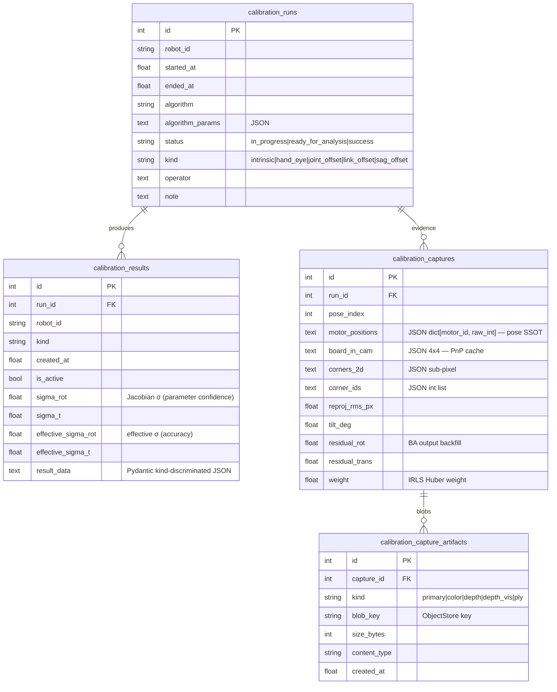
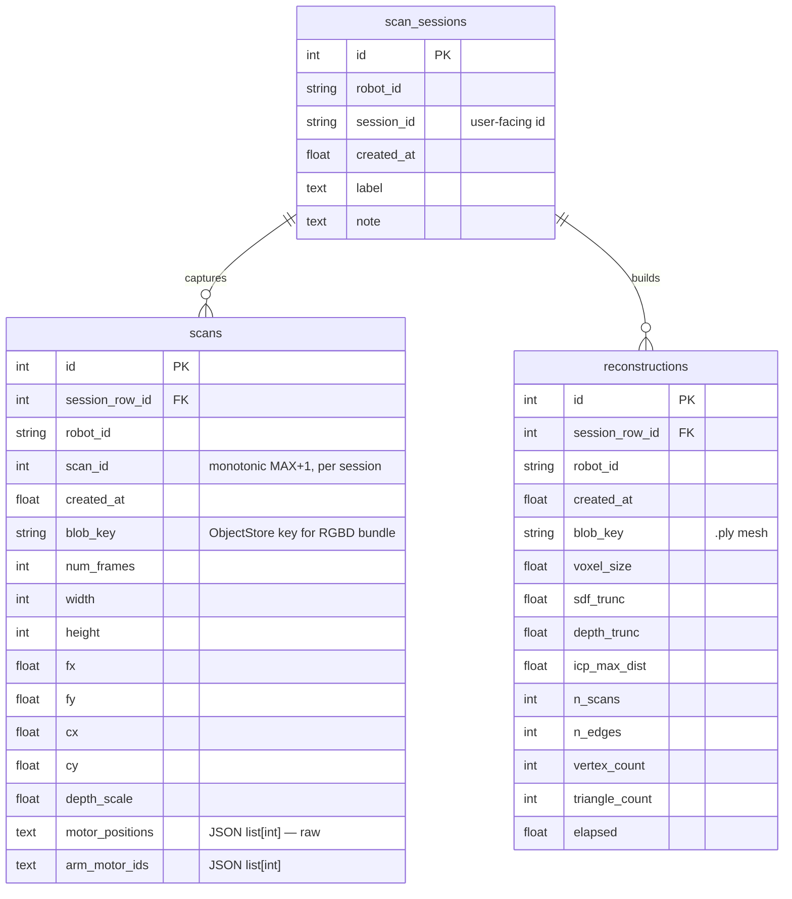

# DB Schema Reference

Horibot 의 RDB 스키마 학습/리뷰용 reference. **현재 구조** 만 다룬다 — 디자인 동기 / 패턴은 [storage_layer.md](storage_layer.md), 캘 절차 / 적용 메커니즘은 [calibration_apply_flow.md](calibration_apply_flow.md) / [calibration_workflow.md](calibration_workflow.md), scan 워크플로는 [scan_interactive_design.md](scan_interactive_design.md).

테이블 7개 / 2 도메인:

- **Calibration** ([backend/modules/calibration/orm.py](../backend/modules/calibration/orm.py)) — `calibration_runs` / `calibration_results` / `calibration_captures` / `calibration_capture_artifacts`
- **Scan workflow** ([backend/modules/scan_workflow/orm.py](../backend/modules/scan_workflow/orm.py)) — `scan_sessions` / `scans` / `reconstructions`

도메인이 다르지만 같은 `Base` 위에서 같은 engine / session 으로 도는 한 DB.

---

## 1. Overview

### 1.1 Engine / dialect 분기

[backend/modules/storage/rdb/base.py](../backend/modules/storage/rdb/base.py) 의 `make_engine(uri)` 가:

- `sqlite:///:memory:` → `StaticPool` + `check_same_thread=False` (멀티스레드 공유)
- `sqlite://...` → `check_same_thread=False`
- 그 외 (Postgres 등) → 그대로

SQLite 일 때 connect 마다 PRAGMA 두 개:

- `foreign_keys=ON` — FK CASCADE 동작에 **필수** (SQLite 는 기본 OFF)
- `journal_mode=WAL` — 동시 read 허용

### 1.2 Base 클래스

```python
class Base(DeclarativeBase): ...
```

calibration / scan_workflow 의 ORM 모델이 같은 `Base` 를 import — Alembic `target_metadata = Base.metadata` 한 자리에서 두 도메인 다 캐치.

### 1.3 session_scope (transaction boundary)

```python
@contextmanager
def session_scope(engine) -> Iterator[Session]:
    session = Session(engine, future=True)
    try:
        yield session
        session.commit()
    except Exception:
        session.rollback()
        raise
    finally:
        session.close()
```

repo 의 `auto_commit=False` 와 짝 — repo 메서드 안에선 `session.flush()` 만, 실제 `commit` 은 `__exit__` 가 담당. 즉 **한 `with rdb.session() as repos:` 블록이 한 transaction**.

### 1.4 동기 Session (왜 AsyncSession 아닌가)

Zenoh queryable callback contract 가 sync callable 이라 storage 호출 측이 sync. DB 만 async 박으면 sync handler 안에서 event loop juggling 이라 오히려 복잡. 추후 storage_node 자체가 async layer 되면 `RdbStore` Protocol 유지한 채 교체 가능 — 자세 [base.py](../backend/modules/storage/rdb/base.py) 의 NOTE.

---

## 2. Calibration Domain

캘 한 run = (사용자 캡처 자세 N장 + offline BA 분석 + Result rows + activate). status machine 한 방향.

### 2.1 Lifecycle

```
new_run                                          → CalibrationRun (status=in_progress)
  ├── append_capture × N                         → CalibrationCapture (+ Artifact × ~5)
  ├── delete_last_capture (옵션)                  → CASCADE artifact
  └── mark_run_ready                             → status=ready_for_analysis
                                                    (capture append 차단)
finalize_run (offline 분석 후)                    → status=success
                                                    + CalibrationResult × M (is_active=False)
                                                    + capture residual backfill (IRLS weight 등)
activate_result(result_id)                       → atomic: 같은 (robot_id, kind) 의
                                                    기존 active 해제 → target 활성
```

frontend / handler 입장에서:
- `[캘 시작]` = `new_run`
- `[캡처]` = `append_capture`
- `[분석 시작]` = `mark_run_ready`
- offline `calibrate_offline.py --commit` = `finalize_run` + `activate_result` (보통 묶임)
- `CalibrationHistoryPanel` 의 `[ACTIVATE]` = `activate_result` 만 (이미 finalize 된 과거 run 의 result 활성)

### 2.2 ER Diagram



### 2.3 Invariants

> 인덱스 / UniqueConstraint 가 *강제* 하는 도메인 규칙. 코드 읽다 막힐 때 가장 먼저 확인할 자리.

| Invariant | 어디서 강제 |
|---|---|
| `CalibrationRun.status` 는 단방향: `in_progress → ready_for_analysis → success` (revert X) | `mark_run_ready` / `finalize_run` 의 status pre-check |
| `append_capture` 는 `status=in_progress` 일 때만 — 그 외 `ValueError` | `repo.append_capture` |
| 같은 `(robot_id, kind)` 의 active result 는 **최대 1개** | partial UNIQUE index `idx_calibration_results_active WHERE is_active` |
| `activate_result` 는 atomic — 기존 active deactivate → target activate 가 한 transaction | `repo.activate_result` 의 UPDATE 두 발 + session flush |
| 같은 `(capture_id, kind)` artifact 2개 금지 | `UniqueConstraint("capture_id", "kind")` |
| Run 삭제 → results / captures / capture_artifacts **전부** CASCADE | FK `ON DELETE CASCADE` + SQLite `PRAGMA foreign_keys=ON` |
| Capture 삭제 → 자식 artifacts CASCADE | FK `ON DELETE CASCADE` |
| **ObjectStore blob 은 CASCADE 못 미침** — handler 가 `list_run_artifacts` 로 key 모은 후 별도 `ObjectStore.delete` | `delete_run` 의 docstring + caller 책임 |
| `CalibrationCapture.motor_positions` = **raw int SSOT** — 캡처 시점 robot pose 의 ground truth. 이후 joint_offset 캘 갱신돼도 raw 불변 | scheme 자체 (Text JSON, post-hoc reinterpret 가능) |
| `CalibrationRun` 은 한 번 finalize 된 후 데이터 mutation 안 함 (immutable history) | finalize 후 path 가 add 만 — UPDATE 안 함 |
| draft (`in_progress`) run 은 `(robot_id, kind)` 별 lookup 자주 — partial index 로 가속 | `idx_calibration_runs_in_progress WHERE status='in_progress'` |

### 2.4 `calibration_runs`

한 번의 캘 실행 단위. immutable history.

| 컬럼 | 타입 | 비고 |
|---|---|---|
| `id` | `Integer PK autoincrement` | |
| `robot_id` | `String NOT NULL` | per-instance 분리 (`omx_f_0`, `so101_0` 등) |
| `started_at` | `Float NOT NULL` | unix epoch |
| `ended_at` | `Float NULL` | finalize 시점, draft 동안 NULL |
| `operator` | `Text NULL` | 사용자 식별자 (옵션) |
| `note` | `Text NULL` | 자유 메모 |
| `algorithm` | `String NOT NULL` | 예: `physical_sag_irls`, `mrcal_intrinsic` |
| `algorithm_params` | `Text NOT NULL default '{}'` | JSON dict — `{"sigma_pixel": 1.0, "huber_k": 1.345, ...}` |
| `status` | `String NOT NULL default 'success'` | `in_progress` / `ready_for_analysis` / `success`. 옛 row 는 처음부터 `success` |
| `kind` | `String NULL` | run 의 목적 — `intrinsic` / `hand_eye` / `joint_offset` / `link_offset` / `sag_offset`. legacy row 면 NULL |

**Index**: `idx_calibration_runs_in_progress(robot_id, kind) WHERE status='in_progress'` (draft lookup 가속).

### 2.5 `calibration_results`

Run 의 산출물 row — kind 별 1개. activate 토글로 "현재 사용 중인 캘" 표시.

| 컬럼 | 타입 | 비고 |
|---|---|---|
| `id` | `Integer PK` | |
| `run_id` | `FK → calibration_runs.id ON DELETE CASCADE` | |
| `robot_id` | `String NOT NULL` | run 의 `robot_id` denormalize — partial index 키 |
| `kind` | `String NOT NULL` | run 의 `kind` 와 동일 |
| `created_at` | `Float NOT NULL` | |
| `is_active` | `Bool NOT NULL default false` | per (robot_id, kind) 1 row 만 true |
| `sigma_rot` | `Float NULL` | **Jacobian σ** — `(JᵀJ)⁻¹·σ²` block trace, parameter confidence |
| `sigma_t` | `Float NULL` | 위와 짝 |
| `effective_sigma_rot` | `Float NULL` | **effective σ** — `board_in_base` std, data consistency. **commit 결정 metric** |
| `effective_sigma_t` | `Float NULL` | 위와 짝 |
| `result_data` | `Text NOT NULL` | kind-discriminated Pydantic union (`HandEyeResultData` / `IntrinsicResultData` / `JointOffsetResultData` / ...) JSON |

**Index**:
- `idx_calibration_results_active(robot_id, kind) WHERE is_active` **UNIQUE** — invariant 강제
- `idx_calibration_results_lookup(robot_id, kind, created_at)` — history 조회

**왜 σ 두 metric** ([memory: project_calibration_sigma_dual_metric](../CLAUDE.md)): Jacobian σ 는 parameter 가 *얼마나 잘 식별됐나*, effective σ 는 그 파라미터가 *실제 board_in_base 재현 일관성을 얼마나 주나*. 후자가 commit 결정 기준 — 전자가 좋아도 후자가 나쁘면 outlier 가 끼어있다는 신호.

### 2.6 `calibration_captures`

Evidence — 자세 1장의 raw sensor + BA 입력/출력 캐시. 같은 row 에 *capture 시점 inputs* + *post-BA outputs* 가 공존 (BA 후 UPDATE 로 residual / weight backfill).

| 컬럼 | 타입 | 비고 |
|---|---|---|
| `id` | `Integer PK` | |
| `run_id` | `FK → calibration_runs.id ON DELETE CASCADE` | |
| `pose_index` | `Integer NOT NULL` | 자세 순번 (0-based) |
| `motor_positions` | `Text NULL` | JSON `dict[motor_id, raw_int]`. intrinsic 캡처 자리 NULL |
| `board_in_cam` | `Text NULL` | 4×4 PnP 결과 JSON — BA 가 매번 재산출 안 하게 캐시 |
| `corners_2d` | `Text NULL` | `(N,2)` sub-pixel JSON |
| `corner_ids` | `Text NULL` | `(N,)` int JSON |
| `reproj_rms_px` | `Float NULL` | capture-time PnP RMS — 1.5px 초과 시 자동 reject |
| `tilt_deg` | `Float NULL` | 보드 tilt — 30~70° 권장 범위 |
| `residual_rot` | `Float NULL` | **BA 후 backfill** — `physical_sag` residual |
| `residual_trans` | `Float NULL` | |
| `weight` | `Float NULL` | **BA 후 backfill** — IRLS Huber weight (1=정상 / 낮음=outlier) |

**Index**: `idx_calibration_captures_run(run_id, pose_index)`.

**왜 JSON dict 의 key 가 int 인데 Text 인가**: SQLite Text JSON 직렬화 시 dict key 가 str 로 변환됨 → `orm_to_capture` 에서 `int(k)` 캐스팅으로 복원. wire 호환을 위해 `motor_id` 는 int (Dynamixel ID) 유지.

### 2.7 `calibration_capture_artifacts`

Capture 1장의 ObjectStore blob 0..N 개. 보통 5개 (`primary` + `color` + `depth` + `depth_vis` + `ply`).

| 컬럼 | 타입 | 비고 |
|---|---|---|
| `id` | `Integer PK` | |
| `capture_id` | `FK → calibration_captures.id ON DELETE CASCADE` | |
| `kind` | `String NOT NULL` | domain vocabulary (`primary` / `color` / `depth` / `depth_vis` / `ply`). DB schema 는 자유 문자열 — Pydantic 자리 validate |
| `blob_key` | `String NOT NULL` | ObjectStore key (예: `calibration/<robot_id>/runs/<run_id>/captures/<pose_index>/primary.bin`) |
| `size_bytes` | `Integer NULL` | |
| `content_type` | `String NULL` | |
| `created_at` | `Float NOT NULL` | |

**Index**: `idx_calibration_capture_artifacts_capture(capture_id)` + **`UniqueConstraint(capture_id, kind)`** (같은 capture 의 같은 kind 자리 2개 금지 — upsert 일관성).

**왜 별도 테이블** (왜 capture row 안에 blob_key list JSON 으로 안 박나): (a) artifact 별 size / content_type / created_at metadata 가 first-class, (b) `(capture_id, kind)` UNIQUE 같은 정합성 강제, (c) 미래에 artifact 단위 delete / re-upload 가 자연. 정규화 이득 > JSON 단순함 비용.

### 2.8 Design Notes

- **Pydantic `CalibrationResultRecordAdapter`** — `orm_to_result` 가 `result_data` JSON 을 union arm 자동 선택 + validate. schema drift 즉시 `ValidationError`. kind 별 ResultData 모델 추가 시 Pydantic union 한 자리만 추가하면 ORM 은 변화 X.
- **JSON Text 컬럼이 많은 이유** — SQLite 가 JSON1 extension 으로 query 가능하지만 Postgres JSONB 가 first-class 라 추후 migration 자리 자연. 지금은 명시적 `json.dumps/loads` boundary mapper — type safety 는 Pydantic Record 가 책임.
- **residual / weight UPDATE 가 capture row 에 in-place** — 캡처 시점에 NULL, finalize 시 UPDATE. 별도 `calibration_capture_results` 테이블 안 만든 이유는 1:1 + 같은 lifecycle.

---

## 3. Scan Workflow Domain

Multi-pose RGBD scan 묶음 → ICP/TSDF reconstruction. 캘과 달리 **append-only** — `is_active` / `ACTIVATE` 자리 없음.

### 3.1 Lifecycle

```
insert_session                            → ScanSession
  ├── allocate_scan_id (MAX+1)            → 다음 scan_id (monotonic, delete 후에도 안 줄음)
  ├── insert_scan × N                     → Scan (+ ObjectStore blob)
  └── insert_reconstruction × 0..N        → Reconstruction (+ .ply blob)

delete_session                            → CASCADE scans / reconstructions
                                            (blob 은 handler 가 별도 cleanup)
```

ScanTask (Step DSL) 입장:
- `NewSession` step = `insert_session`
- `ForEach(MoveJByName + CaptureScan)` = `allocate_scan_id` + `insert_scan` 반복
- `BuildReconstruction` = ReconstructionNode 가 `list_scans` → ICP/TSDF → `insert_reconstruction`

같은 session 에 reconstruction 여러 번 빌드 가능 (parameter sweep / 캘 update 후 rebuild). 그래서 `0..N`.

### 3.2 ER Diagram



### 3.3 Invariants

| Invariant | 어디서 강제 |
|---|---|
| `(robot_id, session_id)` 는 UNIQUE — 같은 robot 의 session_id 중복 X | `UniqueConstraint("robot_id", "session_id")` + `insert_session` pre-check |
| `(session_row_id, scan_id)` 는 UNIQUE — 한 session 안 scan_id 중복 X | `UniqueConstraint("session_row_id", "scan_id")` + `insert_scan` pre-check |
| `scan_id` 는 **monotonic** — `MAX+1` 로 할당. delete 후에도 줄지 않음 | `allocate_scan_id` 의 `SELECT MAX(scan_id) + 1` (같은 transaction 안 — race 차단) |
| Session 삭제 → scans / reconstructions 전부 CASCADE | FK `ON DELETE CASCADE` |
| ObjectStore blob 은 CASCADE 못 미침 — handler 책임 | 캘과 동일 패턴 |
| **scan 은 raw motor_positions 로 저장** — 캡처 시점 캘 변해도 raw 불변. Reconstruction build 때 현재 캘로 fresh 재계산 | scheme 자체 + `ReconstructionNode.build` |
| Scan / Reconstruction 은 immutable — INSERT 후 UPDATE 안 함 | repo 에 UPDATE 메서드 없음 |
| 같은 session 의 Reconstruction 여러 개 OK — UNIQUE 없음 | scheme — `reconstructions` 에 `UniqueConstraint` 없음 |

### 3.4 `scan_sessions`

한 번의 multi-pose scan 묶음 metadata.

| 컬럼 | 타입 | 비고 |
|---|---|---|
| `id` | `Integer PK` | internal row id |
| `robot_id` | `String NOT NULL` | |
| `session_id` | `String NOT NULL` | user-facing id (예: `2026_06_21_1430_box`) |
| `created_at` | `Float NOT NULL` | |
| `label` | `Text NULL` | 자유 라벨 |
| `note` | `Text NULL` | |

**Index**: `UniqueConstraint(robot_id, session_id)` + `idx_scan_sessions_lookup(robot_id, created_at)`.

**왜 `id` (PK) 와 `session_id` (user-facing) 분리** — `id` 는 FK 키로 안정 (rename 시 cascade 안전), `session_id` 는 사용자가 의미 있는 이름 짓는 자리 + rename 자유. 비슷한 패턴 `scans.id` (PK) vs `scan_id` (sequence number).

### 3.5 `scans`

한 자세에서 캡처한 RGBD frame metadata + ObjectStore blob 포인터.

| 컬럼 | 타입 | 비고 |
|---|---|---|
| `id` | `Integer PK` | internal row id |
| `session_row_id` | `FK → scan_sessions.id ON DELETE CASCADE` | |
| `robot_id` | `String NOT NULL` | denormalize |
| `scan_id` | `Integer NOT NULL` | monotonic sequence, per session |
| `created_at` | `Float NOT NULL` | |
| `blob_key` | `String NOT NULL` | `scans/<robot_id>/<session_id>/<scan_id:03d>.bin` |
| `num_frames` | `Integer NOT NULL` | consensus median 의 입력 프레임 수 |
| `width` / `height` | `Integer` | |
| `fx` / `fy` / `cx` / `cy` | `Float` | 캡처 시점 intrinsic (현재 캘 변경 무관 — 그 시점 값 보존) |
| `depth_scale` | `Float` | RealSense Z16 → meter |
| `motor_positions` | `Text NOT NULL` | JSON `list[int]` — raw motor positions |
| `arm_motor_ids` | `Text NOT NULL` | JSON `list[int]` — motor_positions index 와 정렬 |

**Index**: `UniqueConstraint(session_row_id, scan_id)` + `idx_scans_session(session_row_id, scan_id)`.

**왜 intrinsic / motor_positions 를 scan row 에 박나** — Reconstruction build 가 *나중에* 도는데, 그 사이 intrinsic 캘 / joint_offset 캘 갱신될 수 있음. raw 값을 박아둬야 "이 scan 의 ground truth" 가 보존됨. build 시점에 *현재 캘* 적용은 ReconstructionNode 책임.

### 3.6 `reconstructions`

Multi-scan ICP + PoseGraph + TSDF mesh build 결과 metadata.

| 컬럼 | 타입 | 비고 |
|---|---|---|
| `id` | `Integer PK` | |
| `session_row_id` | `FK → scan_sessions.id ON DELETE CASCADE` | |
| `robot_id` | `String NOT NULL` | |
| `created_at` | `Float NOT NULL` | |
| `blob_key` | `String NOT NULL` | `reconstructions/<robot_id>/<session_id>/recon_<ts>.ply` |
| `voxel_size` | `Float` | TSDF param |
| `sdf_trunc` | `Float` | |
| `depth_trunc` | `Float` | |
| `icp_max_dist` | `Float` | ICP param |
| `n_scans` | `Integer` | 입력 scan 수 |
| `n_edges` | `Integer` | PoseGraph edge 수 |
| `vertex_count` / `triangle_count` | `Integer` | mesh size |
| `elapsed` | `Float` | 빌드 소요 (초) |

**Index**: `idx_reconstructions_session(session_row_id, created_at)`.

### 3.7 Design Notes

- **append-only** — 캘 처럼 active 토글 안 함. "최신 reconstruction" 은 `created_at DESC` 의 첫 행 (의미 분기 안 함).
- **같은 session 에 여러 reconstruction** — voxel_size / icp_max_dist sweep, 또는 캘 update 후 rebuild. 컬럼에 param 박은 이유 = "어떤 param 으로 빌드한 mesh 인지" 식별 가능.

---

## 4. Cross-cutting Patterns

### 4.1 Record ↔ ORM boundary mapper

각 도메인의 `orm.py` 에 `*_record_to_orm` / `orm_to_*` 함수 쌍. **Pydantic Record (wire + domain SSOT) ↔ SQLAlchemy ORM (persistence SSOT)** 두 boundary 분리 (DDD mapper).

```
Pydantic Record  ──record_to_orm──→  ORM     ──session.add──→  DB
                ←──orm_to_record──   ORM     ←──select──────   DB
```

장점: wire schema 가 DB schema 변경에 자동 끌려가지 않음. 컬럼 추가해도 Pydantic Record 의 wire 호환은 mapper 가 흡수.

### 4.2 JSON Text columns

지금 모든 JSON 컬럼이 `Text` + 명시적 `json.dumps/loads`. SQLAlchemy 의 `JSON` type 안 씀.

- **이유**: SQLite 의 JSON1 / Postgres 의 JSONB 가 dialect-specific. Text + 명시적 boundary 가 가장 단순.
- **Postgres 진입 시**: `Text` → `JSONB` 로 column type 변경 + mapper 의 `json.dumps` 제거 — Alembic migration 한 자리.

### 4.3 Partial indexes (SQLite/Postgres 양방향)

```python
Index(
    "idx_calibration_results_active",
    "robot_id", "kind",
    unique=True,
    sqlite_where=text("is_active = 1"),
    postgresql_where=text("is_active = TRUE"),
)
```

dialect 별 WHERE 표현이 달라 양쪽 다 명시. SQLAlchemy 가 active dialect 에 맞는 절만 emit.

### 4.4 ObjectStore blob ≠ RDB CASCADE

FK CASCADE 는 **DB row 만** 지움. ObjectStore (S3 / MinIO / local fs) blob 은 CASCADE 못 미침. 패턴:

1. handler 가 `repo.list_*_artifacts(parent_id)` (캘) / `repo.list_scans(session_row_id)` (scan) 로 blob_key 들 먼저 fetch
2. `repo.delete_*` 호출 → RDB cascade
3. ObjectStore.delete(keys) 별도 호출

순서 바뀌면 (RDB 먼저 지우면) blob_key 잃어버려 orphan blob 발생.

### 4.5 SQLite ↔ Postgres 호환성

스키마는 **양방향 호환**:
- 모든 컬럼 타입이 `Integer` / `Float` / `String` / `Text` / `Boolean` 같은 generic SQLAlchemy 타입
- Postgres-only (`JSONB`, `ARRAY`, `TIMESTAMPTZ`) 안 씀
- partial index 는 dialect 분기 명시

현재 SQLite (`robot/instances/<robot_id>/storage/storage.db`), Phase 3 NAS Postgres 진입 시 동일 ORM 그대로.

---

## 5. Future Expansion

| 후보 | 도메인 | 동기 | Anchor |
|---|---|---|---|
| `task_runs` / `task_steps` | Task DSL | task 실행 이력 (success / fail / step별 result) DB 보존 — 현재 in-memory pub/sub 만 | storage_layer.md Phase 2 |
| Job queue (e.g. `pending_jobs`) | Cross-cutting | 백그라운드 BA / reconstruction 비동기 큐 | 아직 사용 패턴 안 잡힘 |
| `pose_library` | Robot meta | 캘 / 운영 자세 named pose 보존 | [pose_library_design.md](pose_library_design.md) |
| `detection_events` | Detector | YOLO 검출 히스토리 (학습 데이터 / debug) | 미정 |

새 도메인 추가 시:

1. `backend/modules/<domain>/orm.py` — ORM 모델 + record_to_orm / orm_to_record mapper
2. `backend/modules/<domain>/persistence_models.py` — Pydantic Record
3. `backend/modules/storage/rdb/repos/<domain>.py` — Repo facade (sub-repo composition + workflow 메서드)
4. 본 문서에 도메인 섹션 추가 (Lifecycle / ER / Invariants / 컬럼표 / Design Notes)

---

## Schema Evolution

Alembic migration: [backend/alembic/](../backend/alembic/) (`alembic upgrade head` 가 `StorageRegistry.init` 안 자동 실행).
