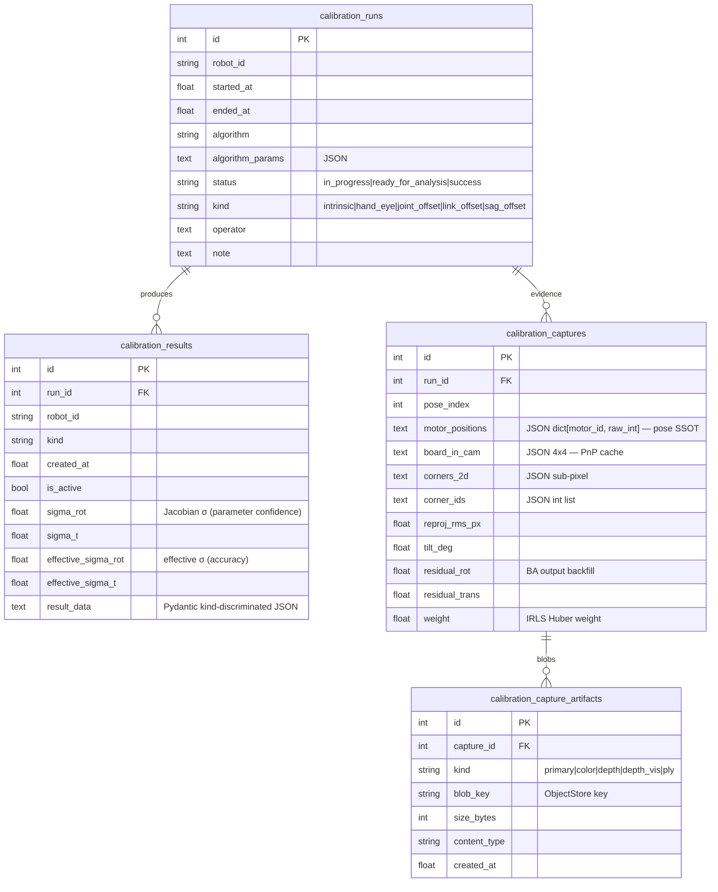
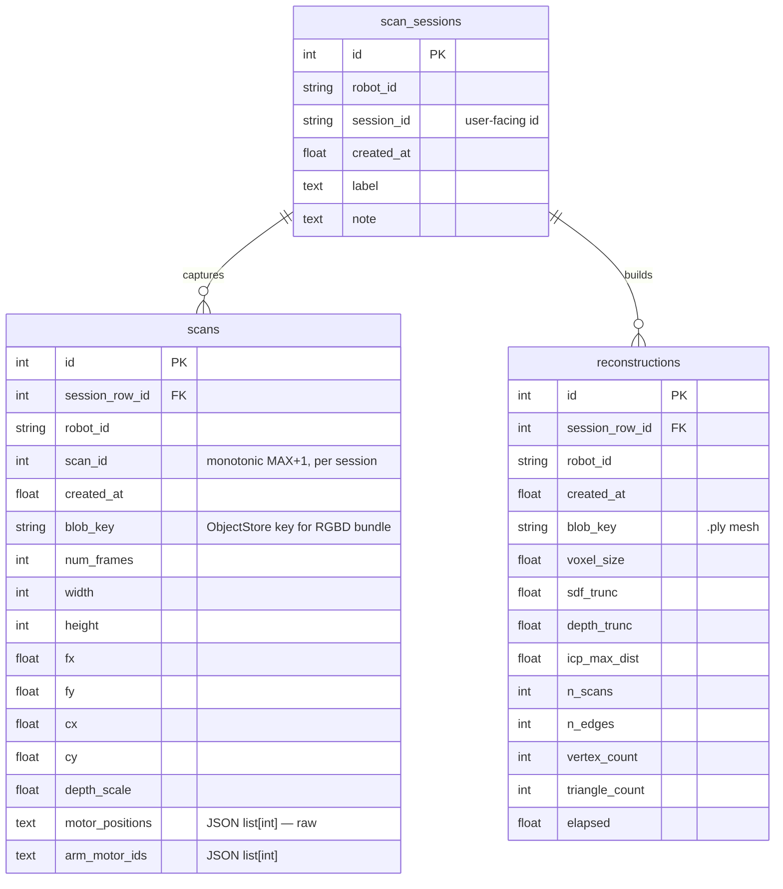

# Dev Reference (통합)

> **통합본 (2026-07-11 문서 다이어트)** — 아래 문서들을 원문 그대로 병합. 옛 파일명으로의
> 링크는 본 문서 내 해당 부(또는 git history). 각 부의 제목/상태 배너는 병합 당시 그대로.
> - `dev_reference.md`
> - `dev_reference.md`
> - `dev_reference.md`
> - `dev_reference.md`


---
---

<!-- ═══════════ [통합 원문] dev_reference.md ═══════════ -->

# DB Schema Reference

> ⚠️ **부분 stale (2026-07-11 문서 전수 감사)**: ORM 경로가 옛 것 — 현행은 `modules/<module>/persistence/orm.py`, `scan_workflow` 모듈은 `scan` 으로 개칭. storage_node 언급은 폐기된 v1 (Database-per-Module 로 대체).
> 본 감사에서 삭제된 v1 문서 참조가 남아있을 수 있음 — git history 에서 복원 가능.

Horibot 의 RDB 스키마 학습/리뷰용 reference. **현재 구조** 만 다룬다 — 디자인 동기 / 패턴은 [storage_layer.md](storage_layer.md), 캘 절차 / 적용 메커니즘은 [calibration_apply_flow.md](calibration_apply_flow.md) / [calibration.md](calibration.md), scan 워크플로는 [scan_interactive_design.md](scan_interactive_design.md).

테이블 7개 / 2 도메인:

- **Calibration** ([backend/modules/calibration/orm.py](../backend/modules/calibration/orm.py)) — `calibration_runs` / `calibration_results` / `calibration_captures` / `calibration_capture_artifacts`
- **Scan workflow** ([backend/modules/scan_workflow/orm.py](../backend/modules/scan_workflow/orm.py)) — `scan_sessions` / `scans` / `reconstructions`

도메인이 다르지만 같은 `Base` 위에서 같은 engine / session 으로 도는 한 DB.

---

## 1. Overview

### 1.1 Engine / dialect 분기

[backend/modules/storage/rdb/base.py](../backend/modules/storage/rdb/base.py) 의 `make_engine(uri)` 가:

- `sqlite:///:memory:` → `StaticPool` + `check_same_thread=False` (멀티스레드 공유)
- `sqlite://...` → `check_same_thread=False`
- 그 외 (Postgres 등) → 그대로

SQLite 일 때 connect 마다 PRAGMA 두 개:

- `foreign_keys=ON` — FK CASCADE 동작에 **필수** (SQLite 는 기본 OFF)
- `journal_mode=WAL` — 동시 read 허용

### 1.2 Base 클래스

```python
class Base(DeclarativeBase): ...
```

calibration / scan_workflow 의 ORM 모델이 같은 `Base` 를 import — Alembic `target_metadata = Base.metadata` 한 자리에서 두 도메인 다 캐치.

### 1.3 session_scope (transaction boundary)

```python
@contextmanager
def session_scope(engine) -> Iterator[Session]:
    session = Session(engine, future=True)
    try:
        yield session
        session.commit()
    except Exception:
        session.rollback()
        raise
    finally:
        session.close()
```

repo 의 `auto_commit=False` 와 짝 — repo 메서드 안에선 `session.flush()` 만, 실제 `commit` 은 `__exit__` 가 담당. 즉 **한 `with rdb.session() as repos:` 블록이 한 transaction**.

### 1.4 동기 Session (왜 AsyncSession 아닌가)

Zenoh queryable callback contract 가 sync callable 이라 storage 호출 측이 sync. DB 만 async 박으면 sync handler 안에서 event loop juggling 이라 오히려 복잡. 추후 storage_node 자체가 async layer 되면 `RdbStore` Protocol 유지한 채 교체 가능 — 자세 [base.py](../backend/modules/storage/rdb/base.py) 의 NOTE.

---

## 2. Calibration Domain

캘 한 run = (사용자 캡처 자세 N장 + offline BA 분석 + Result rows + activate). status machine 한 방향.

### 2.1 Lifecycle

```
new_run                                          → CalibrationRun (status=in_progress)
  ├── append_capture × N                         → CalibrationCapture (+ Artifact × ~5)
  ├── delete_last_capture (옵션)                  → CASCADE artifact
  └── mark_run_ready                             → status=ready_for_analysis
                                                    (capture append 차단)
finalize_run (offline 분석 후)                    → status=success
                                                    + CalibrationResult × M (is_active=False)
                                                    + capture residual backfill (IRLS weight 등)
activate_result(result_id)                       → atomic: 같은 (robot_id, kind) 의
                                                    기존 active 해제 → target 활성
```

frontend / handler 입장에서:
- `[캘 시작]` = `new_run`
- `[캡처]` = `append_capture`
- `[분석 시작]` = `mark_run_ready`
- offline `calibrate_offline.py --commit` = `finalize_run` + `activate_result` (보통 묶임)
- `CalibrationHistoryPanel` 의 `[ACTIVATE]` = `activate_result` 만 (이미 finalize 된 과거 run 의 result 활성)

### 2.2 ER Diagram



### 2.3 Invariants

> 인덱스 / UniqueConstraint 가 *강제* 하는 도메인 규칙. 코드 읽다 막힐 때 가장 먼저 확인할 자리.

| Invariant | 어디서 강제 |
|---|---|
| `CalibrationRun.status` 는 단방향: `in_progress → ready_for_analysis → success` (revert X) | `mark_run_ready` / `finalize_run` 의 status pre-check |
| `append_capture` 는 `status=in_progress` 일 때만 — 그 외 `ValueError` | `repo.append_capture` |
| 같은 `(robot_id, kind)` 의 active result 는 **최대 1개** | partial UNIQUE index `idx_calibration_results_active WHERE is_active` |
| `activate_result` 는 atomic — 기존 active deactivate → target activate 가 한 transaction | `repo.activate_result` 의 UPDATE 두 발 + session flush |
| 같은 `(capture_id, kind)` artifact 2개 금지 | `UniqueConstraint("capture_id", "kind")` |
| Run 삭제 → results / captures / capture_artifacts **전부** CASCADE | FK `ON DELETE CASCADE` + SQLite `PRAGMA foreign_keys=ON` |
| Capture 삭제 → 자식 artifacts CASCADE | FK `ON DELETE CASCADE` |
| **ObjectStore blob 은 CASCADE 못 미침** — handler 가 `list_run_artifacts` 로 key 모은 후 별도 `ObjectStore.delete` | `delete_run` 의 docstring + caller 책임 |
| `CalibrationCapture.motor_positions` = **raw int SSOT** — 캡처 시점 robot pose 의 ground truth. 이후 joint_offset 캘 갱신돼도 raw 불변 | scheme 자체 (Text JSON, post-hoc reinterpret 가능) |
| `CalibrationRun` 은 한 번 finalize 된 후 데이터 mutation 안 함 (immutable history) | finalize 후 path 가 add 만 — UPDATE 안 함 |
| draft (`in_progress`) run 은 `(robot_id, kind)` 별 lookup 자주 — partial index 로 가속 | `idx_calibration_runs_in_progress WHERE status='in_progress'` |

### 2.4 `calibration_runs`

한 번의 캘 실행 단위. immutable history.

| 컬럼 | 타입 | 비고 |
|---|---|---|
| `id` | `Integer PK autoincrement` | |
| `robot_id` | `String NOT NULL` | per-instance 분리 (`omx_f_0`, `so101_0` 등) |
| `started_at` | `Float NOT NULL` | unix epoch |
| `ended_at` | `Float NULL` | finalize 시점, draft 동안 NULL |
| `operator` | `Text NULL` | 사용자 식별자 (옵션) |
| `note` | `Text NULL` | 자유 메모 |
| `algorithm` | `String NOT NULL` | 예: `physical_sag_irls`, `mrcal_intrinsic` |
| `algorithm_params` | `Text NOT NULL default '{}'` | JSON dict — `{"sigma_pixel": 1.0, "huber_k": 1.345, ...}` |
| `status` | `String NOT NULL default 'success'` | `in_progress` / `ready_for_analysis` / `success`. 옛 row 는 처음부터 `success` |
| `kind` | `String NULL` | run 의 목적 — `intrinsic` / `hand_eye` / `joint_offset` / `link_offset` / `sag_offset`. legacy row 면 NULL |

**Index**: `idx_calibration_runs_in_progress(robot_id, kind) WHERE status='in_progress'` (draft lookup 가속).

### 2.5 `calibration_results`

Run 의 산출물 row — kind 별 1개. activate 토글로 "현재 사용 중인 캘" 표시.

| 컬럼 | 타입 | 비고 |
|---|---|---|
| `id` | `Integer PK` | |
| `run_id` | `FK → calibration_runs.id ON DELETE CASCADE` | |
| `robot_id` | `String NOT NULL` | run 의 `robot_id` denormalize — partial index 키 |
| `kind` | `String NOT NULL` | run 의 `kind` 와 동일 |
| `created_at` | `Float NOT NULL` | |
| `is_active` | `Bool NOT NULL default false` | per (robot_id, kind) 1 row 만 true |
| `sigma_rot` | `Float NULL` | **Jacobian σ** — `(JᵀJ)⁻¹·σ²` block trace, parameter confidence |
| `sigma_t` | `Float NULL` | 위와 짝 |
| `effective_sigma_rot` | `Float NULL` | **effective σ** — `board_in_base` std, data consistency. **commit 결정 metric** |
| `effective_sigma_t` | `Float NULL` | 위와 짝 |
| `result_data` | `Text NOT NULL` | kind-discriminated Pydantic union (`HandEyeResultData` / `IntrinsicResultData` / `JointOffsetResultData` / ...) JSON |

**Index**:
- `idx_calibration_results_active(robot_id, kind) WHERE is_active` **UNIQUE** — invariant 강제
- `idx_calibration_results_lookup(robot_id, kind, created_at)` — history 조회

**왜 σ 두 metric** ([memory: project_calibration_sigma_dual_metric](../CLAUDE.md)): Jacobian σ 는 parameter 가 *얼마나 잘 식별됐나*, effective σ 는 그 파라미터가 *실제 board_in_base 재현 일관성을 얼마나 주나*. 후자가 commit 결정 기준 — 전자가 좋아도 후자가 나쁘면 outlier 가 끼어있다는 신호.

### 2.6 `calibration_captures`

Evidence — 자세 1장의 raw sensor + BA 입력/출력 캐시. 같은 row 에 *capture 시점 inputs* + *post-BA outputs* 가 공존 (BA 후 UPDATE 로 residual / weight backfill).

| 컬럼 | 타입 | 비고 |
|---|---|---|
| `id` | `Integer PK` | |
| `run_id` | `FK → calibration_runs.id ON DELETE CASCADE` | |
| `pose_index` | `Integer NOT NULL` | 자세 순번 (0-based) |
| `motor_positions` | `Text NULL` | JSON `dict[motor_id, raw_int]`. intrinsic 캡처 자리 NULL |
| `board_in_cam` | `Text NULL` | 4×4 PnP 결과 JSON — BA 가 매번 재산출 안 하게 캐시 |
| `corners_2d` | `Text NULL` | `(N,2)` sub-pixel JSON |
| `corner_ids` | `Text NULL` | `(N,)` int JSON |
| `reproj_rms_px` | `Float NULL` | capture-time PnP RMS — 1.5px 초과 시 자동 reject |
| `tilt_deg` | `Float NULL` | 보드 tilt — 30~70° 권장 범위 |
| `residual_rot` | `Float NULL` | **BA 후 backfill** — `physical_sag` residual |
| `residual_trans` | `Float NULL` | |
| `weight` | `Float NULL` | **BA 후 backfill** — IRLS Huber weight (1=정상 / 낮음=outlier) |

**Index**: `idx_calibration_captures_run(run_id, pose_index)`.

**왜 JSON dict 의 key 가 int 인데 Text 인가**: SQLite Text JSON 직렬화 시 dict key 가 str 로 변환됨 → `orm_to_capture` 에서 `int(k)` 캐스팅으로 복원. wire 호환을 위해 `motor_id` 는 int (Dynamixel ID) 유지.

### 2.7 `calibration_capture_artifacts`

Capture 1장의 ObjectStore blob 0..N 개. 보통 5개 (`primary` + `color` + `depth` + `depth_vis` + `ply`).

| 컬럼 | 타입 | 비고 |
|---|---|---|
| `id` | `Integer PK` | |
| `capture_id` | `FK → calibration_captures.id ON DELETE CASCADE` | |
| `kind` | `String NOT NULL` | domain vocabulary (`primary` / `color` / `depth` / `depth_vis` / `ply`). DB schema 는 자유 문자열 — Pydantic 자리 validate |
| `blob_key` | `String NOT NULL` | ObjectStore key (예: `calibration/<robot_id>/runs/<run_id>/captures/<pose_index>/primary.bin`) |
| `size_bytes` | `Integer NULL` | |
| `content_type` | `String NULL` | |
| `created_at` | `Float NOT NULL` | |

**Index**: `idx_calibration_capture_artifacts_capture(capture_id)` + **`UniqueConstraint(capture_id, kind)`** (같은 capture 의 같은 kind 자리 2개 금지 — upsert 일관성).

**왜 별도 테이블** (왜 capture row 안에 blob_key list JSON 으로 안 박나): (a) artifact 별 size / content_type / created_at metadata 가 first-class, (b) `(capture_id, kind)` UNIQUE 같은 정합성 강제, (c) 미래에 artifact 단위 delete / re-upload 가 자연. 정규화 이득 > JSON 단순함 비용.

### 2.8 Design Notes

- **Pydantic `CalibrationResultRecordAdapter`** — `orm_to_result` 가 `result_data` JSON 을 union arm 자동 선택 + validate. schema drift 즉시 `ValidationError`. kind 별 ResultData 모델 추가 시 Pydantic union 한 자리만 추가하면 ORM 은 변화 X.
- **JSON Text 컬럼이 많은 이유** — SQLite 가 JSON1 extension 으로 query 가능하지만 Postgres JSONB 가 first-class 라 추후 migration 자리 자연. 지금은 명시적 `json.dumps/loads` boundary mapper — type safety 는 Pydantic Record 가 책임.
- **residual / weight UPDATE 가 capture row 에 in-place** — 캡처 시점에 NULL, finalize 시 UPDATE. 별도 `calibration_capture_results` 테이블 안 만든 이유는 1:1 + 같은 lifecycle.

---

## 3. Scan Workflow Domain

Multi-pose RGBD scan 묶음 → ICP/TSDF reconstruction. 캘과 달리 **append-only** — `is_active` / `ACTIVATE` 자리 없음.

### 3.1 Lifecycle

```
insert_session                            → ScanSession
  ├── allocate_scan_id (MAX+1)            → 다음 scan_id (monotonic, delete 후에도 안 줄음)
  ├── insert_scan × N                     → Scan (+ ObjectStore blob)
  └── insert_reconstruction × 0..N        → Reconstruction (+ .ply blob)

delete_session                            → CASCADE scans / reconstructions
                                            (blob 은 handler 가 별도 cleanup)
```

ScanTask (Step DSL) 입장:
- `NewSession` step = `insert_session`
- `ForEach(MoveJByName + CaptureScan)` = `allocate_scan_id` + `insert_scan` 반복
- `BuildReconstruction` = ReconstructionNode 가 `list_scans` → ICP/TSDF → `insert_reconstruction`

같은 session 에 reconstruction 여러 번 빌드 가능 (parameter sweep / 캘 update 후 rebuild). 그래서 `0..N`.

### 3.2 ER Diagram



### 3.3 Invariants

| Invariant | 어디서 강제 |
|---|---|
| `(robot_id, session_id)` 는 UNIQUE — 같은 robot 의 session_id 중복 X | `UniqueConstraint("robot_id", "session_id")` + `insert_session` pre-check |
| `(session_row_id, scan_id)` 는 UNIQUE — 한 session 안 scan_id 중복 X | `UniqueConstraint("session_row_id", "scan_id")` + `insert_scan` pre-check |
| `scan_id` 는 **monotonic** — `MAX+1` 로 할당. delete 후에도 줄지 않음 | `allocate_scan_id` 의 `SELECT MAX(scan_id) + 1` (같은 transaction 안 — race 차단) |
| Session 삭제 → scans / reconstructions 전부 CASCADE | FK `ON DELETE CASCADE` |
| ObjectStore blob 은 CASCADE 못 미침 — handler 책임 | 캘과 동일 패턴 |
| **scan 은 raw motor_positions 로 저장** — 캡처 시점 캘 변해도 raw 불변. Reconstruction build 때 현재 캘로 fresh 재계산 | scheme 자체 + `ReconstructionNode.build` |
| Scan / Reconstruction 은 immutable — INSERT 후 UPDATE 안 함 | repo 에 UPDATE 메서드 없음 |
| 같은 session 의 Reconstruction 여러 개 OK — UNIQUE 없음 | scheme — `reconstructions` 에 `UniqueConstraint` 없음 |

### 3.4 `scan_sessions`

한 번의 multi-pose scan 묶음 metadata.

| 컬럼 | 타입 | 비고 |
|---|---|---|
| `id` | `Integer PK` | internal row id |
| `robot_id` | `String NOT NULL` | |
| `session_id` | `String NOT NULL` | user-facing id (예: `2026_06_21_1430_box`) |
| `created_at` | `Float NOT NULL` | |
| `label` | `Text NULL` | 자유 라벨 |
| `note` | `Text NULL` | |

**Index**: `UniqueConstraint(robot_id, session_id)` + `idx_scan_sessions_lookup(robot_id, created_at)`.

**왜 `id` (PK) 와 `session_id` (user-facing) 분리** — `id` 는 FK 키로 안정 (rename 시 cascade 안전), `session_id` 는 사용자가 의미 있는 이름 짓는 자리 + rename 자유. 비슷한 패턴 `scans.id` (PK) vs `scan_id` (sequence number).

### 3.5 `scans`

한 자세에서 캡처한 RGBD frame metadata + ObjectStore blob 포인터.

| 컬럼 | 타입 | 비고 |
|---|---|---|
| `id` | `Integer PK` | internal row id |
| `session_row_id` | `FK → scan_sessions.id ON DELETE CASCADE` | |
| `robot_id` | `String NOT NULL` | denormalize |
| `scan_id` | `Integer NOT NULL` | monotonic sequence, per session |
| `created_at` | `Float NOT NULL` | |
| `blob_key` | `String NOT NULL` | `scans/<robot_id>/<session_id>/<scan_id:03d>.bin` |
| `num_frames` | `Integer NOT NULL` | consensus median 의 입력 프레임 수 |
| `width` / `height` | `Integer` | |
| `fx` / `fy` / `cx` / `cy` | `Float` | 캡처 시점 intrinsic (현재 캘 변경 무관 — 그 시점 값 보존) |
| `depth_scale` | `Float` | RealSense Z16 → meter |
| `motor_positions` | `Text NOT NULL` | JSON `list[int]` — raw motor positions |
| `arm_motor_ids` | `Text NOT NULL` | JSON `list[int]` — motor_positions index 와 정렬 |

**Index**: `UniqueConstraint(session_row_id, scan_id)` + `idx_scans_session(session_row_id, scan_id)`.

**왜 intrinsic / motor_positions 를 scan row 에 박나** — Reconstruction build 가 *나중에* 도는데, 그 사이 intrinsic 캘 / joint_offset 캘 갱신될 수 있음. raw 값을 박아둬야 "이 scan 의 ground truth" 가 보존됨. build 시점에 *현재 캘* 적용은 ReconstructionNode 책임.

### 3.6 `reconstructions`

Multi-scan ICP + PoseGraph + TSDF mesh build 결과 metadata.

| 컬럼 | 타입 | 비고 |
|---|---|---|
| `id` | `Integer PK` | |
| `session_row_id` | `FK → scan_sessions.id ON DELETE CASCADE` | |
| `robot_id` | `String NOT NULL` | |
| `created_at` | `Float NOT NULL` | |
| `blob_key` | `String NOT NULL` | `reconstructions/<robot_id>/<session_id>/recon_<ts>.ply` |
| `voxel_size` | `Float` | TSDF param |
| `sdf_trunc` | `Float` | |
| `depth_trunc` | `Float` | |
| `icp_max_dist` | `Float` | ICP param |
| `n_scans` | `Integer` | 입력 scan 수 |
| `n_edges` | `Integer` | PoseGraph edge 수 |
| `vertex_count` / `triangle_count` | `Integer` | mesh size |
| `elapsed` | `Float` | 빌드 소요 (초) |

**Index**: `idx_reconstructions_session(session_row_id, created_at)`.

### 3.7 Design Notes

- **append-only** — 캘 처럼 active 토글 안 함. "최신 reconstruction" 은 `created_at DESC` 의 첫 행 (의미 분기 안 함).
- **같은 session 에 여러 reconstruction** — voxel_size / icp_max_dist sweep, 또는 캘 update 후 rebuild. 컬럼에 param 박은 이유 = "어떤 param 으로 빌드한 mesh 인지" 식별 가능.

---

## 4. Cross-cutting Patterns

### 4.1 Record ↔ ORM boundary mapper

각 도메인의 `orm.py` 에 `*_record_to_orm` / `orm_to_*` 함수 쌍. **Pydantic Record (wire + domain SSOT) ↔ SQLAlchemy ORM (persistence SSOT)** 두 boundary 분리 (DDD mapper).

```
Pydantic Record  ──record_to_orm──→  ORM     ──session.add──→  DB
                ←──orm_to_record──   ORM     ←──select──────   DB
```

장점: wire schema 가 DB schema 변경에 자동 끌려가지 않음. 컬럼 추가해도 Pydantic Record 의 wire 호환은 mapper 가 흡수.

### 4.2 JSON Text columns

지금 모든 JSON 컬럼이 `Text` + 명시적 `json.dumps/loads`. SQLAlchemy 의 `JSON` type 안 씀.

- **이유**: SQLite 의 JSON1 / Postgres 의 JSONB 가 dialect-specific. Text + 명시적 boundary 가 가장 단순.
- **Postgres 진입 시**: `Text` → `JSONB` 로 column type 변경 + mapper 의 `json.dumps` 제거 — Alembic migration 한 자리.

### 4.3 Partial indexes (SQLite/Postgres 양방향)

```python
Index(
    "idx_calibration_results_active",
    "robot_id", "kind",
    unique=True,
    sqlite_where=text("is_active = 1"),
    postgresql_where=text("is_active = TRUE"),
)
```

dialect 별 WHERE 표현이 달라 양쪽 다 명시. SQLAlchemy 가 active dialect 에 맞는 절만 emit.

### 4.4 ObjectStore blob ≠ RDB CASCADE

FK CASCADE 는 **DB row 만** 지움. ObjectStore (S3 / MinIO / local fs) blob 은 CASCADE 못 미침. 패턴:

1. handler 가 `repo.list_*_artifacts(parent_id)` (캘) / `repo.list_scans(session_row_id)` (scan) 로 blob_key 들 먼저 fetch
2. `repo.delete_*` 호출 → RDB cascade
3. ObjectStore.delete(keys) 별도 호출

순서 바뀌면 (RDB 먼저 지우면) blob_key 잃어버려 orphan blob 발생.

### 4.5 SQLite ↔ Postgres 호환성

스키마는 **양방향 호환**:
- 모든 컬럼 타입이 `Integer` / `Float` / `String` / `Text` / `Boolean` 같은 generic SQLAlchemy 타입
- Postgres-only (`JSONB`, `ARRAY`, `TIMESTAMPTZ`) 안 씀
- partial index 는 dialect 분기 명시

현재 SQLite (`robot/instances/<robot_id>/storage/storage.db`), Phase 3 NAS Postgres 진입 시 동일 ORM 그대로.

---

## 5. Future Expansion

| 후보 | 도메인 | 동기 | Anchor |
|---|---|---|---|
| `task_runs` / `task_steps` | Task DSL | task 실행 이력 (success / fail / step별 result) DB 보존 — 현재 in-memory pub/sub 만 | storage_layer.md Phase 2 |
| Job queue (e.g. `pending_jobs`) | Cross-cutting | 백그라운드 BA / reconstruction 비동기 큐 | 아직 사용 패턴 안 잡힘 |
| `pose_library` | Robot meta | 캘 / 운영 자세 named pose 보존 | [pose_library_design.md](pose_library_design.md) |
| `detection_events` | Detector | YOLO 검출 히스토리 (학습 데이터 / debug) | 미정 |

새 도메인 추가 시:

1. `backend/modules/<domain>/orm.py` — ORM 모델 + record_to_orm / orm_to_record mapper
2. `backend/modules/<domain>/persistence_models.py` — Pydantic Record
3. `backend/modules/storage/rdb/repos/<domain>.py` — Repo facade (sub-repo composition + workflow 메서드)
4. 본 문서에 도메인 섹션 추가 (Lifecycle / ER / Invariants / 컬럼표 / Design Notes)

---

## Schema Evolution

Alembic migration: [backend/alembic/](../backend/alembic/) (`alembic upgrade head` 가 `StorageRegistry.init` 안 자동 실행).


---
---

<!-- ═══════════ [통합 원문] dev_reference.md ═══════════ -->

# Testing Strategy — 실 hardware 가기 전에 최대한 버그 잡기

> ⚠️ **부분 stale (2026-07-11 문서 전수 감사)**: 4계층 검증 방법론은 현행 유효. 단 명령/설정명이 옛 것 — 현행: `config/deployments/*.yaml` + `python -m apps.main --host {mock|pc|pi_hori*}`, fast loop 은 `pytest -m "not sim"`.
> 본 감사에서 삭제된 v1 문서 참조가 남아있을 수 있음 — git history 에서 복원 가능.

> 사용자 expectation (2026-06-21): "다른 기능 추가할 때도 테스트 빡세게 돌려서
> 내가 실 hardware 검증 전에 버그는 많이 잡아내고 싶다."

본 문서 = *기능 추가 / 코드 변경 후 어떤 검증을 자동으로 돌려야 사용자가 실
hardware 들고 검증할 때 burn cycle 이 안 나오는지* 의 SSOT. 변경 자체가 작아도
**전체 stack** (backend lint + unit + cross-process + bridge WS leg) 다 통과해야
사용자에게 "검증해보세요" 라고 넘김.

## 1. 4 계층 검증 (실 hardware 직전 까지 자동)

| Layer | 도구 | 자동 가능? | 본 PR 의 예시 (MOTION_STATE_TCP fix) |
|---|---|---|---|
| L1 Lint / Type | `uv run ruff check .` / `uv run pyright` / `pnpm lint` / `tsc -b` | ✅ 항상 | clean |
| L2 Unit | `uv run pytest tests/` | ✅ 항상 | 103/103 + 새 회귀 차단 2/2 |
| L3 단일 process e2e | host_mock 부팅 + WS 클라이언트 verify 스크립트 | ✅ ~30s | bridge WS 499 msgs / 5s |
| L4 Cross-process | host_pc_sim + host_pi_motor_sim 두 프로세스 + 외부 Zenoh peer verify | ✅ ~30s | 98 msgs cross-process / 5s |
| L5 실 hardware | 사용자 토크오프 + 작업대 검증 | ❌ 사용자 | ← 본 단계 *전* 까지 다 잡기 |

**L1–L4 다 통과한 후에만** "사용자 실 hardware 검증해주세요" 라고 넘긴다. 한 layer
라도 떨어지면 그 layer 안에서 root cause 잡고 다음 layer 진행.

## 2. Layer 별 *언제* 실행

### L1 Lint / Type — *내 변경 파일 한정*

```powershell
# Backend (내가 건드린 파일만 — 다른 곳 stale lint error 노이즈 제거)
uv run ruff check <touched files>
uv run pyright <touched files>

# Frontend
cd frontend; pnpm lint; npx tsc -b
```

전체 ruff/pyright 가 깨끗하면 다행이지만, 내 변경과 무관한 기존 에러가 있을 수
있음. 내가 건드린 파일만 강조해서 reporting.

### L2 Unit — *항상 전체*

```powershell
cd backend; uv run pytest tests/ -v
```

새 기능 / 변경마다 **회귀 차단 합성 테스트** 한 개 이상 추가 — [§3 합성 데이터
회귀 차단 패턴](#3-합성-데이터-회귀-차단-테스트-패턴) 참조.

### L3 단일 process e2e — *wire (topic/service) 추가 / 변경 시*

`host_mock` 으로 bridge 까지 단일 process 부팅 → 외부 WS 클라이언트가 새 wire 를
받는지/보낼 수 있는지 검증. [§4 verify 스크립트 템플릿](#4-verify-스크립트-템플릿)
참조.

### L4 Cross-process — *wire 추가 / Coordinates / 캐시 / cross-process state 자리*

`host_pc_sim` + `host_pi_motor_sim` 두 프로세스 + 외부 Zenoh peer 가 메시지 받는지.

cross-process 자리 안 잡히는 버그 종류 ([[feedback_mock_doesnt_verify_distributed]]
memory):
- process-local factory 객체에 mutation 하는 자리 (한 process 만 알고 다른 process 모름)
- 캐시 invalidation (한 쪽 push, 다른 쪽 pull)
- Singleton 이 process 마다 별개라 sync 안 됨
- Topic key expression placeholder expand 누락

이런 자리는 L3 단일 process 자리에서 안 보임. **L4 필수**.

### L5 실 hardware — 사용자

L1-L4 다 통과한 후. 사용자에게 *어떤 자세* / *어떤 토글* / *어떤 결과 기대* 명시
해서 burn cycle 최소화.

## 3. 합성 데이터 회귀 차단 테스트 패턴

본 PR 의 [test_tcp_state_publish.py](../backend/tests/test_tcp_state_publish.py)
가 reference. 패턴:

1. **bug 의 mechanism 을 코드로 재현** — 합성 데이터 만들기 (예: 합성 horizontal
   plane + 합성 robot pose). 실 hardware 안 필요.
2. **fix 전 자리 (naive)** 와 **fix 후 자리 (corrected)** 의 *측정 가능한 metric*
   을 둘 다 계산 (예: tilt angle).
3. **두 metric 의 차이가 의미있는 값** 임을 assert (`naive > 0.5°`, `corrected < 0.001°`).
4. 누군가 fix 를 회귀시키면 (naive 자리로 돌리면) 테스트가 자동 깨짐.

```python
def test_<bug_mechanism>_blocked():
    # 1. 합성 데이터
    angles = synth_pose()
    # 2. fix 전 / 후 양쪽 계산
    metric_naive     = compute_with_naive_chain(angles)
    metric_corrected = compute_with_corrected_chain(angles)
    # 3. assert 의미 있는 차이
    assert metric_corrected < threshold_good
    assert metric_naive     > threshold_bad
```

bug 가 실 캘 / 실 motor state 의존이면, 본 PR 처럼 SQLite 의 active 캘 row 를
fixture 로 사용하고 row 없으면 `pytest.skip` — CI fresh checkout 에선 자동 skip.

## 4. Verify 스크립트 템플릿

### L3 host_mock + WS

```python
# /tmp/verify_<feature>_ws.py
import asyncio, json, os, subprocess, sys, time
from pathlib import Path
import websockets

BACKEND = Path("D:/Study/horibot/backend")
WS_URL = "ws://localhost:8000/ws"
TOPIC_KEY = "horibot/<robot_id>/<your_topic>"

p = subprocess.Popen(
    ["uv", "run", "python", "main.py", "--host", "mock"],
    cwd=str(BACKEND),
    env={**os.environ, "PYTHONIOENCODING": "utf-8"},
    stdout=subprocess.DEVNULL, stderr=subprocess.DEVNULL,
)
try:
    time.sleep(10)  # boot
    async def run():
        async with websockets.connect(WS_URL) as ws:
            await ws.send(json.dumps({"type": "subscribe", "topic": TOPIC_KEY}))
            received = []
            deadline = time.time() + 5.0
            while time.time() < deadline:
                try:
                    msg = await asyncio.wait_for(ws.recv(), timeout=2.0)
                    d = json.loads(msg)
                    if d.get("type") == "topic_data" and d.get("topic") == TOPIC_KEY:
                        received.append(d["data"])
                except asyncio.TimeoutError:
                    break
            return received
    received = asyncio.run(run())
    assert len(received) > 0, f"FAIL — no messages on {TOPIC_KEY}"
    # schema 검증 추가
    print(f"PASS — {len(received)} msgs / 5s")
finally:
    p.terminate()
```

실행:
```powershell
$env:PYTHONIOENCODING="utf-8"
uv --project backend run --with websockets python verify_<feature>_ws.py
```

### L4 host_pc_sim + host_pi_motor_sim cross-process

```python
# /tmp/verify_<feature>_distributed.py
# 동일 패턴, 차이점:
# - 두 process subprocess.Popen (pc_sim + pi_motor_sim)
# - WS 대신 직접 Zenoh peer 로 subscribe (bridge 우회, 진짜 cross-process)
import zenoh
cfg = zenoh.Config(); cfg.insert_json5("mode", '"peer"')
session = zenoh.open(cfg)
received = []
sub = session.declare_subscriber(TOPIC_KEY, lambda s: received.append(json.loads(bytes(s.payload).decode())))
time.sleep(5.0)
sub.undeclare(); session.close()
```

## 5. 흔한 verify 스크립트 자체 함정

본 PR 검증 자리 직접 마주친 자리들:

| 함정 | 증상 | 해결 |
|---|---|---|
| Windows cp949 + 한글 / em-dash | `UnicodeEncodeError: 'cp949' codec ...` | `env["PYTHONIOENCODING"]="utf-8"` + verify 스크립트는 ASCII-only 권장 |
| WS message field `action` vs `type` | `received 0 msgs` (조용히) | bridge `_handle_message` 의 `msg_type` 자리 확인 — 컨벤션은 `"type"` |
| pyrealsense2 import 자리 분산 Pi 에서 import fail | `--no-install-package pyrealsense2` 후 별도 .whl install | [hardware.md](hardware.md) |
| zenoh peer discovery hang | 무한 대기 | localhost multicast loopback 안 되는 환경은 `connect: ["tcp/127.0.0.1:7447"]` 명시 |
| **`uv run` subprocess + `p.terminate()` 시 child python 안 죽음** | `wmic process where "name='python.exe'"` 의 잔여 python — 같은 LAN 의 frontend 가 *중복 publish 깜빡임* + 같은 topic conflict + 메모리 누수 (LLM 로딩한 3GB+ 그대로) | **해결됨 (2026-06-23)** — `backend/tests/conftest.py::spawn_backend` 가 `.venv/Scripts/python.exe` 직접 호출 (uv 우회). `_SPAWNED_PROCS` global list 에 띄운 pid 추적 + `atexit` 가 KeyboardInterrupt / fixture finalize 누락 시 정리 (자기가 띄운 pid 만 — 사용자 production backend 안 건드림). 새 e2e/분산 test 는 모두 이 helper 사용. |

## 5.1 ⚠️ 분산 transport 의 부수효과 — **pytest / sim 도 실 robot 으로 broadcast 됨**

**Zenoh multicast scout 의 default 동작**: 같은 LAN 의 같은 process 자체 자리 *peer 자동 발견* + topic broadcast. 즉:

- `pytest tests/test_motion_e2e.py` 의 `MOTION_MOVE_J` / `MOTOR_CMD_JOINT` publish → **같은 LAN 에 떠있는 실 robot pi backend 가 receive → 실 motor 움직임**
- `host_mock` / `host_pc_sim` / `host_pi_motor_sim` 도 동일 — mock_motor 의 publish 와 실 motor_node 의 publish 가 같은 topic 자리 충돌

**해결책 (2026-06-23) — LAN 격리 default**:

1. `host_mock.yaml` + `host_pc_sim.yaml` + `host_pi_motor_sim.yaml` + `host_pi_camera_sim.yaml` 의 zenoh block:
   ```yaml
   zenoh:
     mode: peer
     scouting:
       multicast:
         enabled: false
     listen: ["tcp/127.0.0.1:7447"]   # pc_sim / mock 만
     connect: ["tcp/127.0.0.1:7447"]  # pi_*_sim 만
   ```
   `core.transport.zenoh_session._build_config` 가 `scouting.multicast.enabled` 키를 받아 처리.

2. test process 의 zenoh peer 도 같은 격리:
   ```python
   from tests.conftest import isolated_zenoh_config
   session = zenoh.open(isolated_zenoh_config())
   ```
   helper 가 multicast off + connect `tcp/127.0.0.1:7447` 박음. 같은 LAN 의 실 robot pi backend 와 절대 발견 안 됨.

3. production yaml (`host_dev / host_pc / host_pi_motor / host_pi_camera`) 은 손 안 댐 — 실 hardware 운영은 LAN multicast 필요. 격리는 test/sim/mock 만.

**검증된 결과**: `test_motion_e2e` (host_mock 부팅 + MOTOR_CMD publish), `test_calibration_e2e`, `test_calibration_distributed_sim` (3-process) 모두 격리 config 위 통과. 사용자가 실 robot backend 띄운 상태에서 pytest 돌려도 LAN broadcast 0 (localhost loopback 만).

이전 권고 (robot torque-off / subnet 분리 / VLAN) 은 추가 안전망. 현재 시점에서 mandatory 아님.

## 6. 새 wire 추가 시 체크리스트

새 topic / service 추가 PR 자리:

- [ ] `backend/core/transport/topic_map.py` 에 키 추가 (`{robot_id}` placeholder convention)
- [ ] `backend/core/transport/messages/<domain>.py` 에 payload schema (`StrictModel`)
- [ ] `backend/api_contract.py` 의 `PUBLIC_TOPICS` / `PUBLIC_SERVICES` 등재
  (등재 안 하면 frontend 자동 못 받음)
- [ ] Backend publisher / subscriber wire 자리
- [ ] **합성 회귀 차단 test** — bug mechanism 재현
- [ ] **L3 host_mock + WS verify 스크립트** — 외부 클라이언트가 받는지
- [ ] **L4 cross-process verify 스크립트** — multi-process 에서 흐르는지
- [ ] `pnpm gen:types` — `contract.ts` + `types.ts` 자동 갱신
- [ ] Frontend consumer 자리 (`useTopic` / `useService` / `callService`) 갱신
- [ ] `pnpm build` 성공
- [ ] CLAUDE.md / docs 자리 anchor 갱신 (다음 세션 인지)

## 7. 사용자 → 다음 세션 전달 사항

본 strategy 가 적용 안 되는 자리 (= 사용자가 실 hardware 검증 단계로 직접 가야
의미 있는 자리):

- **실 motor backlash / sag 의 *물리적* 효과** — 합성으로는 회로 검증만, 실값은 hardware
- **실 D405 의 depth noise / 광량 의존 dropout** — 합성 depth_frame 으로 안 잡힘
- **실 케이블 / 전원 / USB 대역폭 경합** — host_pc_sim 자리 아님
- **UX 의 "이상함"** — 사선이 4°냐 30°냐는 합성으로 정량 측정 가능, 그러나 *왜
  이상한지* 의 perception 은 사용자만

이런 자리는 사용자에게 *명확한 절차 + 기대 결과* 제공:
> 예: "토크오프 + 책상 면 보는 자세로 PC 토글 → PC 면이 책상 수평이면 fix 완료.
>  4° 이상 사선이면 hand_eye observability 가설로 진행."

## 테스트 스위트 유지 원칙 (2026-07-17 대정리 — 이 절이 정본)

> 배경: "기능 하나 구현할 때마다 테스트 돌리는 데 시간 다 쓰고, 돌리면 깨져서
> 테스트 고치는 데 또 시간" — 원인 진단 결과 ① sim 마커가 3파일에만 붙어 있어
> fast loop 가 452개/177s (Runtime/Zenoh/PyBullet 부팅 테스트가 전부 inner loop
> 에 침입, 순수 JSON 파서 테스트조차 qwen 모듈 경유 torch import 로 20s)
> ② 구현 구조를 그대로 미러링하는 change-detector 잠금(정확 개수/전체 목록/좌표
> literal)이 정당한 변경마다 파손. 47파일 전수 분류 후 36개 삭제 + 잠금 완화 +
> 마커 전면 재적용 + llm 순수 파서를 경량 모듈(drivers/parse.py)로 분리.
> **결과: fast loop 348개/27s (6.6×), 전체 461→425개.**

### 두 트랙 (마커 = `sim`)

- **fast loop** `pytest -m "not sim"` — 순수 로직/상태머신/in-process 모듈/wire
  인코딩. **매 구현 변경마다 도는 트랙** — 수십 초 안이어야 하고, 여기 들어오는
  테스트는 부팅·소켓·sleep 폴링 금지.
- **sim (pre-handoff 게이트)** — Runtime/실 Zenoh 세션/PyBullet/URDF/subprocess/
  모델 import 가 필요한 전부. **실물 handoff 직전 full `pytest` 로 1회**. 새
  테스트가 이 부류면 파일 단위 `pytestmark = pytest.mark.sim` 또는 개별 마킹을
  반드시 붙일 것 — 안 붙이면 inner loop 가 다시 3분으로 썩는다 (이번 사태의 뿌리).

### 지운 것 (다시 만들지 말 것 — 클래스로 기억)

1. **구현 미러 잠금**: 서비스 키 전체 set 동치 / 가족·토픽 정확 개수(`len==52`) /
   모듈 전체 목록 중복 잠금 / robots.yaml 좌표 literal / HTML 문자열 match / 프리뷰
   step 트리 전체 목록. → 불변식 형태로 완화 (예: "기본 블록 = 확장의 prefix",
   "robot-agnostic 키에 `{robot_id}` 없음", "phase 골격 순서 + 파지판정 ≥2").
   같은 사실의 게이트가 이미 한 곳에 있으면 (FRONTEND_EXPOSED set 동치) 개수
   재잠금은 중복이다.
2. **mock 자체 테스트**: mock driver 의 no-op 응답 확인(reboot ok=True), Fake/
   Scripted 인프라 자체 검증 (vacuous-pass 방지 스모크 1건만 예외 유지),
   `isinstance(x, Protocol)` 구조 체크.
3. **layer 중복**: 같은 회귀를 더 낮은 layer 가 이미 잡는 상위 재기술 (StrEnum=str
   동일 경로, registry 단건 조회 = build_runtime 경유 커버 등).
4. **vacuous 검증**: 뒤집어도(=구현을 부숴도) 초록인 테스트 — GIL 아래서 못 깨지는
   thread race 검증, 필터를 제거해도 통과하던 robot-scoped event filter (스파이
   카운터로 재작성함).
5. **production 소비자 0 인 경로**: antipodal/plan_grasp 파이프라인 (2026-07-16
   closed-loop 전환으로 대체, 소비자 = 진단 스크립트뿐) — 테스트 통삭제. 되살리면
   git history.

### 절대 보존 (지우자는 제안이 나오면 이 목록부터)

- **실사고 재현 회귀** (docstring 에 날짜/사고 명시된 것 전부): mirror 늦은부팅
  수렴(2026-07-07 침묵 identity-fallback), liveliness 4전이, boot rollback,
  graceful shutdown hang, servo 게이트/재앵커/재플랜/withdraw 폴백(2026-07-17 실물
  체인), IK multi-restart, 캘 세션 탈출구/신호등 hysteresis, z-앵커/body_points.
- **안전 의미론**: TaskRunner 병렬 gather all-stop(CLAUDE.md 명시 잠금)·cancel
  전파·paused 긴급정지, ctx.call 참여 명부 거부, on_abort 전원 STOP + best-effort.
- **멀티robot 리트머스** (`test_single_instance_serves_so101_and_omx_isolated`
  류): 6DOF/5DOF 혼입·교차오염은 이 클래스가 유일하게 잡는다.
- **wire/데이터 계약**: bridge frame 인코딩·큐 의미론, contract export exposure
  게이트, msgpack native bytes(base64 회귀), zstd depth 왕복, decode dedup,
  alembic migration↔ORM 드리프트 + partial unique(active 캘 1개), FK 상호검증
  (FkChain≡PyBullet), timeout 해석 순서.

### 추가할 때의 기준

새 assert 마다 "**뒤집으면 어떤 실물 버그가 잡히나**"에 한 문장으로 답할 수
있어야 한다 (feedback_meaningful_tests). 답이 "구현이 바뀌었다는 사실"뿐이면
그건 잠금이 아니라 유지비다. 실물 사고를 잡았으면 그 시나리오 그대로 회귀
테스트 1개 — 이 클래스는 성역이고, 나머지는 위 삭제 클래스에 비추어 회의적으로.

### 남은 개선 여지 (다음 손질 후보)

- motor/camera/motion 류의 test 당 Runtime 재부팅 → module-scope 픽스처 공유
  (state 누수 검토 필요해서 이번엔 보류; sim 마킹으로 inner loop 에선 이미 제거).
- `_LOCAL_CFG`(멀티캐스트 off) 가 8개 파일에 중복 — 공용 conftest 픽스처로 단일화
  하면 LAN 누출 footgun 제거 (현재는 전 파일 명시 off 확인됨).

## 관련 문서

- [slice_abc_verify.md](slice_abc_verify.md) — Phase 2 dev 서버 검증 순차 가이드
- [scan_pipeline_readiness.md](scan_pipeline_readiness.md) — 본 패턴의 다른 적용 예시
- CLAUDE.md `feedback_mock_doesnt_verify_distributed` memory anchor


---
---

<!-- ═══════════ [통합 원문] dev_reference.md ═══════════ -->

# 아키텍처 검토 프로토콜

기능 구현 phase 끝, **horibot 전체 코드 아키텍처 점검 phase**. 다른 세션 / 다른 PC 에서도 이 프로토콜대로 진행 — 매번 사용자가 의도 다시 설명 X.

## 사용자 진행 방식

사용자가 코드 한 줄씩 읽으며 던지는 질문:

- "이거 뭐지?"
- "이거 왜 이렇게 짰어?"
- "이거 설계상 맞아?"
- "이거 [원칙/패턴] 깨진 거 아냐?"

매번 "지금 우리가 뭐 하는 중인지" 다시 설명 안 함. 본 protocol 자리로 답.

## 검토 framework — 각 의심 자리에 4 step

### 1. 의심 자리 식별

사용자가 던지면 받고 *단편 reflex X*. "DIP 깨졌네 고치자" / "SOLID 위반" / "표준 패턴 어김" 같은 학술 어휘만 박고 끝내는 자리 금지.

### 2. *왜 이렇게 됐나* 짚기 — 의도 vs 임시 판별

**추측 / 일반론 / 기억 자리 답 X**. 코드 / git / docs 자리 짚어서:

- **코드 docstring / 주석** — "왜 이렇게 짰는지" 명시되어 있나
- **`git log --follow` / `git log --diff-filter=A --follow`** — 도입 커밋 / 커밋 메시지 어휘 / 변천사. 의도였으면 메시지에 흔적 남음, 임시였으면 잡스러운 자리에 끼어 들어옴
- **docs/** 안의 design 자리 — 해당 패턴 자리가 `multi_robot_architecture.md` / `dev_reference.md` / 등에 명시되어 있나
- **일관성 패턴 자체** — 같은 패턴이 *여러 자리* 에 있으면 design choice 흔적, *1-2 자리* 만이면 임시 / 복붙 가능성

판별 결과:
- (a) **의도된 design choice** — 명시적으로 그렇게 짰음, 이유 있음
- (b) **그냥 빨리 만드느라 / 별 생각 없이 흘러간 자리** — 복붙 / 시간 압박 / 패턴 인지 못 함
- (c) **결과적으로는 OK 인데 의도였는지 흘러간 건지 코드만으론 판별 불가** — 사용자에게 기억 자리 직접 확인

### 3. 분기

- **(a) 의도였음** → 정당화 *명문화* (docs / 주석 / 메모리) + **다른 자리도 같은 원칙에 맞게 정렬** (통일)
- **(b) 임시였음** → 정석 패턴으로 *수정* + 통일
- **(c) 판별 불가** → 사용자 확인 받고 (a)/(b) 분기

### 4. 통일성 갖춰 나감

검토 phase 끝 자리에는:
- *원칙 별로 일관된* 코드
- *원칙 자체* 가 docs / CLAUDE.md / 메모리 자리 박혀 있음 → 다음 세션에서 흔들리지 않음
- 새 코드 추가 자리 자연스럽게 같은 원칙 따름

## 제약

### 1. "지금 잘 돌아가는 이유" 깎으면 기능 망가짐

통일성만 추구하다 *전체 동작 모델 자리 손상* 위험. 검토 = *왜 잘 돌아가는지* 까지 이해한 후 통일. "단편적으로만 보면 안 됨" 이 핵심.

예: `FrameCache()` 가 노드 안에서 직접 호출되는 자리. DIP 위반 어휘로 무조건 고치자 식 reflex X — *왜 topic-based + e2e 검증 자리 모델 자리에선 실제 비용 안 나타나는지* 까지 이해한 후 분기.

### 2. 검토 ≠ 즉시 구현

사용자가 명시적 "구현해" 전엔 **논의만**. 코드 한 줄 수정 X, 새 파일 생성 X, 리팩토링 점프 X. 메모리 [feedback_discuss_before_implement.md](../C:/Users/Oscar/.claude/projects/d--study-horibot/memory/feedback_discuss_before_implement.md) 적용.

### 3. 단편 reflex 금지

- "DIP 위반" / "SOLID 어김" / "표준 패턴" 어휘만 박고 *왜 그렇게 됐는지* 안 짚으면 검토 X
- "한 줄이면 고침" / "cheap fix" 같은 변경 크기 근거 X (메모리 [feedback_no_cheap_argument.md](../C:/Users/Oscar/.claude/projects/d--study-horibot/memory/feedback_no_cheap_argument.md))
- "개인 학습 프로젝트라서" / "N=2 라서" scope 핑계 X (메모리 [feedback_no_scope_excuse.md](../C:/Users/Oscar/.claude/projects/d--study-horibot/memory/feedback_no_scope_excuse.md))

### 4. 코드 답변은 코드 읽고

"이거 어떻게 동작하나" 류 답 *전* Read / Grep / git log 필수. 추측 / 기억 / 일반론으로 시작 X (메모리 [feedback_read_code_before_claiming.md](../C:/Users/Oscar/.claude/projects/d--study-horibot/memory/feedback_read_code_before_claiming.md)).

### 5. md/docs 인용 X — 실제 코드 우선

검토 / 의도 파악 자리 docs 인용으로 답하지 말 것. 코드 자체 (클래스 구현, lock 패턴, 가드 메시지, 멱등 처리, 변수 명명) 가 1차 source.

- docs/md 는 *내가 또는 사용자가 나중에 정리한 자기 의도* 일 가능성 — 코드 ground truth 와 일치 안 할 수 있음
- "docs 에 X 명시되어 있음" 식 권위 인용 X — 사용자가 본 거 또는 직접 적은 거
- 의도 추론 자리: 코드 흔적 짚기
  - 두 클래스 lock 패턴 동일성 → 의식적 통일 흔적
  - 가드 메시지 어휘 유사성 → 같은 손에서 짠 흔적
  - 멱등 / 가드 / 주석 → 의식적 design 여부
- 예외: 외부 표준 / 라이브러리 spec 인용 자리는 OK (Zenoh / Alembic 등)

### 6. 의도를 사용자한테 떠넘기지 말 것

이 코드는 *내가 짠 것*. 사용자는 기능 명세만 줬고 구현 결정은 내가 했음. 그래서 "이게 의도였어?" / "너만 알아" 식 떠넘기기 X.

- 코드 흔적 (위 §5) 으로 *내가 짚어내야* 함
- 사용자가 명시적으로 *기억 자리 직접 확인 부탁* 할 때만 묻기
- 단정 못 하면 "코드 흔적상 의식적인 것 같다 / 자연스럽게 흘러간 것 같다" 식 *내 추론* 으로 답하지, 사용자한테 답을 미루지 말 것

### 7. 사용자 push 에 입장 뒤집기 X

검토 자리 핵심 — 사용자가 challenge 톤 자리 던져도 *새 정보 없으면* 원래 입장 근거 다시 댐. 단 *새 정보 / 정정* 자리는 받아들임 (메모리 [feedback_no_flipflop_under_pressure.md](../C:/Users/Oscar/.claude/projects/d--study-horibot/memory/feedback_no_flipflop_under_pressure.md)).

## 산출물 자리

검토 진행하면서 *합의된 원칙* 자리는 *그때그때* (검토 끝에 한 번에 X) 박을 것. 위치 후보:

| 범위 | 자리 |
|---|---|
| 코드만 짚어도 명확한 단일 패턴 자리 | **주석** (해당 클래스 / 함수 docstring) |
| 한 줄 협업 원칙 자리 | **메모리** (`feedback_*` / `project_*`) |
| 여러 자리 영향 / 다른 노드 정렬 필요 | **`docs/<주제>.md`** (신규) |
| 프로젝트 전반 design decision | **CLAUDE.md "프로젝트 design decision" 섹션** |

사용자 OK 받고 박을 것 — 검토 *대화* 자리만 진행하다 산출물 자리 0 이면 다음 세션 자리 흔들림.

## 진행 방식 — 매 의심 자리 자리에서

1. 사용자 던짐 → 받기
2. (필요하면) Read / Grep / git log 자리로 짚기
3. *왜 이렇게 됐나* 분석 → 의도 / 임시 / 판별 불가 분기
4. 사용자와 **분기 결정** 자리 (정당화 명문화 / 수정 / 보존)
5. 산출물 자리 합의 후 *그때 박기* (코드 수정은 명시적 "구현해" 후)
6. 다음 의심 자리 자리로

## 시작 자리

매 세션 시작 자리에 본 문서 자동 로드 (CLAUDE.md anchor 자리). 사용자가 "검토 모드" / "음 이거 뭐지?" 어휘 자리 던지면 본 protocol 진입.


---
---

<!-- ═══════════ [통합 원문] dev_reference.md ═══════════ -->

# Ideas

> ⚠️ **부분 stale (2026-07-11 문서 전수 감사)**: LLM orchestrator 항목이 Step DSL 전제 — Step/Slot DSL 은 폐기 결정 ([task.md](task.md)). 해당 항목은 imperative framework 위에서 재해석할 것.
> 본 감사에서 삭제된 v1 문서 참조가 남아있을 수 있음 — git history 에서 복원 가능.

새 기능/방향 아이디어 모음. roadmap.md 는 "할 거"이고 여기는 "할까 말까 — 검토 대기" 버킷. 채택되면 roadmap 으로 옮기거나 별도 design 문서로 승격.

각 항목 포맷:

- **한 줄**: 뭘 하자는 거
- **왜**: 동기 / 지금 못 하는 것
- **어떻게**: 대략적 구현 스케치
- **리스크 / 트레이드오프**
- **의존성**: 선행으로 깔려야 하는 인프라

---

## 파지 방향 시각화 — "이 면을 이 방향으로 집는다" (2026-07-19 사용자 제안)

- **한 줄**: 3D 씬의 grasp 마커를 위치 점에서 **방향 있는 마커**로 — 조 축(jaw
  axis)·접근 방향·파지 자세를 함께 그려, 그리퍼가 물체의 어느 면을 어느 방향으로
  물 계획인지 실행 전/중에 보이게.
- **왜**: 지금 `TaskMarker` 는 `label + position` 뿐이라 계획이 어느 가족
  (수직/tilt, 조 축 long/short, yaw)을 채택했는지 UI 로 판별 불가 — trace/로그를
  열어야 안다. yaw 스큐·가족 재유도(refit_family) 류 실사고는 "화면에서 방향이
  보였으면 즉시 캐치" 클래스.
- **어떻게**: 데이터는 이미 전부 있음 — 정본은 `servo.GraspFamily`
  (jaw_axis/approach/quat/label — antipodal.py 는 진단 전용 잔존물, 소스 아님)
  + `ServoPlan.grasp_tcp0` + servo on_grasp 갱신 경로. ① `TaskMarker` 에
  optional `quaternion`/`jaw_axis`(+개구 폭) 필드 추가 (additive — contract
  regen) ② `module._publish_markers` 가 `plan.family` 를 실어 발행 (on_grasp
  재발행 경로 포함 — servo 중 가족이 바뀌면 방향도 실시간) ③
  `TaskMarkersOverlay` 가 접근 방향 화살표 + 조 축 양방향 바(폭 = lateral/개구)
  렌더.
- **리스크/트레이드오프**: 마커 스트림 payload 확장은 optional 필드라 하위호환.
  씬 소유권은 기존 scenePart(패널 수명) 규약 그대로 — 신규 표면 없음.
- **의존성**: 없음 (contract regen 만).

---

## Palletizing — 다양한 크기 직육면체 쌓기

승격됨 — 별도 design 문서로 분리: [docs/random_palletizing.md](random_palletizing.md)

박스 spec / 선결 prerequisite / Track A (휴리스틱) / Track B (정석) / Track C (iterative sim2real RL) / curriculum 전부 거기서 다룬다.

---

## LLM task orchestrator (★ 유력)

- **한 줄**: 자연어 task 요청 → Local LLM 이 step list 를 JSON 으로 생성 → 기존 TaskRunner 가 실행.

- **왜**: 지금 [pick_and_place.py](../backend/modules/task/tasks/pick_and_place.py) 같은 task 는 `(pick_object, place_object)` 2-슬롯 템플릿이라 "큐브 다 박스에" (loop), "빨간 건 X, 파란 건 Y" (분기), "책상 정리해줘" (목표 추상화), 이종 task 연결 등이 안 됨. **Step DSL lego refactor 완료** ([task.md](task.md)) 로 primitive + recipe + control flow (`ForEach`/`Try`/`BreakIf`) 다 정리돼서 LLM 이 조립할 토대 준비됨. 남은 일은 **plumbing** (LLM 출력 → Task 변환 + schema 자동 추출 + dry-run preview).

- **어떻게** (작업 list):

  1. system prompt — primitive + recipe 카탈로그 (`task.md` 의 표 그대로 활용) + few-shot 2-3개 (pick_and_place 정답 plan)
  2. dataclass → JSON schema 자동 reflection (~50줄). [step.py](../backend/modules/task/step.py) 의 `step_to_dict` 가 출력 schema 이미 정의 — 그 역방향 deserializer
  3. Slot 참조 JSON 표기 결정 (`{"$ref": "step-xxx"}` 같은) + plan-time 검증 (잘못된 step_id 참조 reject)
  4. [prompt_parser.py](../backend/modules/llm/prompt_parser.py) 옆에 `task_planner.py` — 같은 모델/lock 재사용, 출력 스키마만 다름
  5. TaskNode 진입점 추가 — 자연어 prompt → planner → Task → 실행
  6. **Dry-run preview UI** — [PromptPanel](../frontend/src/components/panels/PromptPanel.tsx) 에 LLM 이 짠 step list 먼저 띄우고 사용자 confirm 해야 실행. 환각 1번이 충돌로 이어지는 거 막음

- **결정 정리** (Step DSL refactor 로 사실상 정리됨):

  | 축                        | 옛 상태                                                | 현재                                                                                             |
  | ------------------------- | ------------------------------------------------------ | ------------------------------------------------------------------------------------------------ |
  | 1. Control flow 위치      | (A) step DSL 안 / (B) planner 재호출 / (C) hybrid 보류 | ✅ **(A) 선택** — `ForEach`/`BreakIf`/`Try` 가 step DSL 안 first-class                           |
  | 2. Context 타입화         | dict 유지 / typed / Pydantic 미정                      | ✅ **typed schema** — Position3/Pose6/Detection + Slot[T]                                        |
  | 3. Primitive 입도         | 기준 미정                                              | ✅ **primitive + recipe 두 층** — [task.md](task.md) §10 참조                            |
  | 4. 새 primitive 비용 모델 | schema reflection 가능한가 미정                        | ⏳ **LLM 도입 시점에 결정** — dataclass `fields()` reflection 으로 자동 생성 가능 여부 본격 점검 |

- **리스크 / 트레이드오프**:

  - Qwen2.5-1.5B 는 2-슬롯 추출은 잘 하지만 multi-step plan 의 Slot 참조 일관성은 환각 잦을 가능성. 안 되면 Qwen2.5-3B / Phi-3.5-mini 로 올림 (RTX 3060 가능). 다만 typed Slot 으로 plan-time 검증 → 환각 _수용 가능 한도_ 낮춤.
  - 환각 방지는 `type` literal whitelist + Slot 참조 검증 (없는 step_id 참조 시 reject + 재호출)
  - LLM 이 recipe 우선 호출 / 새 조합엔 primitive 분해 — system prompt 가이드로 처리

- **의존성**: 이미 [prompt_parser.py](../backend/modules/llm/prompt_parser.py) 인프라 (모델 로드/lock/preload/JSON 파싱/fallback) 굴러감. Step DSL 토대 완성. 추가 plumbing 약 ~400줄 수준.

---

## Auto-scanning (Next-Best-View)

- **한 줄**: TSDF 캡처 자세를 사람이 클릭하지 않고 로봇이 알아서 다음 best view 로 이동 → 캡처 반복.
- **왜**: 지금 scan 자세는 사용자가 매번 수동 지정. 워크스페이스 전체 mesh 빌드가 노동집약.
- **어떻게**:
  1. 현재까지 빌드된 partial TSDF 에서 **information gain** 큰 viewpoint 산출 (frontier voxel / unseen surface 비율 기반).
  2. PyBullet 으로 후보 자세 IK 검증 + self-collision check.
  3. `POINTCLOUD_CAPTURE` 자동 트리거 → 충분히 수렴할 때까지 loop.
- **리스크 / 트레이드오프**:
  - NBV scoring 이 너무 단순하면 같은 자리 맴돌거나, 너무 정교하면 계산 비싸짐.
  - 워크스페이스 reach 한계 (5DOF) 로 도달 불가 자세가 많을 수 있음.
- **의존성**: 이미 [perception.md](perception.md) + [pointcloud_node.py](../backend/nodes/application/pointcloud_node.py) 인프라 다 있음. NBV scorer 만 추가.

---

## Kinesthetic teaching (drag-to-record)

- **한 줄**: XL430/330 을 current-control 모드로 풀어서 사람이 손으로 팔 끌고 다니면 trajectory 녹화, replay 가능.
- **왜**: (a) 자체로 데모 인터페이스. (b) 미래 imitation learning (Diffusion Policy / ACT / VLA) 의 **데이터 수집 인프라** 로 자연스럽게 연결.
- **어떻게**:
  1. Dynamixel current-based control 모드 진입 + 중력 보상 토크 미세 출력.
  2. 모터 상태 + 카메라 frame + gripper state 를 sync 해서 episode 로 저장 (.npz 또는 zarr).
  3. Replay 는 기존 TrajectoryRunner 재사용.
- **리스크 / 트레이드오프**:
  - XL330 토크 약해서 중력 보상 정밀도 한계. 어깨 무거우면 처짐.
  - Episode label/메타데이터 스키마 결정 필요.
- **의존성**: Dynamixel current control 모드 진입 검증. 중력 보상 모델 (URDF 기반 RNE) 구현.

---

## 6DoF Grasp prediction (AnyGrasp / Contact-GraspNet)

- **한 줄**: 포인트클라우드 → 6DoF grasp pose 예측 모델로 "centroid + top-down" 가정을 대체.
- **왜**: 지금 detector 는 centroid + Z=0 평면 가정 + 옆면 정책으로 grasp 위치 산출. 누운 병, 손잡이, 클러터, 미학습 객체엔 무력.
- **어떻게**:
  1. 라이브 포인트클라우드 stream → AnyGrasp / Contact-GraspNet inference.
  2. 6DoF grasp 후보들 중 reachable + collision-free 한 거 선택 (PyBullet 검증).
  3. `GraspPolicyStep` 을 정책 기반 → 모델 기반으로 교체 또는 병행.
- **리스크 / 트레이드오프**:
  - 모델 크기 / 추론 비용 (RTX 3060 가능한지 확인 필요).
  - σ_t 7.94mm 천장 때문에 작은 손잡이/얇은 부품은 여전히 안 됨. 박스/병/도구 같은 관대한 grasp 이 현실적.
- **의존성**: 포인트클라우드 pipeline 이미 굴러감. 모델 라이선스 + 가중치 확인.

---

## Closed-loop visual servoing

- **한 줄**: 마지막 approach 단계에서 카메라 픽셀 오차를 직접 줄이는 방향으로 in-loop 보정.
- **왜**: σ_t 7.94mm 천장은 캘 정확도 한계인데, visual servoing 은 캘에 의존 안 하고 픽셀 오차를 minimize 하므로 **하드웨어 천장을 우회**할 수 있음. 지금은 open-loop (detect → plan → 실행).
- **어떻게**:
  1. Approach 단계에서 30Hz 정도로 target object 재검출 → 픽셀 오차 → Image-Based Visual Servoing (IBVS) Jacobian → joint vel command.
  2. PyBullet IK / Ruckig 위에 얹는 게 아니라 별도 reactive controller.
- **리스크 / 트레이드오프**:
  - 5DOF + jerk-limited 트레이지 위에서 reactive 제어 안정성 튜닝 어려울 수 있음.
  - 검출 latency / FOV 한계 (eye-in-hand 라 가까이 가면 target 시야 밖).
- **의존성**: 안정적 30Hz+ 검출 (현재 5fps stream 으론 부족).

---

## Drawing / 필기 (와일드카드)

- **한 줄**: 그리퍼에 펜 물리고 입력 텍스트/스케치를 평면에 그리기.
- **왜**: 새 motion 도메인 — 지금까지 다 점-to-점 manipulation 인데 이건 연속 contact-rich. 데모 영상 보기 좋음, ROI 는 fun.
- **어떻게**:
  1. 펜 그리퍼 어태치먼트 + 종이 평면 캘리브레이션 (3-point touch).
  2. 입력 텍스트 → stroke path (vector font / SVG) → MoveL waypoints.
  3. Z 압력은 펜 스프링 / 수동 force compliance.
- **리스크 / 트레이드오프**:
  - σ_t 7.94mm 천장 안에서 필기 가독성 확인 필요 (한글 < 영어 < 도형).
  - contact force control 없으니 종이/펜에 따라 결과 편차.
- **의존성**: 없음. 단순히 새 task 추가.

---

## 미래 방향: Imitation Learning (Diffusion Policy / ACT / VLA)

- **한 줄**: (image stream, language, action) 페어 데이터셋으로 end-to-end 정책 학습. step 스크립트 자체 제거.
- **왜**: 트렌드. 하지만 첫 발로 적합하지 않음.
- **어떻게**: ACT / Diffusion Policy 부터 — 50M~100M, 자기 로봇만 학습, 데모 30-50개로 시작 가능. 작동하면 OpenVLA-OFT / π0-FAST 같은 VLA fine-tuning 으로 확장.
- **리스크 / 트레이드오프**:
  - VLA 들은 Franka/UR5/ALOHA pretrain 이라 OMX_F (5DOF) 는 분포 밖. fine-tune 필수.
  - 5DOF action head 차원 mismatch — 모델 수술 필요.
  - 추론 latency (OpenVLA-7B 기준 ~150ms/액션) 와 100Hz 제어 결합 설계.
  - **실제 병목은 모델 선택이 아니라 데모 수집 인프라**. 그래서 kinesthetic teaching 이 선행.
- **의존성**: kinesthetic teaching (위) 가 먼저 깔려야 함. 그 위에서 자연스럽게 ACT → VLA.
