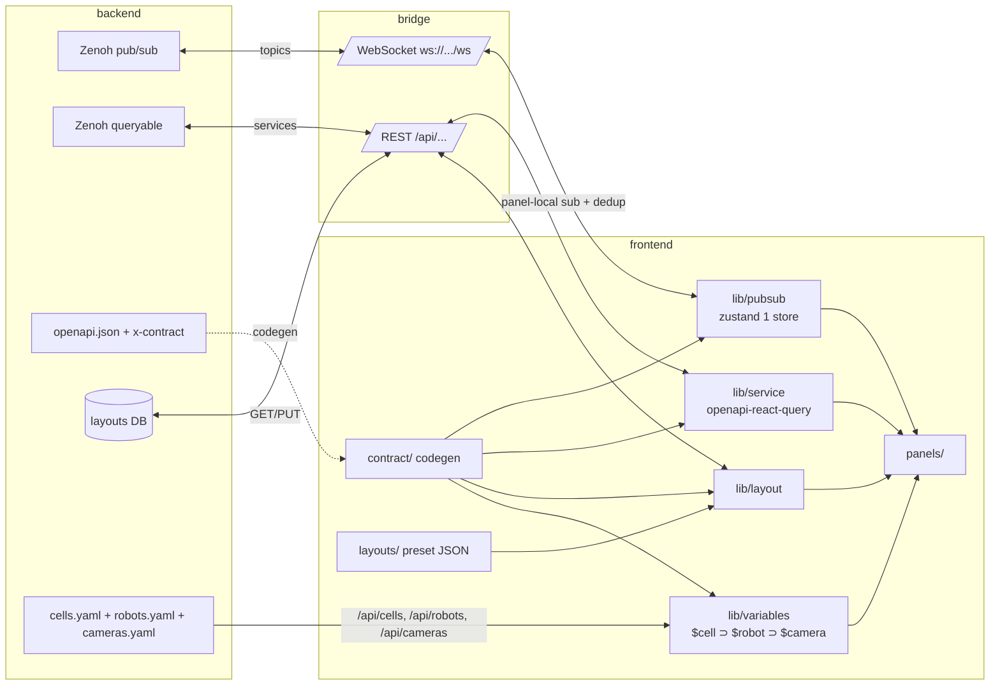

# Frontend Redesign Plan

기존 React 프론트의 *그때그때 추가된* 페이지/스토어/타입 구조를 산업 표준 패턴으로 재정렬하고, 동시에 multi-robot/multi-camera/협력 task 까지 자연스럽게 얹는 plan. backend 의 `api_contract` openapi codegen 완료가 trigger.

본 문서는 **아키텍처 재정의** 위주 — 단순 리팩토링이 아니라 *어떤 product 인가* 의 답. [multi_robot_phase2_frontend.md](multi_robot_phase2_frontend.md) 의 4 슬라이스 (§1 namespace / §2 페이지 / §3 멀티로봇 UX / §4 데이터 플로우) 통합 답.

> 이 문서는 **연속 논의 중** (2026-06-03). 결정된 자리와 open question 명확히 분리. §11 change log 참고.

---

## 0. TL;DR — 진짜 가치 1순위

**`새 entity 추가 시 frontend 코드 변경 0`**

이게 본 plan 의 *모든 결정* 이 향하는 곳:
- 새 robot 추가 → `robots.yaml` 1줄 + cell membership 1줄. frontend 코드 0
- 새 camera 추가 → `cameras.yaml` 1줄. frontend 코드 0
- 새 workcell 추가 → `cells.yaml` 1줄. frontend 코드 0
- 새 workflow / layout 추가 → JSON 1개. 코드 0 또는 panel 1개만
- 새 panel (정말 새 위젯) → 폴더 1개 + entry 1줄

→ 사용자 원칙 (SSOT + 비즈니스 로직만) 의 *applying*.

### 6대 결정 (TL;DR)

1. **Domain model = 4 entity** (workcell / robot / camera / task). workcell 이 컨테이너 (1급), camera 는 robot 종속 X (mounted 또는 fixed), task 는 cell 안 N robot 협력. [§1](#1-domain-model--4-entity)
2. **Layout = workflow-oriented** (동사: HandEyeCal / MotionTest / CellMonitor / CoopTask). entity 는 layout 에 주입되는 *변수*. *RobotLayout / CameraLayout* 같은 명사형 폐기. [§2](#2-workflow-model--layout이-동사)
3. **3D = Workcell3D 단일 panel + view mode** (highlight 가 layout config). 새 entity (AGV / conveyor) 들어와도 panel 추가 X. [§2.3](#23-workcell3d--단일-panel--view-mode)
4. **Topic/Service namespace = entity scope flat** (`omx/cell/<id>/...`, `omx/robot/<id>/...`, `omx/camera/<id>/...`, `omx/system/...`). [§4](#4-namespace)
5. **Pubsub layer = Flora 식 (zustand 1 store + declarative useTopics), Service layer = openapi-react-query** (typed RPC). control 시스템 비중 = service 7-8할. [§5](#5-data-flow--pubsub-service-layer)
6. **첫 화면 = Grafana 식 Home** (Recent / Favorite / Quick Start). entity-list page (`/robots`, `/cells`) 는 first-class entry 아님. [§3](#3-ux-entry-workflow-first)

---

## 1. Domain Model — 4 entity

연속 논의 (2026-06-03) 에서 도출. [project_three_entity_model](../) memory 와 동기 (파일명은 그대로지만 실제 4 entity).

```
World
└── Workcell (cell_id, 예: assembly_01)   ← 1급 컨테이너
    ├── Robots[]                         (omx_f_0, so101_0, ...)
    ├── Cameras[]                        mounted (robot link) OR fixed (cell world frame)
    ├── Objects[]                        동적 (detection 결과, bottle / gear / ...)
    ├── Fixtures[]                       정적 (table / conveyor, cell config)
    └── Coordinate frames                TF tree (world ↔ robot_base ↔ ee ↔ camera)
        ↑
   Task (cell 안에서 실행, N robot + M camera 조작, 협력 가능)
```

### 1.1 4 entity 의 분류

| Entity | 종류 | 정의 위치 | URL variable |
|---|---|---|---|
| Workcell | **config** | `cells.yaml` | `$cell` |
| Robot | **config** | `robots.yaml` (+ cell membership) | `$robot` |
| Camera | **config** | `cameras.yaml` (+ mount: robot/link 또는 cell/pose) | `$camera` |
| Fixture | **config** | cell config 안 | (variable 불필요, scene 자동) |
| Object | **runtime** | detection 결과로 publish | `$object` (현재 미사용) |
| Task | **runtime** | service `task/srv/run` → task_id | `$task` |
| Frame | **derived** | TF tree (robot pose + mount) | (자동) |

→ **config entity** = YAML SSOT + URL variable. **runtime entity** = backend 생성. **derived** = 계산.

### 1.2 cells.yaml 모델 (sketch)

```yaml
assembly_01:
  world_frame: world
  robots: [omx_f_0, so101_0]              # robots.yaml entry 참조
  cameras: [d405_omx_f_0, ceiling_cam_01] # cameras.yaml entry 참조
  fixtures:
    - { type: table, pose: [0, 0, 0, 0, 0, 0] }

# robots.yaml
omx_f_0:
  type: omx_f
  base_pose_in_cell: [0.3, 0.0, 0.0, 0, 0, 0]  # cell world frame 기준

# cameras.yaml (camera 가 robot mount 인지 cell fixed 인지)
d405_omx_f_0:
  type: d405
  mount: { type: link, robot: omx_f_0, link: end_effector, extrinsic: hand_eye.npz }
ceiling_cam_01:
  type: rgb
  mount: { type: cell_world, cell: assembly_01, pose: [...] }
```

→ Membership 은 *config SSOT*. namespace 안 nested X (§4 참고).

### 1.3 관계 데이터 — Hand-eye / Detector / PointCloud

| 관계 | 어디 표현 | 근거 |
|---|---|---|
| Hand-eye (robot ↔ camera) | **camera mount/extrinsic** (별도 토픽 X) | ROS2 식 — mounted camera 는 robot link 기준 extrinsic, fixed 는 cell world 기준 |
| Detector / perception | **camera scope** (input 기준) | 결과 좌표 frame 은 payload 명시 (`frame: "base_omx_f_0"`) |
| PointCloud live stream | **camera scope** (출처) | |
| PointCloud scan | camera scope + payload (`robot_id, joints`) | scan 시점 robot pose 묶음 |
| Multi-camera scene mesh | **cell scope** | N camera scan 합쳐 cell 좌표계 |

---

## 2. Workflow Model — Layout 이 *동사*

연속 논의에서 도출 (2026-06-03). 핵심 통찰: **Domain hierarchy ≠ UX entry point** (k8s 비유 — Cluster ⊃ Namespace ⊃ Pod 인데 사용자는 `kubectl get pods` 부터).

### 2.1 Layout = workflow (동사)

| Workflow | 분류 | 변수 필요 |
|---|---|---|
| `HandEyeCal` | 개발 | cell, robot, camera |
| `IntrinsicCal` | 개발 | cell, camera |
| `MotionTest` | 개발 | cell, robot |
| `TCPCal` | 개발 | cell, robot |
| `Teleop` | 개발 | cell, robot |
| `PickPlaceDebug` | 개발 | cell, robot |
| `CellMonitor` | 운영 | cell |
| `CoopTask` | 운영 | cell, task |
| `CollisionCheck` | 운영 | cell |
| `ProductionRun` | 운영 | cell, task |

→ **모두 동사형** (사용자가 *하는 일*). *RobotLayout / CameraLayout / TaskLayout* 같은 명사형은 자연 등장 X.

### 2.2 Variable cascading — `$cell ⊃ $robot ⊃ $camera`

namespace 가 이미 그 위계 (cell 이 robot/camera membership 정의) → variable 도 cascading. 사용자 혼란 방지.

```ts
cellPicker:    options = cells.yaml 전체
robotPicker:   options = $cell.robots          // cell 선택 시 후보 필터
cameraPicker:  options = $cell.cameras + $robot.cameras (mounted 인 경우)
taskPicker:    options = $cell 의 정의된 task templates
```

**N=1 시 implicit / N>1 시 explicit** (k8s default context 패턴):
- 현재 horibot: cell 1, robot 1, camera 1 → variable picker 안 보임 (auto-resolve)
- future N>1: picker 활성

### 2.3 Workcell3D = 단일 panel + view mode

연속 논의 핵심 결정 — *새 entity 들어올 때마다 새 panel 만들지 X*. Workcell3D 가 항상 있고, layout 이 *highlight mode* 만 다름.

```ts
// layout 의 panel config
{
  type: "workcell3d",
  config: {
    highlight: {
      mode: "robot",        // "robot" | "cell" | "cameras" | "object" | "trajectory"
      target: "$robot",     // variable substitute
    },
    show: {
      otherRobots: "ghost", // "ghost" | "hide" | "full"
      cameras: "frustum",   // "frustum" | "hide" | "full"
      objects: "auto",
      pointcloud: "live",
    },
  },
}
```

| Layout | Workcell3D config |
|---|---|
| `MotionTest` | `highlight=robot, otherRobots=ghost` |
| `HandEyeCal` | `highlight=robot+camera, otherRobots=ghost` |
| `CellMonitor` | `highlight=cell, otherRobots=full, cameras=frustum` |
| `CoopTask` | `highlight=cell, otherRobots=full` |

→ **새 entity (AGV / conveyor) 추가** = Workcell3D scene loader 가 cells.yaml 보고 자동 렌더. panel 코드 변경 0.

---

## 3. UX Entry — Workflow First

연속 논의 결정 — entity-list page (`/robots`, `/cells`) 는 first-class entry 아님. Grafana 식 Home.

```
/                → Home
                   ├─ Recent layouts (최근 연 5개)
                   ├─ Starred layouts (즐겨찾기)
                   └─ Quick Start
                      ├─ "Calibrate hand-eye"  → HandEyeCal
                      ├─ "Test motion"          → MotionTest
                      ├─ "Run pick & place"     → PickPlaceDebug
                      └─ "Monitor cell"         → CellMonitor

/d/<layout_uid>  → layout 진입 (variable picker 자동 표시, N=1 시 implicit)
/layouts         → 전체 list (workflow folder 별 — Dev/Ops 분류 가능)
/settings        → app config (entity admin 자리도 여기 아래)
```

→ 사용자 진입 멘탈 모델: "Hand-Eye 캘 하러 왔다" (workflow first) > "robot_a 보고 싶다" (entity first).

---

## 4. Namespace

Topic / service namespace = entity scope flat (ROS2 식). Membership 은 namespace 안 nested X, config 가 SSOT.

```
omx/cell/<cell_id>/...                ← cell 단위 state, 동적 object, task 호스팅
  state
  task/<task_id>/state                (task = cell 안 실행)
  task/<task_id>/tree
  task/<task_id>/step_result
  task/<task_id>/srv/stop|pause|...
  task/srv/run                        (creates task_id)
  object/<object_id>/pose             (동적 object, detection 결과)
  scene/srv/build_mesh                (multi-camera scan 합쳐 cell mesh)

omx/robot/<robot_id>/...              ← robot scope
  motor/state/joint
  motor/cmd/joint
  motor/srv/enable | set_profile | reboot | get_config | gripper | ...
  motion/state/trajectory
  motion/srv/move_j | move_l | move_c | move_p | move_tcp | get_tcp | stop
  calib/joint_offset/... | link_offset/... | sag/...   (robot 자체 캘)

omx/camera/<camera_id>/...            ← camera scope
  stream/raw | depth_frame
  state/status
  srv/set_depth_stream
  calib/intrinsic/... | mount/...     (intrinsic + extrinsic mount = hand-eye)
  detector/state | srv/detect
  perception/state/grounded | srv/grounded_detect
  pointcloud/stream | snapshot
  pointcloud/srv/configure | new_session | capture | list_* | delete_scan

omx/system/...                        ← global
  heartbeat
  log
  srv/node_status
```

### 4.1 현 토픽/서비스 분류표 (sketch, 다음 세션 검증)

| 현 위치 | 새 namespace | scope |
|---|---|---|
| `omx/motor/state/joint` | `omx/robot/<id>/motor/state/joint` | robot |
| `omx/motor/cmd/joint` | `omx/robot/<id>/motor/cmd/joint` | robot |
| `omx/camera/stream/raw` | `omx/camera/<id>/stream/raw` | camera |
| `omx/camera/state/status` | `omx/camera/<id>/state/status` | camera |
| `omx/camera/stream/depth_frame` | `omx/camera/<id>/stream/depth_frame` | camera |
| `omx/motion/state/trajectory` | `omx/robot/<id>/motion/state/trajectory` | robot |
| `omx/calibration/state/handeye_preview` | `omx/camera/<id>/mount/preview` | camera (mount = hand-eye) |
| `omx/detector/state` | `omx/camera/<id>/detector/state` | camera |
| `omx/perception/state/grounded` | `omx/camera/<id>/perception/state/grounded` | camera |
| `omx/pointcloud/stream` | `omx/camera/<id>/pointcloud/stream` | camera |
| `omx/pointcloud/snapshot` | `omx/camera/<id>/pointcloud/snapshot` | camera |
| `omx/pointcloud/state` | `omx/camera/<id>/pointcloud/state` | camera |
| `omx/system/heartbeat` | `omx/system/heartbeat` | global |
| `omx/system/log` | `omx/system/log` | global |
| `omx/task/state` | `omx/cell/<id>/task/<task_id>/state` | cell + task |
| `omx/task/tree` | `omx/cell/<id>/task/<task_id>/tree` | cell + task |
| `omx/task/step_result` | `omx/cell/<id>/task/<task_id>/step_result` | cell + task |
| `omx/motor/srv/*` (6개) | `omx/robot/<id>/motor/srv/*` | robot |
| `omx/camera/srv/set_depth_stream` | `omx/camera/<id>/srv/set_depth_stream` | camera |
| `omx/motion/srv/*` (7개) | `omx/robot/<id>/motion/srv/*` | robot |
| `omx/calib/srv/intrinsic/*` (2개) | `omx/camera/<id>/calib/intrinsic/*` | camera |
| `omx/calib/srv/handeye/*` (7개) | `omx/camera/<id>/mount/srv/*` | camera (mount = hand-eye) |
| `omx/calib/srv/capture` | `omx/camera/<id>/mount/srv/capture` | camera |
| `omx/detector/srv/detect` | `omx/camera/<id>/detector/srv/detect` | camera |
| `omx/perception/srv/grounded_detect` | `omx/camera/<id>/perception/srv/grounded_detect` | camera |
| `omx/pointcloud/srv/*` (8개) | `omx/camera/<id>/pointcloud/srv/*` | camera |
| `omx/task/srv/*` (9개) | `omx/cell/<id>/task/srv/*` (run) + `omx/cell/<id>/task/<task_id>/srv/*` (stop/pause/...) | cell + task |
| `omx/system/srv/node_status` | `omx/system/srv/node_status` | global |

→ 분류 검증 + cut-over 방식은 §10 open question.

---

## 5. Data Flow — Pubsub / Service Layer

연속 논의 핵심 통찰 — control 시스템에서 **service layer 가 7-8할** 비중. Flora MessagePipeline 은 viewer 편향 (재생/관측 위주, service 약함). 우리는 control + monitor 둘 다 first-class.

### 5.1 Pubsub layer (Flora 차용)

| 자리 | Flora 패턴 | 우리 적용 |
|---|---|---|
| State 관리 | zustand 1 중앙 store + subscriber 별 분배 ([store.ts](https://github.com/flora-suite/flora/blob/main/packages/suite-base/src/components/MessagePipeline/store.ts)) | 9 store + setter 보일러 폐기 |
| Subscribe | `useMessagesByTopic({ topics, historySize })` declarative panel-local ([useMessagesByTopic.ts](https://github.com/flora-suite/flora/blob/main/packages/suite-base/src/PanelAPI/useMessagesByTopic.ts)) | useBridge god hook 폐기 |
| Subscription dedup | `mergeSubscriptions()` — N panel 같은 토픽 → backend union 1번 ([subscriptions.ts](https://github.com/flora-suite/flora/blob/main/packages/suite-base/src/components/MessagePipeline/subscriptions.ts)) | network 효율 보존 |

### 5.2 Service layer (openapi-react-query)

control 시스템 *진짜 핵심*. MoveJ / MoveL / Gripper / Cal capture / Task run / PointCloud build — 사용자 명령 7-8할.

```ts
// layout 안 panel
function JointControlPanel() {
  const robot  = useVariable("robot");                            // $robot URL state
  const joints = useTopics([`omx/robot/${robot}/motor/state/joint`]);  // pubsub
  const moveJ  = useService("robot.motion.move_j", { robot });    // service (typed)
  return <JointPanelUI joints={joints} onMoveJ={(d) => moveJ.call(d)} />;
}
```

- endpoint 정의 코드 0 — `paths` openapi-typescript 산출물 자동완성
- backend openapi.json + `x-contract` SSOT → frontend hook 자동
- WebSocket pubsub 은 별개 layer (§5.1). HTTP/RPC service 만 이쪽

### 5.3 REST path = 3 entity 모델 정합

service path 가 entity scope 따라야 typed-from-URL 작동:

```
POST  /api/robot/{robotId}/motion/move_j
POST  /api/robot/{robotId}/motor/srv/enable
POST  /api/camera/{cameraId}/calib/intrinsic/start
POST  /api/camera/{cameraId}/pointcloud/capture
POST  /api/cell/{cellId}/task/run                  → returns {task_id}
POST  /api/cell/{cellId}/task/{taskId}/stop
GET   /api/cells                                   → cells.yaml
GET   /api/robots                                  → robots.yaml
GET   /api/cameras                                 → cameras.yaml
GET   /api/layouts                                 → layout list
GET   /api/layouts/{layoutUid}                     → layout JSON
PUT   /api/layouts/{layoutUid}                     → save
```

---

## 6. Target 아키텍처

### 6.1 폴더 구조

```
frontend/src/
├── contract/             # SSOT codegen 산출물 (이미 있음)
│   ├── topics.ts         # Topic / TopicPayloadMap
│   ├── services.ts       # ServiceKey / ServiceMap
│   └── paths.ts          # openapi-typescript paths
├── lib/
│   ├── pubsub/           # ★ Flora MessagePipeline 차용
│   │   ├── store.ts      # zustand 1 중앙 store
│   │   ├── provider.tsx  # MessagePipelineProvider (bridge ↔ store)
│   │   ├── useTopics.ts  # ★ panel-local declarative subscribe
│   │   └── subscriptions.ts  # merge dedup
│   ├── service/          # ★ openapi-react-query wrap
│   │   ├── client.ts     # createFetchClient + $api
│   │   └── useService.ts # bridge service call typed wrapper
│   ├── layout/           # Grafana JSON model
│   │   ├── schema.ts     # Layout / Panel / Variable types
│   │   ├── manager.ts    # load/save/list (server API)
│   │   └── useLayout.ts
│   ├── variables/        # ★ $cell, $robot, $camera, $task cascading
│   │   ├── store.ts
│   │   ├── url.ts        # ?var-X=Y URL sync
│   │   ├── cascade.ts    # picker option filtering
│   │   └── useVariable.ts
│   └── panel/            # PanelCatalog (Flora 식)
│       ├── catalog.ts    # PanelInfo[] registry (lazy load)
│       └── usePanelData.ts
├── panels/               # ★ 1st-class panels (workflow 보단 *재사용 단위*)
│   ├── Workcell3D/       # 단일 panel, view mode = layout config
│   ├── JointControl/
│   ├── MoveJ/ MoveL/ MoveC/ MoveP/ MoveTCP/
│   ├── CameraStream/
│   ├── Calibration/      # cal capture / commit (workflow 별 use)
│   ├── PointCloud/
│   ├── TaskMonitor/      # task progress / step debugger
│   ├── TaskTree/
│   ├── DetectionResults/
│   ├── SystemStatus/
│   └── ...
├── layouts/              # ★ workflow preset JSON (built-in)
│   ├── HandEyeCal.json
│   ├── IntrinsicCal.json
│   ├── MotionTest.json
│   ├── Teleop.json
│   ├── PickPlaceDebug.json
│   ├── CellMonitor.json
│   └── CoopTask.json
├── pages/
│   ├── Home.tsx          # / → Recent / Favorite / Quick Start
│   ├── DashboardLayout.tsx  # /d/:uid → layout 로드 + DockView
│   ├── LayoutList.tsx    # /layouts → 전체 list
│   └── SettingsLayout.tsx   # /settings
└── App.tsx               # Routes 4개
```

### 6.2 데이터 흐름



### 6.3 새 panel 작성 — 비즈니스 로직만

```ts
// panels/JointControl/index.tsx
export const panelInfo: PanelInfo = {
  type: "joint-control",
  title: "Joint Control",
  category: "robot",
  module: () => import("./Component"),
  configSchema: { /* zod */ },
};

// panels/JointControl/Component.tsx
export default function JointControlPanel({ config }: PanelProps) {
  const robot  = useVariable("robot");
  const joints = useTopics([`omx/robot/${robot}/motor/state/joint`]);
  const moveJ  = useService("robot.motion.move_j", { robot });
  return <JointPanelUI joints={joints} onMoveJ={moveJ.call} />;
}
```

→ panel 작성 시 코드 = 2 파일. store/dispatch/route/types 손작업 0.

### 6.4 Layout JSON (workflow-oriented)

```jsonc
// layouts/HandEyeCal.json
{
  "uid": "handeye-cal",
  "title": "Hand-Eye Calibration",
  "category": "dev",
  "description": "특정 robot 의 mounted camera 와 EE 간 변환 캘",
  "version": 1,
  "requires": ["cell", "robot", "camera"],
  "templating": [
    { "name": "cell",   "type": "cellPicker"   },
    { "name": "robot",  "type": "robotPicker",  "depends_on": "cell" },
    { "name": "camera", "type": "cameraPicker", "depends_on": ["cell", "robot"] }
  ],
  "panels": [
    { "id": "p1", "type": "workcell3d",   "grid": {"x":0,"y":0,"w":8,"h":8},
      "config": { "highlight": { "mode": "robot+camera", "target": ["$robot", "$camera"] },
                  "show": { "otherRobots": "ghost", "cameras": "frustum" } } },
    { "id": "p2", "type": "cameraStream", "grid": {"x":8,"y":0,"w":4,"h":4},
      "config": { "camera": "$camera" } },
    { "id": "p3", "type": "calibration",  "grid": {"x":8,"y":4,"w":4,"h":4},
      "config": { "type": "handeye", "robot": "$robot", "camera": "$camera" } },
    { "id": "p4", "type": "jointControl", "grid": {"x":0,"y":8,"w":8,"h":4},
      "config": { "robot": "$robot" } }
  ]
}
```

URL: `/d/handeye-cal?var-cell=assembly_01&var-robot=omx_f_0&var-camera=d405_omx_f_0`

(N=1 시 모든 var 생략 가능 — auto-resolve)

### 6.5 새 entity 추가 비용

| Entity 추가 | 비용 |
|---|---|
| **새 cell** | `cells.yaml` 1줄. frontend 코드 0 |
| **새 robot** (기존 type) | `robots.yaml` 1줄 + cell membership 1줄. frontend 코드 0 |
| **새 robot type** (예: UR5) | backend `MotorBackend` adapter (Phase 1 Protocol). frontend 코드 0 |
| **새 camera** | `cameras.yaml` 1줄 (mount 명시). frontend 코드 0 |
| **새 workflow** | `layouts/<Name>.json` 1개 (기존 panel 조합). frontend 코드 0 |
| **새 panel** (정말 새 위젯) | `panels/<X>/` 폴더 2 파일 (entry + Component) |

---

## 7. 사용자 페인포인트 ↔ 해결 매핑

| 페인포인트 | 해결 |
|---|---|
| store 보일러 9개 + setter 14개 | §5.1 Flora — zustand 1 store + subscriber 분배 |
| god hook (useBridge 무조건 sub) | §5.1 Flora — `useTopics()` panel-local |
| 페이지 6개 그때그때 | §2 — page-driven 폐기. Layout = workflow JSON |
| Dashboard 의미 X / Motion blind / Calibration 두 자리 | §2.3 / §6.4 — Workcell3D 단일 panel + workflow layout 별 highlight mode. preset 6-10 개 |
| URL 상태 없음 | §3 — Grafana 식 `/d/<uid>?var-...&from=...` |
| single robot 가정 | §2.2 — `$cell ⊃ $robot ⊃ $camera` cascading variable |
| multi-robot 동시 보기 | §1 — workcell 모델, Workcell3D 가 cell 안 다 그림 |
| 협력 task (병+뚜껑, 빨래 갬) | §1 — task 가 cell 안 N robot 조작. CoopTask layout |
| Fixed camera (천장/벽) | §1 — camera mount = cell_world. 별도 모델 X |
| SSOT 분산 | §0 — backend openapi + cells/robots/cameras.yaml + layouts DB |
| types 손작업 | 이미 openapi codegen 완료 (commit `648d37f`, `645d3ae`) |
| ad-hoc 우회 | §5 — 모든 토픽 동일 패턴, calibration 도 `useService` 통합 |
| service layer 약함 | §5.2 — openapi-react-query, control 시스템 7-8할 비중 인지 |

---

## 8. 분류 의식 — Flora 한계

[project_horibot_is_inhouse_web](../) memory.

| 자리 | Flora (desktop first) | 우리 (inhouse web) |
|---|---|---|
| Layout 저장 | localStorage / 파일 | **서버 DB** |
| Active source/robot | `selectedSource?` singular | **per-client** URL state |
| 새로고침/북마크 | layout 만 살아있으면 OK | **URL 에 상태** |
| 동시 user | 1 PC = 1 user | **N user**, 권한 (옵션) |
| Panel | extension install | **admin-controlled** |
| **Service 비중** | **viewer 편향** (재생/관측, service 약함) | **control + monitor 둘 다 first-class** |

→ Flora 의 *순수 client-side 패턴* (zustand store / declarative hook / panel lazy catalog) 은 차용. service layer 는 별도 (openapi-react-query). layout 저장 / variable / multi-user 는 Grafana 식.

---

## 9. 마이그레이션 phase (제안)

선행 phase 가 후행 인프라 → 순서 강제.

### Phase A. 인프라 layer (foundation, 1-2 주)
- `lib/pubsub/` (Flora MessagePipeline 차용)
- `lib/service/` (openapi-react-query)
- `lib/panel/` (PanelCatalog)
- 기존 9 store + useBridge 유지 (동시 동작). 새 panel 부터 신 인프라

### Phase B. namespace 마이그레이션 (1-2 주)
- backend topic_map.py → 4 entity scope (§4.1 분류표 cut-over)
- §10 open question #6 결정 (한 번에 vs backward compat dual publish)
- camera 분리 (현 motor/camera 통합 → robot/camera 분리)

### Phase C. panel 추출 + Workcell3D 통합 (2-3 주)
- 기존 페이지 컴포넌트 → `panels/<Name>/` 이전
- 각 panel 이 신 인프라 (`useTopics` / `useService` / `useVariable`)
- Workcell3D 단일 panel + view mode API
- 기존 페이지 = panel wrapper (route 유지, 점진)

### Phase D. Layout + Variable + URL (2주)
- `lib/layout/` (Grafana JSON model)
- backend `/api/layouts` (DB 저장)
- `lib/variables/` ($cell/$robot/$camera/$task cascading)
- Built-in preset layout (HandEyeCal / MotionTest / CellMonitor / ...) 4-6개
- `/d/:uid` route + URL state (`?var-*`)

### Phase E. UX Entry 재구성 (1주)
- `/` → Home (Recent / Favorite / Quick Start)
- `/layouts` → workflow folder list
- 기존 page route deprecated → `/d/:uid` redirect

### Phase F. cleanup (1주)
- 기존 9 store + useBridge + 6 페이지 delete
- 손작업 type 제거
- 문서화 (panel / layout / variable 작성 가이드)

각 phase 끝 기존 동작 보장. 한 번에 갈아엎기 X.

---

## 10. Open Question — 결정 필요

연속 논의에서 답 도출된 자리는 제거, 새로 생긴 자리 추가.

### 답 도출됨 (제거)
- ~~3D scene 좌표계~~ → §2.3 Workcell3D + cell world frame 공유
- ~~Mixed view UX~~ → §2.3 highlight mode (layout config)
- ~~페이지 책임~~ → §2 workflow-oriented layout

### 남은 자리 + 새로 생긴 자리

1. **Topic namespace cut-over** (§9 Phase B) — 한 번에 vs backward compat dual publish? 어떤 client 가 깨질지?
2. **Layout 동시 편집** (다중 user) — Grafana 식 last-writer-wins + `version` 충돌 감지? lock?
3. **권한 / multi-user** — 누가 layout 편집? 누가 robot 조작? org/role 도입? 단순 LAN 신뢰?
4. **Layout namespace** — user 별 / org 공유 / cell 별? Grafana folder 구조 차용?
5. **Preset layout 구체** — HandEyeCal / MotionTest / ... 의 정확한 panel + grid 결정
6. **bridge ↔ pubsub Player adapter** — Flora 의 `Player` 추상화 어떻게 우리 Zenoh WebSocket bridge 와 매핑?
7. **개발 / 운영 workflow 분리** — folder/tag? mode toggle? 분리 X? (지금은 분리 X 직감)
8. **Workcell3D highlight mode 깊이** — `robot / cell / cameras / object / trajectory` 4-5개 충분? 더 세분 시 config 자유 vs 별도 panel?
9. **Layout metadata 어디** — layout JSON 안 (Grafana 식, SSOT) vs 별도 catalog vs hybrid?
10. **Workflow first-class concept** — workflow = (layout + variable bindings + actions) 정의? 또는 layout 만으로 충분?
11. **camera 의 robot mount 매핑 detail** — D405 가 EE link 에 어떻게 부착되는지 (TF) 정확한 spec
12. **runtime entity (Object) 의 publish 모델** — detection 결과가 `omx/cell/<id>/object/<object_id>/pose` 로 publish? 어떤 id 부여?

---

## 11. Change Log

본 문서가 *연속 논의 중* 이라 변경이 누적. 다음 세션에서 진입 시 빠른 파악용.

### v1 (초안) — 2026-06-03 (1차)
- Flora pubsub + Grafana layout + openapi-react-query 차용 결정
- 3 entity 가정 (robot / camera / task) — 부정확, v2 에서 보정
- multi-robot = `$robot` variable
- Layout 예시 = `default-monitor` (cell 모니터 1개)
- Open Q 8개

### v2 (현재) — 2026-06-03 (2차, 본 버전)
연속 논의 결과 반영:
- **Domain model** → 4 entity (workcell / robot / camera / task). workcell 1급 컨테이너 (§1)
- **Layout** → workflow-oriented (동사: HandEyeCal / MotionTest / CellMonitor / CoopTask). entity 는 변수 (§2)
- **Workcell3D** → 단일 panel + view mode (highlight = layout config). 새 entity 추가 시 panel 코드 0 (§2.3)
- **Variable cascading** → `$cell ⊃ $robot ⊃ $camera`. N=1 시 implicit (§2.2)
- **UX entry** → Grafana 식 Home (Recent / Favorite / Quick Start). entity-list page first-class X (§3)
- **Namespace** → 4 entity scope flat (cell/robot/camera/system). hand-eye = camera mount extrinsic, 별도 토픽 X (§4)
- **Service layer 비중 격상** — control 시스템 7-8할. Flora viewer 편향 인지 (§5)
- **REST path** = 3 entity 모델 정합 (§5.3)
- **분류표** — 35+ 토픽/서비스 새 namespace 매핑 sketch (§4.1)
- **Phase B 추가** — namespace 마이그레이션 별 phase (§9)
- **Open Q** — 답 도출 자리 제거 + 새 자리 추가 (§10)
- **§0 TL;DR** 재배치 — "new entity = code 0" 1순위

### 다음 세션 진입 가이드 (review point)

사용자가 *문서 review* 시 핵심 검증 자리:
- **§0 6대 결정** — 동의/이의?
- **§1 4 entity 모델** — workcell entity 도입 동의?
- **§2 workflow-oriented Layout** — 동사형 layout + Workcell3D 단일 panel 동의?
- **§3 UX entry** — Grafana 식 Home (entity-list X) 동의?
- **§4.1 namespace 분류표** — 35+ 항목 검증, 특히 calibration/perception/pointcloud
- **§10 Open Q** 12개 — 우선순위, 추가 의문

review 후 *방향 fix* 되면 Phase A 부터 코드 작업 진입.

---

## 12. 참고

- Flora repo: <https://github.com/flora-suite/flora> (Foxglove Studio → Lichtblick → Flora 계보, MPL-2.0)
- Grafana dashboard JSON: <https://grafana.com/docs/grafana/latest/dashboards/build-dashboards/view-dashboard-json-model/>
- Grafana variables: <https://grafana.com/docs/grafana/latest/dashboards/variables/add-template-variables/>
- openapi-react-query: <https://openapi-ts.dev/openapi-react-query/>
- [multi_robot_phase2_frontend.md](multi_robot_phase2_frontend.md) — 본 plan 이 답한 4 슬라이스 entry point
- [multi_robot_architecture.md](multi_robot_architecture.md) — backend Phase 1 foundation
- [project_horibot_is_inhouse_web](../) memory — 우리 product 분류
- [project_three_entity_model](../) memory — 4 entity (파일명은 three 유지)
