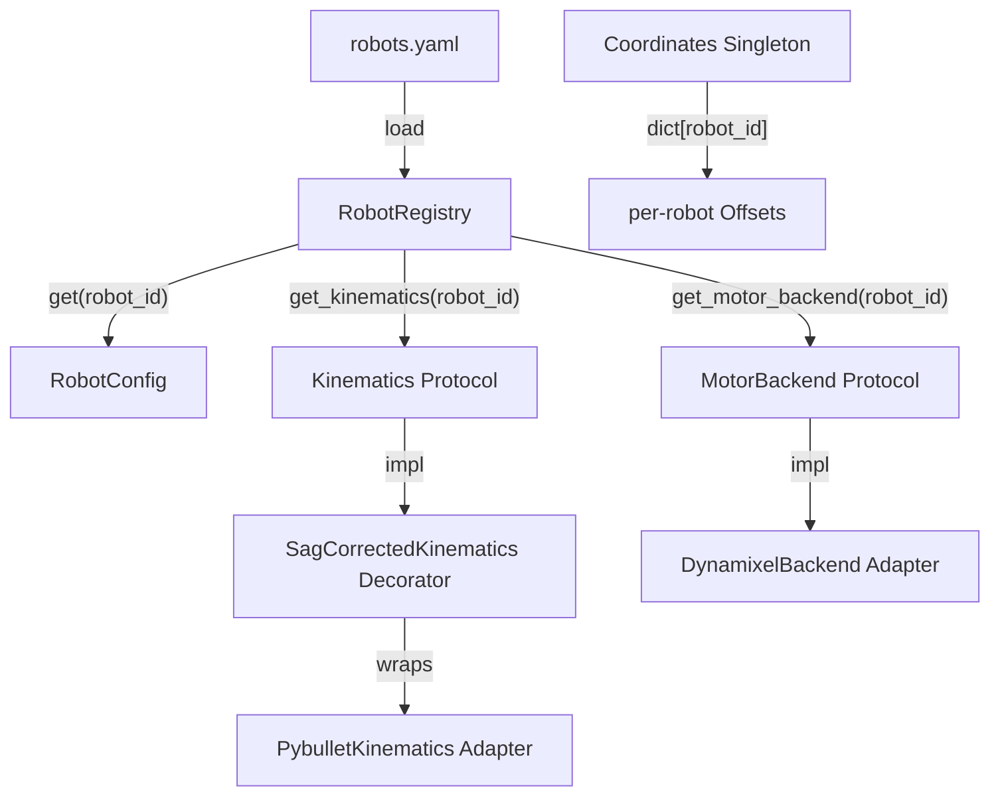
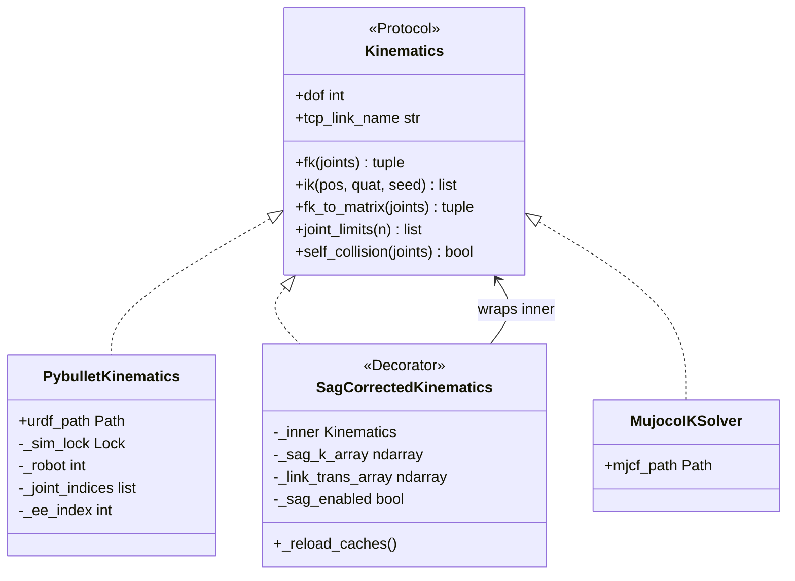
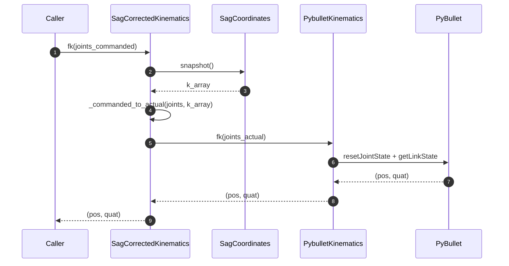
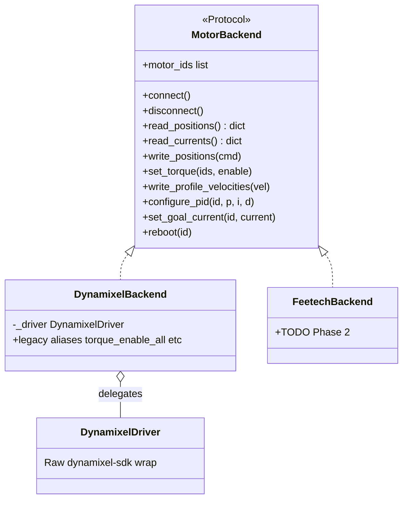
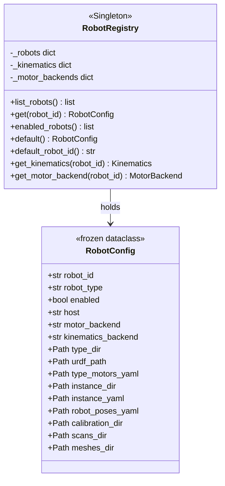
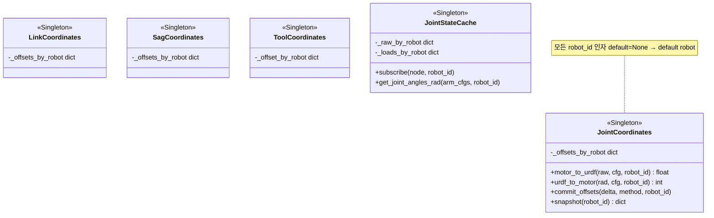
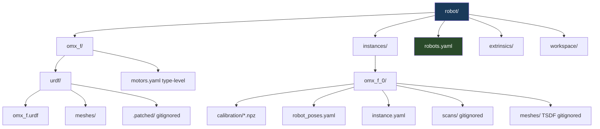
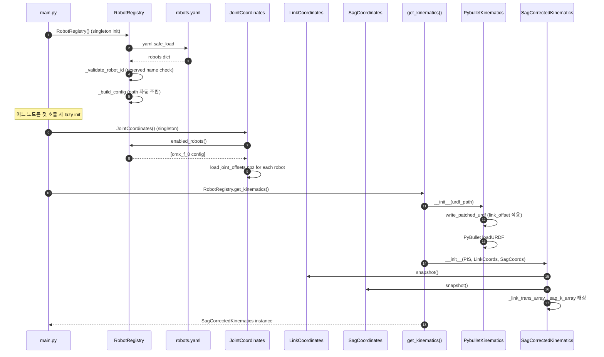
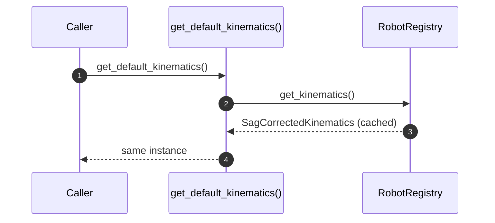
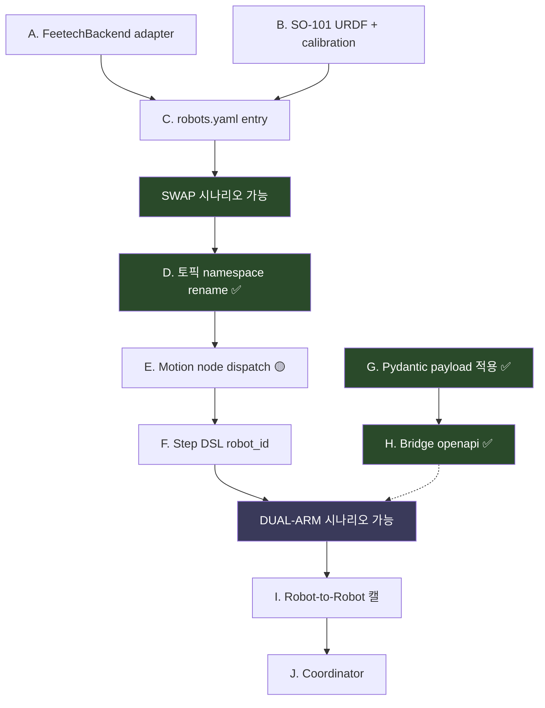

# Multi-Robot Architecture — Walkthrough

> 2026-06-01 Phase 1 (foundation) 완성. 이 문서는 그 결과물 + 설계 결정 + 남은
> 작업을 **공부용 + 다음 세션 follow-up 용** 으로 풀어 둠.
>
> Design 원본은 [multi_robot_architecture.md](multi_robot_architecture.md) (긴 design doc).
> 본 문서는 **"코드 보면서 따라가기"** 관점에서 재정리. step_dsl.md 와 같은 스타일.
>
> **2026-06-15 업데이트** — 본 문서의 `.patched/` 디렉토리 / `write_patched_urdf` 언급은 *historical* (Phase 1 시점 기록). storage_node 도입 후 `.patched/` 디스크 영속화 폐기, in-memory `patch_urdf_text` + tempfile 1회성 패턴으로 교체 ([storage_layer.md §13](storage_layer.md)).

## 한 줄

"OMX 하나만" 라는 대전제가 깨졌으니, **robot 종류 / 대수에 무관한 코드**로 재구성.
Hexagonal Architecture 의 Adapter / Strategy / DIP 패턴 적용 (단 layer 강제 /
DTO / DI container 같은 무거운 부속은 안 박음). LeRobot 의 type/instance 패턴
차용.

---

## 0. Before / After — 한 눈에 차이

### Before (OMX single robot 가정)

```
robot/
├── urdf/omx_f/omx_f.urdf
├── calibration/*.npz          # 7 종
├── config/motors.yaml
└── models/mesh_*.ply
```

```python
# 코드 곳곳에 hardcoded path
JOINT_OFFSETS_PATH = Path(__file__).parents[2] / "robot" / "calibration" / "joint_offsets.npz"
URDF_PATH          = Path(__file__).parents[3] / "robot" / "urdf" / "omx_f" / "omx_f.urdf"

# Hardware 가 곳곳에 박힘
from modules.motor.adapters.dynamixel_driver import DynamixelDriver
solver = get_default_kinematics()   # singleton, sag 코드도 안에 박힘
driver = DynamixelDriver(port, motors)
```

문제:
- robot 추가 → 모든 hardcoded path 수정
- "PyBullet → MuJoCo" / "Dynamixel → Feetech" swap 불가
- sag / link_offset / 캘 적용이 한 클래스 (`Kinematics`) 안에 다 박힘 → 재사용성 0

### After (N-robot 가정 + Protocol/Adapter)

```
robot/
├── omx_f/                          # robot TYPE (URDF + 공통 motor spec)
│   ├── urdf/{omx_f.urdf, meshes/, .patched/}
│   └── motors.yaml
├── instances/
│   └── omx_f_0/                    # robot INSTANCE (캘 + port + scans)
│       ├── calibration/*.npz
│       ├── robot_poses.yaml
│       ├── instance.yaml           # USB port, baud
│       ├── scans/                  # gitignored
│       └── meshes/                 # gitignored TSDF outputs
└── robots.yaml                     # ★ registry — 모든 robot list
```

```python
# 모든 path 가 RobotRegistry 경유
cfg = RobotRegistry().default()     # → RobotConfig (모든 path)
solver = RobotRegistry().get_kinematics()   # → SagCorrectedKinematics
backend = RobotRegistry().get_motor_backend()  # → DynamixelBackend

# Protocol 만 의존 — adapter swap 가능
def some_func(solver: Kinematics):  # PybulletKinematics / MujocoIKSolver 다 OK
    pos, quat = solver.fk(joints)
```

차이:
- robot 추가 = `robots.yaml` 에 entry + adapter (필요 시)
- hardware swap = adapter 교체 (Protocol 만족하면)
- sag 보정이 Decorator 로 분리 → ideal kinematics 와 sag 가 독립 unit test

---

## 1. 핵심 컨셉 6가지



| 컨셉 | 코드 위치 | 역할 |
|---|---|---|
| **`robots.yaml`** | [robot/robots.yaml](../robot/robots.yaml) | 모든 robot instance 선언. registry 의 source of truth |
| **`RobotRegistry`** | [core/robot_registry.py](../backend/core/robot/robot_registry.py) | yaml 싱글톤 + `RobotConfig` 조립 + factory (`get_kinematics` / `get_motor_backend`) |
| **`RobotConfig`** | 같은 파일 | frozen dataclass — robot 1개의 모든 path / 설정 |
| **`Kinematics` Protocol** | [modules/kinematics/kinematics.py](../backend/modules/kinematics/kinematics.py) | fk / ik / fk_to_matrix / joint_limits 의 통합 인터페이스 |
| **`MotorBackend` Protocol** | [modules/motor/backend.py](../backend/modules/motor/backend.py) | Dynamixel / Feetech SDK 의 통합 인터페이스 |
| **`CameraCapture`** | [modules/camera/capture.py](../backend/modules/camera/capture.py) | Protocol — RealSense / MuJoCo / USB 카메라의 통합 인터페이스. 구현체는 [adapters/realsense_capture.py](../backend/modules/camera/adapters/realsense_capture.py) (`RealsenseCapture`), raw SDK wrap 은 [adapters/realsense_driver.py](../backend/modules/camera/adapters/realsense_driver.py) (`RealsenseDriver`) |

---

## 2. 클래스 다이어그램

### 2.1 Kinematics 체인 (가장 중요)



**호출 순서** (`solver.fk(joints)` 호출 시):



### 2.2 MotorBackend



### 2.3 RobotRegistry — 중심점



### 2.4 Coordinates — robot_id-aware singleton



---

## 3. 폴더 구조 다이어그램



**Type-level (공통)** vs **Instance-level (개체별)**:

| Type-level (`robot/<robot_type>/`) | Instance-level (`robot/instances/<robot_id>/`) |
|---|---|
| URDF (디자인 도면 — 같은 type 의 모든 instance 가 공유) | calibration npz 7종 (개체 캘) |
| `motors.yaml` (motor ID / joint limit / gear ratio / model / PID) | `instance.yaml` (USB port / baud) |
| mesh STL 파일 (URDF 가 참조) | `robot_poses.yaml` (home / rest / search_*) |
| `.patched/` (link_offset 적용된 URDF cache) | `scans/` + `meshes/` (TSDF 산출물) |

---

## 4. 코드 파일 지도

### 4.1 Phase 1 에 신규 / 갱신된 파일

| 파일 | 종류 | 역할 |
|---|---|---|
| [robot/robots.yaml](../robot/robots.yaml) | 신규 | robot instance registry |
| [robot/omx_f/motors.yaml](../robot/omx_f/motors.yaml) | 이동+split | type-level motor spec (port 제외) |
| [robot/instances/omx_f_0/instance.yaml](../robot/instances/omx_f_0/instance.yaml) | 신규 | instance-level (USB port / baud) |
| [core/robot_registry.py](../backend/core/robot/robot_registry.py) | 신규 | `RobotRegistry` 싱글톤 + factory |
| [core/joint_coordinates.py](../backend/core/coords/joint_coordinates.py) | 갱신 | dict[robot_id] 화 |
| [core/link_coordinates.py](../backend/core/coords/link_coordinates.py) | 갱신 | dict[robot_id] 화 |
| [core/sag_coordinates.py](../backend/core/coords/sag_coordinates.py) | 갱신 | dict[robot_id] 화 |
| [core/tool_coordinates.py](../backend/core/coords/tool_coordinates.py) | 갱신 | dict[robot_id] 화 |
| [core/joint_state_cache.py](../backend/core/cache/joint_state_cache.py) | 갱신 | dict[robot_id] state |
| [core/messages/__init__.py](../backend/core/transport/messages/__init__.py) | 신규 | Pydantic typed payload 패키지 |
| [core/messages/base.py](../backend/core/transport/messages/base.py) | 신규 | `StrictModel` / `EmptyData` / `ServiceRequest[T]` / `ServiceResponse[T]` |
| [modules/kinematics/kinematics.py](../backend/modules/kinematics/kinematics.py) | 신규 | `Kinematics` Protocol + exceptions |
| [modules/kinematics/adapters/pybullet_kinematics.py](../backend/modules/kinematics/adapters/pybullet_kinematics.py) | 신규 | `PybulletKinematics` (ideal only) |
| [modules/kinematics/adapters/sag_corrected.py](../backend/modules/kinematics/adapters/sag_corrected.py) | 신규 | `SagCorrectedKinematics` Decorator |
| [modules/kinematics/registry.py](../backend/modules/kinematics/registry.py) | 갱신 | `get_default_kinematics()` facade — Registry.get_kinematics() 위임 |
| [modules/motor/backend.py](../backend/modules/motor/backend.py) | 신규 | `MotorBackend` Protocol |
| [modules/motor/adapters/dynamixel_backend.py](../backend/modules/motor/adapters/dynamixel_backend.py) | 신규 | `DynamixelBackend` (Protocol + legacy aliases) |
| [modules/camera/capture.py](../backend/modules/camera/capture.py) | 갱신 | `CameraCapture` Protocol + dataclasses (구현체는 `adapters/realsense_capture.py` 의 `RealsenseCapture`, raw SDK wrap 은 `adapters/realsense_driver.py` 의 `RealsenseDriver`) |

### 4.2 Phase 1 에 path 만 갱신된 파일 (caller)

`RobotRegistry` 경유로 path 가져오게 갱신:

- [main.py](../backend/main.py) — intrinsic seed path
- [modules/calibration/loader.py](../backend/modules/calibration/loader.py) — `_calib_dir()` 함수
- [modules/motor/motor_config.py](../backend/modules/motor/motor_config.py) — `load_motor_config(robot_id)` split load
- [modules/pointcloud/scan_io.py](../backend/modules/pointcloud/scan_io.py) — `_scans_dir()` / `meshes_dir()` / `_calib_dir()`
- [nodes/application/calibration_node.py](../backend/nodes/application/calibration_node.py) — `_save_dir()` / `_handeye_poses_path()`
- [nodes/application/pointcloud_node.py](../backend/nodes/application/pointcloud_node.py) — `scan_io.meshes_dir()` / `scan_io.robot_root()`
- [nodes/device/motor_node.py](../backend/nodes/device/motor_node.py) — `DynamixelBackend` 사용

---

## 5. 부팅 시 흐름



`get_default_kinematics()` 호출 시 (backward compat facade):



---

## 6. 핵심 설계 결정 + 근거

### 6.1 왜 type/instance 분리?

**Research 근거**: [LeRobot](https://github.com/huggingface/lerobot/tree/main/src/lerobot/robots) 의
`<calibration_root>/<robot_type>/<robot_id>.json` 패턴.

**자료 boundary 가 자연스러움**:

| 변경 빈도 | 변경 trigger | 어디 | git tracked? |
|---|---|---|---|
| 거의 안 변함 | 새 robot type 출시 | `robot/<robot_type>/` | ✓ URDF / mesh |
| 캘 commit 시 | 캘 절차 | `robot/instances/<robot_id>/calibration/` | ✓ npz |
| 런타임 매번 | scan / TSDF 산출 | `robot/instances/<robot_id>/scans|meshes/` | ✗ gitignored |

같은 type 의 robot 이 N대 (`omx_f_0`, `omx_f_1`) 되면 URDF 자동 공유.

### 6.2 왜 Decorator 로 sag 분리?

기존 `Kinematics` 안에 fk → sag → pybullet → sag-inverse → return 다 박혀있어서:
- inner kinematics 만 단독 테스트 불가
- MuJoCo 로 swap 시 sag 코드 복붙

Decorator 로 분리하면:
- `PybulletKinematics` = ideal URDF kinematics (테스트 단독 가능)
- `SagCorrectedKinematics` = sag 보정 (어떤 inner 든 wrap)
- 미래 다른 보정 (thermal drift 등) → 새 Decorator 한 layer 더

### 6.3 왜 Pydantic v2 (Protobuf 아닌)?

**Research 근거**: ROS 2 의 rosidl IDL+codegen / FastAPI+Pydantic / LeRobot dict+schema /
Drake LCM (실패 신호) 비교 (multi_robot_architecture.md §1.2.1).

- 우리 backend 1 + frontend 1 언어 — Protobuf 다국어 codegen ROI 낮음
- Bridge 가 이미 FastAPI — Pydantic auto OpenAPI emission
- Pyright 와 native (static + runtime validation)
- LeRobot 검증: config typed + payload dict 의 hybrid 도 OK

도구: Pydantic v2 + `openapi-typescript` codegen.

### 6.4 왜 토픽 namespace `<robot_id>/<domain>/...`?

ROS 2 multi-robot namespace 표준 + Zenoh wildcard subscribe 와 자연.
한 robot 만 구독 시 `omx_f_0/**` → traffic 자체가 안 옴 (payload 필터링 X).

단 reserved domain (`system`, `task`, `coord`, `viz`, `cameras`) 는 robot_id 로 사용 금지.
이건 RobotRegistry load 시 validation 으로 강제.

---

## 7. Phase 1 무엇이 끝났는가 — 코드 읽기 가이드

각 작업이 어떤 commit 으로 끝났는지 + 어떤 파일을 읽으면 이해 가능한지:

| 작업 | commit | 핵심 파일 | 읽어볼 것 |
|---|---|---|---|
| **폴더 type/instance split** | `592bf52` | `robot/` 전체 | `git show 592bf52 --stat` 으로 mv 목록 |
| **RobotRegistry** | `592bf52` | `core/robot_registry.py` | `_validate_robot_id` / `_build_config` / `enabled_robots` |
| **Kinematics Protocol** | `5bfbe72` | `modules/kinematics/kinematics.py` | Protocol 메서드 6개 + exception 2종 |
| **PybulletKinematics adapter** | `5bfbe72` | `modules/kinematics/adapters/pybullet_kinematics.py` | sag 코드가 *없음* 에 주목 |
| **SagCorrectedKinematics Decorator** | `5bfbe72` | `modules/kinematics/adapters/sag_corrected.py` | `_commanded_to_actual` / `_actual_to_commanded` 양방향 |
| **MotorBackend Protocol + Adapter** | `8fd77ab` | `modules/motor/{backend.py, adapters/dynamixel_backend.py}` | DynamixelBackend 의 legacy aliases 가 caller backward compat |
| **CameraCapture Protocol** | `5ec460f` | `modules/camera/capture.py` | `CameraCaptureProtocol` + dataclass + 기존 class 가 Protocol 만족 (후속 commit: Protocol 이름 `CameraCapture` 회수 + impl `RealSenseCapture` 로 rename + `adapters/realsense.py` 분리) |
| **Coordinates dict[robot_id]** | `e8f75ea` | `core/{joint,link,sag,tool}_coordinates.py`, `joint_state_cache.py` | 모든 메서드의 `robot_id=None` kwarg pattern |
| **Registry factory** | `6d95551` | `core/robot_registry.py` | `get_kinematics` / `get_motor_backend` + `_build_*` lazy import |
| **Kinematics facade 단순화** | `6d95551` | `modules/kinematics/registry.py` | 50줄 → 15줄 |
| **Pydantic infra scaffolding** | `b207246` | `core/messages/base.py` | `StrictModel` + `ServiceRequest[T]` / `ServiceResponse[T]` generic |

**한 줄 학습 path**:

1. `git show <commit> --stat` 로 변경 파일 보기
2. 핵심 파일 1-2개 읽기
3. 의문점 있으면 다음 commit 으로 — 누적 학습

---

## 8. Phase 2 (SO-101 도착 시) 남은 작업 — follow-up 가이드

Phase 1 에서 deferred 된 작업들. 노드 ownership taxonomy + multi-robot dispatch 인프라가 다 미리 완성됨 (D / E / G / H / main.py yaml schema / FrameCache dict[robot_id] / Detector/PointCloud/Calibration SYSTEM 화). SO-101 도착 시점에는 hardware 의존 자리 (A / B / C / I) 와 Step DSL robot_id (F) 만 남음.

### Node ownership taxonomy (2026-06-08 결정)

분산 architecture 에서 노드를 두 범주로 분류:

| Node | Layer | 이유 |
|---|---|---|
| motor / motion / camera | **Device** | vendor-shipped (UR Control Box 등가물). hardware 직결 (USB). 한 프로세스가 두 머신 USB 못 잡음 → robot 마다 인스턴스 필연 |
| detector / pointcloud / calibration / task / gamepad | **Application** | robot driver 위 algorithm / orchestration / UI. 한 인스턴스가 `dict[robot_id]` 로 multi-robot dispatch — YOLO / Open3D 모델 메모리 1번 |
| bridge | — | 노드 아님 (main.py `bridge.enabled` 별도) |

layer 판정은 클래스 계층이 SSOT — `DeviceNode` / `ApplicationNode` 상속. [node_registry.py](../backend/core/transport/node_registry.py) 는 `NodeSpec(module, cls_name)` 만 lazy-import 위해 보유, layer metadata 없음. main.py 가 host config 의 `robots:` / `device_nodes:` / `application_nodes:` 보고 `issubclass` 로 위치 검증 + 인스턴스화:
- Device: `robots × device_nodes` 데카르트곱 인스턴스
- Application: 한 인스턴스, 내부에서 `enabled_robots()` loop 으로 robot 별 service 등록

이전 walkthrough 의 *"모든 노드가 robot-scoped 인스턴스"* 가정은 outdated.

### 8.1 작업 단위별 영향 받는 파일 / 핵심 변경

| 작업 | 상태 | 영향 받는 파일 | 핵심 변경 | 어떻게 follow |
|---|---|---|---|---|
| **A. FeetechBackend adapter** | ⏳ pending (so101 의존) | `modules/motor/adapters/feetech_backend.py` (신규) | `DynamixelBackend` 와 같은 패턴 — Protocol 만족 + STS3215/3250 model 별 분기 | DynamixelBackend 와 side-by-side diff |
| **B. SO-101 URDF + calibration** | ⏳ pending (hardware 의존) | `robot/so101_6dof/urdf/` (신규) + `robot/instances/so101_6dof_0/calibration/*.npz` | URDF 배치 + 캘 절차 돌려 npz 생성 | so101_6dof_plan.md §6.2 |
| **C. robots.yaml entry** | ⏳ pending (so101 enabled 시점) | `robot/robots.yaml` (1줄 추가) | `so101_6dof_0` entry + `enabled: true` | yaml diff 만 보면 됨 |
| **D. 토픽 namespace rename** | ✅ **done** (commit `2270eba`) | `core/topic_map.py` + 모든 publish/subscribe caller | `horibot/{robot_id}/...` template + `BaseNode.r()` helper + `topic_for()`. 자세한 결정문은 [multi_robot_phase2_frontend.md §1](multi_robot_phase2_frontend.md) | topic_map.py 보면 끝 |
| **+ FrameCache `dict[robot_id]`** | ✅ **done** (commit `2270eba`) | `core/cache/frame_cache.py` | `_latest_jpeg_by_robot: dict[str, bytes]` + per-robot subscribe. `JointStateCache` 와 동형 | frame_cache.py 보면 끝 |
| **+ Node taxonomy (Device / Application 2-layer)** | ✅ **done** | `core/transport/{device_node,application_node,node_registry}.py` + `nodes/device/` + `nodes/application/` 폴더 split | `DeviceNode` / `ApplicationNode` base 도입 — vendor-shipped vs application layer 명시. Application 노드 한 인스턴스 + `dict[robot_id]` dispatch + `enabled_robots()` loop service 등록. layer 판정은 `issubclass` SSOT, `NodeSpec` 은 lazy-import 컨테이너만 | device_node.py / application_node.py + 각 application 노드 `__init__` |
| **+ main.py host config schema** | ✅ **done** | `backend/main.py` + host config 5개 | `robots:` / `device_nodes:` / `application_nodes:` 분리 + `issubclass` 위치 검증 + `robots × device_nodes` 데카르트곱 인스턴스 + application_nodes 1번씩 | main.py + host_dev/mock/pc/pi_motor/pi_camera.yaml |
| **+ load_calibration(robot_id) + scan_io robot_id** | ✅ **done** (이번 세션) | `modules/calibration/loader.py` + `modules/pointcloud/scan_io.py` + `modules/pointcloud/tsdf_builder.py` | robot_id 인자 강제. caller 다 명시화 | 각 모듈 시그니처 |
| **+ bridge `/robots/{id}/calibration/results`** | ✅ **done** (이번 세션) | `bridge/calibration_router.py` + frontend `useCalibrationResults(robotId)` | endpoint path 에 robot_id + 4 frontend caller (Container / HandEyeTab / RobotStatePanel / CalibrationPanel) 갱신 | router 파일 + hook 시그니처 |
| **E. Motion node robot_id dispatch** | ✅ **done** (commit `2270eba` 가 인스턴스화 모델 도입; 같은 머신 multi-instance 는 main.py 데카르트곱이 자연 처리) | `nodes/device/motion_node.py` | `MotionNode(robot_id=...)` 인스턴스 단위 — main.py 가 robots × device_nodes 데카르트곱으로 multi-instance 인스턴스화 | main.py + motion_node.py |
| **F. Step DSL robot_id field** | ⏳ pending (task multi-robot 운영 시) | `modules/task/{step.py, steps.py, recipes.py}` | Step base 에 `robot_id` field + primitives 갱신 (옵션 a explicit) | step_dsl.md 와 같이 typed Slot pattern 유지. TaskNode / GamepadNode 는 transition (default robot) 으로 SYSTEM 화 — Step.robot_id 도입 시 자연 multi-robot |
| **G. Pydantic typed payload 적용** | ✅ **done** (commits `0008cfd` / `e97278c` / `08037f8` / `645d3ae`) | `core/transport/messages/{motor, camera, motion, ...}` + service handler 시그니처 | dict → Pydantic BaseModel migration 완료 | messages/ 폴더 + service handler 시그니처 |
| **H. Bridge `/openapi.json` + `/schemas`** | ✅ **done** (commit `648d37f`) | `bridge/zenoh_bridge.py` + `frontend/src/api/generated/` | FastAPI auto-emit + frontend `pnpm gen:types` 활성화 | `frontend/src/api/generated/contract.ts` |
| **I. Robot-to-Robot extrinsic 캘** | ⏳ pending (so101 도착 후) | `robot/extrinsics/` + 새 캘 절차 | 두 robot 의 base frame 변환 (§9.2 의 3 방법 중) | multi_robot_architecture.md §9.2, multi_robot_cross_calibration.md |
| **J. Coordinator layer (Phase 3)** | ⏳ pending (Phase 2 끝 후) | `modules/coordination/` (신규 폴더) | Workspace conflict / SyncBarrier / Handoff | §10 — Phase 2 끝 후 |

### 8.2 진행 순서 추천 (의존성 그래프)

> **현재 상태** (2026-06-08): D / G / H + main.py dict entry + FrameCache `dict[robot_id]` 가 hardware 무관 토대로 미리 완료. 남은 작업은 hardware 의존 (A / B / I) 또는 multi-robot 운영 시점에 검증 (E partial / F) 또는 Phase 3 (J). so101 enable=true 시점부터 plug-and-play 에 가까움.



- **A + B + C** → SO-101 단독 SWAP 운영 가능 (omx 끄고 so101 켜기)
- **+ E (이미 partial) + F** → dual-arm 동시 운영 가능 (각자 motion)
- **+ I + J** → 공조 (handoff / bimanual)

### 8.3 다음 세션이 코드 follow 하기 — 각 작업의 학습 포인트

다음 세션에서 제가 위 작업을 구현할 때, 사용자가 코드 보고 바로 이해할 수 있도록
**각 작업에서 주목할 부분** 미리 정리:

#### A. FeetechBackend

**볼 파일**: `modules/motor/adapters/feetech_backend.py` (신규) + 기존
`modules/motor/adapters/dynamixel_backend.py` side-by-side.

**주목**:
- Protocol 메서드 (`read_positions` 등) 의 시그니처는 그대로 — Feetech SDK 의
  서로 다른 호출에 매핑만 다름
- Mixed 모터 모델 처리 — `motors.yaml` 의 `model` 필드로 분기 (sts3215 vs sts3250)
- legacy aliases 는 motor_node 가 Dynamixel 만 쓰는 경우 없어도 됨

#### D. 토픽 namespace rename

**볼 파일**: `core/topic_map.py` 전후 diff. `frontend/src/constants/topics.ts`.

**주목**:
- 토픽 key 가 **함수형** 으로 바뀔 수도 — `Topic.motor_state_joint(robot_id)` →
  `f"{robot_id}/motor/state/joint"`. 또는 클래스 상수에 robot_id 박힌 채 (`MOTOR_STATE_JOINT = "omx_f_0/motor/state/joint"`)
- 두 곳 동기화 룰 (CLAUDE.md 참조) 그대로
- bridge 의 `_ALWAYS_SUBSCRIBE` 도 갱신 필요

#### E. Motion node robot_id dispatch

**볼 파일**: `nodes/device/motion_node.py` (가장 큰 diff). `motion_commands.py` /
`trajectory_runner.py` (보조).

**주목**:
- service handler 가 payload 에서 `robot_id` 추출 → 적절한 Kinematics /
  MotorBackend dispatch
- per-robot TrajectoryRunner 생성 (`dict[robot_id] → TrajectoryRunner`)
- `_publish_cmd` 가 robot-scoped 토픽 사용 (D 작업과 연결)
- 사용자가 다음 세션에 이 부분 볼 때 — **sequence diagram 새로 그려달라 요청 권장**

#### F. Step DSL robot_id

**볼 파일**: `modules/task/step.py` (`Step` base) + `steps.py` (primitives) +
`recipes.py`.

**주목**:
- 옵션 (a) explicit: `MoveTCP(robot="omx_f_0", target=..., offset=...)`
- Step base 에 `robot_id: str | None = None` field 추가
- `StepContext.call_motion()` 이 robot_id 자동 propagate
- step_dsl.md 의 typed Slot pattern 그대로 유지

#### G. Pydantic typed payload

**볼 파일**: `core/messages/{motion, motor, camera}.py` (신규) + service handler 시그니처
변경.

**주목**:
- 점진 도입 — service signature 먼저 (Phase 1.A), core topic 후순위 (Phase 1.B)
- `StrictModel` 상속 → `extra="forbid"` 로 schema drift 방지 (robot_id 는 topic key placeholder 로 routing — 당초 BaseRobotMessage plan 은 구현 단계에서 도태)
- `ServiceResponse[T]` envelope generic 패턴
- backward compat: `model_validate(dict)` 로 기존 dict caller 도 호환

#### H. Bridge OpenAPI + frontend codegen

**볼 파일**: `bridge/zenoh_bridge.py` 의 FastAPI 라우터.
`frontend/package.json` 의 `gen:types` script (이미 있음).

**주목**:
- FastAPI 가 Pydantic 모델 자동 OpenAPI emit
- `/schemas` endpoint 가 Zenoh 토픽용 schema 모음 emit
- `pnpm gen:types` → `src/api/generated/types.ts` 생성
- frontend 가 `types.ts` 에서 type import

---

## 9. 디버깅 / 확인 명령어

### Phase 1 정상 작동 확인

```powershell
cd backend
uv run python -c "
import sys; sys.path.insert(0, '.')
from core.robot_registry import RobotRegistry
r = RobotRegistry()
print('robots:', r.list_robots())
cfg = r.default()
print('urdf:', cfg.urdf_path.exists())
print('calibration files:', sum(1 for p in cfg.calibration_dir.iterdir() if p.suffix == '.npz'))
solver = r.get_kinematics()
print('solver type:', type(solver).__name__)
"
```

기대 결과:
```
robots: ['omx_f_0']
urdf: True
calibration files: 7
solver type: SagCorrectedKinematics
```

### Boot 시 log 확인

```powershell
uv run python main.py --host dev
```

기대 log (한 줄씩):
```
RobotRegistry load 완료: 1 robot — ['omx_f_0']
link_offsets[omx_f_0] 적용: 5 joints
patched URDF 로드: D:\Study\horibot\robot\omx_f\urdf\.patched\omx_f.urdf
sag_offsets[omx_f_0] 적용: J2=+0.2652, J3=+0.1413
SagCorrectedKinematics sag 적용: J2=+0.26523, J3=+0.14126
```

`[omx_f_0]` 가 robot_id key. 다중 robot 시 `[omx_f_0]`, `[so101_6dof_0]` 둘 다 보일 것.

---

## 10. 관련 문서

- [multi_robot_architecture.md](multi_robot_architecture.md) — design 원본 (길음). 본 walkthrough 가 그 디지스트
- [step_dsl.md](step_dsl.md) — Step DSL refactor walkthrough (본 문서 스타일의 원형)
- [calibration_apply_flow.md](calibration_apply_flow.md) — 4종 캘 산출물 적용 메커니즘 (Phase 1 에서 path 만 변경, 적용 흐름 동일)
- [so101_6dof_plan.md](so101_6dof_plan.md) — SO-101 하드웨어 plan + 모터 SDK 추상화
- [hand_eye_extended_ba.md](hand_eye_extended_ba.md) — sag 모델 + 확장 BA (SagCorrectedKinematics 가 적용하는 그 sag)

---

## 11. FAQ (Phase 1 작업하며 나왔던 질문)

**Q. `get_default_kinematics()` 라는 facade 가 왜 있나? `RobotRegistry().get_kinematics()` 직접 쓰면 안 되나?**

A. 14개 기존 caller 가 모두 `get_default_kinematics()` 호출 패턴. caller 수정 비용 회피
용. 미래에 점진 migration 가능 — 새 코드는 `RobotRegistry().get_kinematics(robot_id)`
직접 호출 권장.

**Q. `enabled: false` 인 robot 은?**

A. `RobotRegistry().enabled_robots()` 에서 빠짐. Coordinates 가 부팅 시 load 안
함. `robots.yaml` 엔 남아있어서 design 의도 유지.

**Q. `robot_id` 가 `system`, `task`, `coord` 같은 이름이면?**

A. `RobotRegistry._validate_robot_id()` 가 load 시 즉시 `ValueError` raise.
충돌 차단 메커니즘.

**Q. 같은 type 의 robot 2대 (omx_f 두 대) 되면?**

A. `robots.yaml` 에 `omx_f_0`, `omx_f_1` entry 추가. 각자 `robot/instances/omx_f_0/`,
`omx_f_1/` 폴더 (calibration 따로). URDF 는 자동으로 `robot/omx_f/urdf/` 공유.

**Q. `SagCorrectedKinematics` 가 sag 안 적용된 inner pos 를 return 한다는 거 맞나?**

A. **반대**. `SagCorrectedKinematics.fk()` 는 sag *적용된* (실제 ee 위치) 를 반환.
`inner.fk()` 는 sag 안 적용된 ideal URDF 위치를 반환. caller 입장에서는
`SagCorrectedKinematics` 만 봐서 신경 안 써도 OK.

**Q. backward compat alias (`get_present_positions` 등) 는 언제 제거?**

A. caller migration 완료 후. 우선순위 낮음 — 동작 차이 없고 alias 가 cosmetic.

---

## 12. 마무리

Phase 1 의 목표였던 "SO-101 도착 시 plug-and-play" 의 foundation 끝. 다음 세션
(SO-101 도착 후) 은 §8 의 Phase 2 작업 진행. 본 문서가 그 follow-up 의 anchor.
