# Step DSL — typed Slot 기반 lego 조립

> 2026-05-30 refactor 완성. 이 문서는 그 결과물 + 설계 결정을 공부용으로 풀어
> 둠. 코드 위치는 [backend/modules/task/](../backend/modules/task/).

## 한 줄

한 step 의 **출력이 다음 step 의 입력으로 변수처럼 흐르는** typed dataflow DSL.
BT (Behavior Tree) 의 control vocabulary 차용 + Airflow 의 typed deps + sequential
단순성. blackboard / tick 같은 BT 의 함정은 의식적으로 피함.

---

## 0. Before / After — 한 눈에 차이

같은 일을 하는 코드:

### Before (구버전, string-key dict chaining)

```python
steps = [
    SearchAndDetectStep(
        prompt="cube",
        output_key="pick_pos",          # ← 사용자가 임의 string 박음
    ),
    GraspPolicyStep(
        input_key="pick_pos",           # ← 위와 똑같이 외워서 박아야 함
        output_key="grasp_xyz",         # ← 또 새 키
    ),
    MoveTCPStep(
        position_key="grasp_xyz",       # ← 또 외움
        offset=(0.0, 0.0, 0.06),
    ),
]
```

문제:
- `"pick_pos"` 가 *어떤 타입* 인지 run-time 까지 모름
- 오타 (`"pick_poss"`) 가 run-time 에야 발견
- `output_key + "_meta"` 같은 숨은 추가 키 (`step_executor.py` 에 박힘)
- 새 task 마다 임의 키 이름 외움

### After (현재, typed Slot)

```python
pick_steps, pick_slot = search_and_detect("cube")   # → Slot[Detection]
grasp = GraspPolicy(target=pick_slot)               # → grasp.out: Slot[Position3]

steps = [
    *pick_steps,
    grasp,
    MoveTCP(
        target=grasp.out,                # 변수처럼 직접 넘김
        offset=Position3(0.0, 0.0, 0.06),
    ),
]
```

차이:
- 변수 (`pick_slot`, `grasp.out`) 가 typed reference
- 오타? Python NameError — plan-time 에 터짐
- 타입 mismatch? pyright 가 잡음
- 외울 string 0개

---

## 1. 핵심 컨셉 4가지

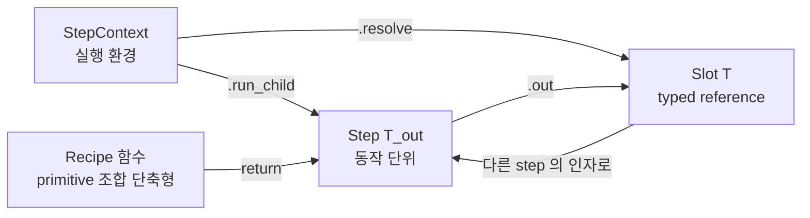

| 컨셉 | 코드 위치 | 역할 |
|---|---|---|
| **Step[T_out]** | [step.py](../backend/modules/task/step.py) | 동작 단위. `execute(ctx) → T_out` |
| **Slot[T]** | [schema.py](../backend/modules/task/schema.py) | 다른 step 의 출력 reference. covariant frozen dataclass |
| **StepContext** | [step.py](../backend/modules/task/step.py) | 실행 자원 모음 + `resolve()` / `run_child()` 헬퍼 |
| **Recipe 함수** | [recipes.py](../backend/modules/task/recipes.py) | primitive 조합 단축형. step 클래스 안 만들고 함수로 |

---

## 2. 클래스 다이어그램

### 2.1 Step 상속 — 카테고리별 그룹화

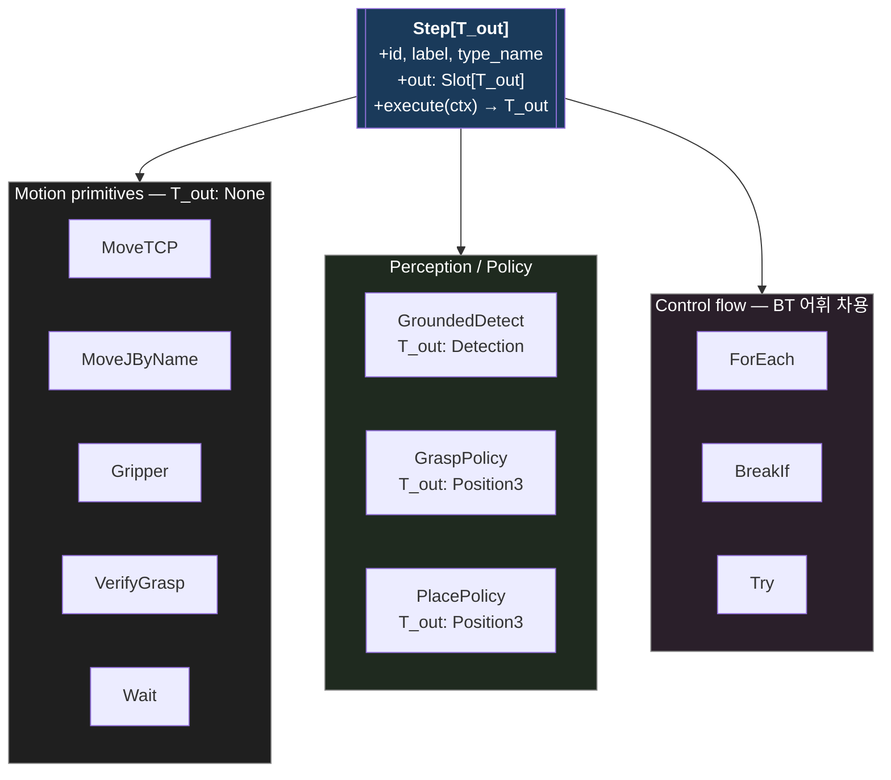

지원 클래스 (Step 옆에 같이 다님):

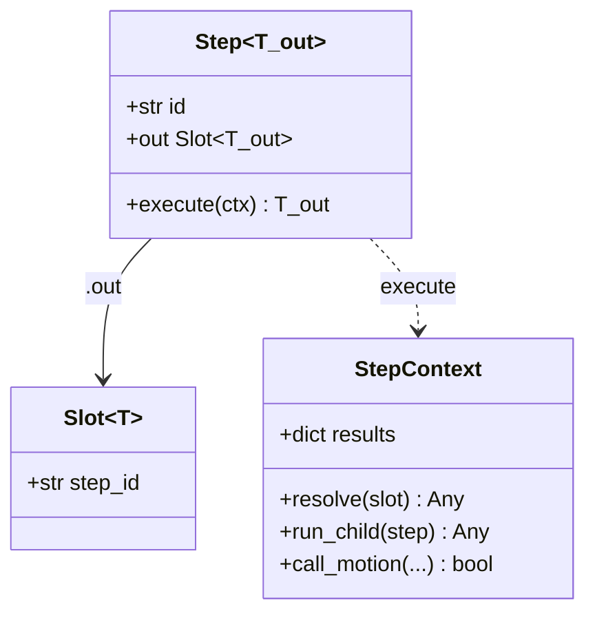

### 2.2 Typed value classes (schema)

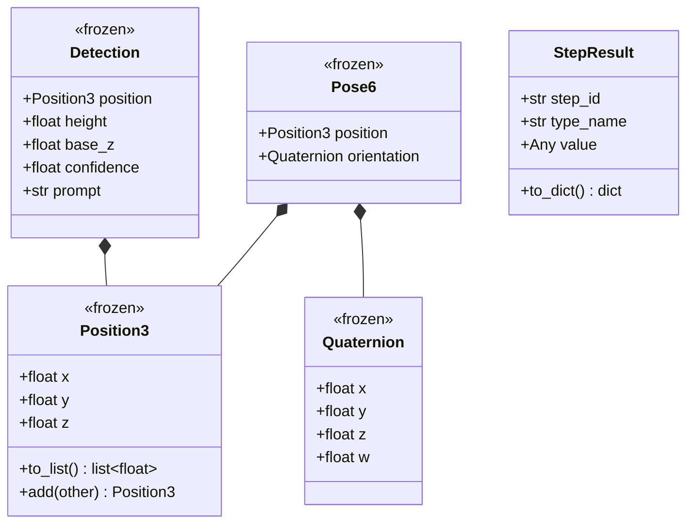

### 2.3 출력 타입 → step 의 Generic 인자

| Step | T_out | 의미 |
|---|---|---|
| `Wait` | `None` | 사이드이펙트만 |
| `MoveTCP`, `MoveJByName`, `Gripper`, `VerifyGrasp` | `None` | 모터 동작만 |
| `GroundedDetect` | `Detection` | 객체 위치 + 메타 |
| `GraspPolicy`, `PlacePolicy` | `Position3` | derived xyz |
| `ForEach`, `BreakIf` | `None` | control flow (값 안 반환) |
| `Try` | `Any` | child 의 출력 또는 None (실패 시) |

---

## 3. Slot 의 dataflow — pick_and_place 핵심

전체 18 step 다 그리면 어지러우니 **Slot 의 흐름만** 추출. 실행 순서가 아니라
*어떤 step 의 출력이 어떤 step 의 입력으로 가는지*.

### 3.1 핵심 dataflow (pick 절반만)

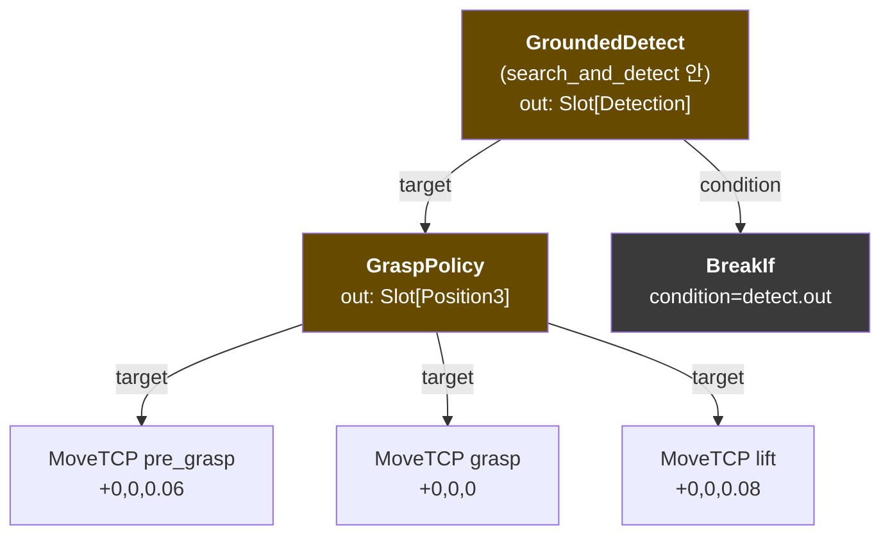

핵심 관찰:
- **같은 `grasp.out` 슬롯을 3개 MoveTCP 가 공유** — 같은 위치 + 다른 offset 만
- **같은 `detect.out` 슬롯이 GraspPolicy 입력 + BreakIf condition 둘 다로** —
  Slot 은 immutable reference 라 분기 가능

### 3.2 search_and_detect 안의 ForEach 구조

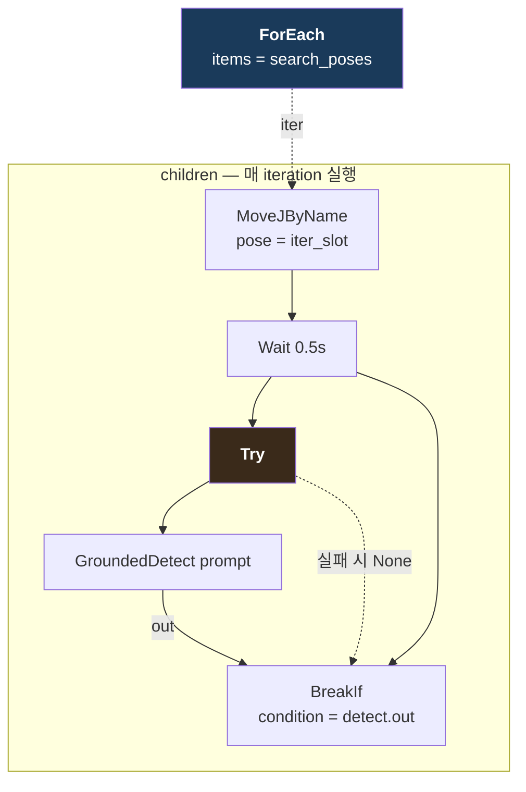

동작:
1. ForEach 가 `search_poses` 의 자세를 순회 (lexical sort)
2. 각 iteration 에서: MoveJ → Wait → Try(GroundedDetect) → BreakIf
3. GroundedDetect 가 raise 하면 Try 가 catch → None 반환 (다음 iteration 으로)
4. 성공 시 BreakIf 의 `detect.out` 이 truthy → `_BreakLoop` raise → ForEach 종료
5. 모든 iteration 실패면 detect.out 이 None → 후속 GraspPolicy 에서 TypeError

---

## 4. Run-time 동작 — results dict 의 변화

`StepContext.results: dict[step_id, value]` 가 step 들 사이 데이터를 운반.

| 시점 | results 내용 |
|---|---|
| task 시작 | `{}` |
| `Gripper(open)` 후 | `{}` (None 출력은 저장 X) |
| ForEach iteration 0, `MoveJByName` 후 | `{iter-xxx: "search_left"}` |
| 같은 iter, `Try(GroundedDetect)` 후 (실패) | `{iter-xxx: "search_left", step-yyy(Try): None}` |
| iteration 1, `MoveJByName` 후 | `{iter-xxx: "search_front", ...}` |
| 같은 iter, `Try(GroundedDetect)` 후 (성공) | `{iter-xxx: "search_front", step-zzz(detect): Detection(...), step-yyy(Try): Detection(...)}` |
| `BreakIf(detect.out)` truthy → break | (iter slot cleanup) |
| `GraspPolicy(target=Slot(step-zzz))` 실행 | `resolve(Slot(step-zzz))` → Detection lookup → grasp 계산 → 저장 |

→ **string key 없음, 모두 UUID step.id**.

```python
# StepContext.resolve 의 핵심
def resolve(self, value_or_slot):
    if isinstance(value_or_slot, Slot):
        return self.results[value_or_slot.step_id]
    return value_or_slot  # literal 값이면 그대로
```

---

## 5. Control flow — ForEach 의 nested unroll

`ctx.run_child()` 가 lego 의 핵심 메커니즘. ControlFlowStep base 없이도
nested step 이 디버거 게이트를 받음.

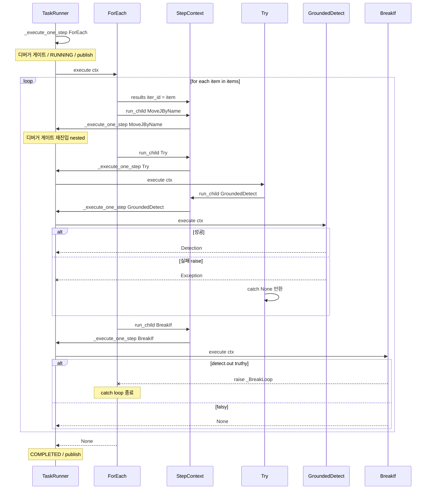

핵심:
- `ctx.run_child(step)` 안에서 **runner 의 `_execute_one_step` 이 재호출** → 디버거 게이트 + status + publish 가 nested step 에도 일관 작동
- `_BreakLoop` exception 으로 break 표현 — Python 의 StopIteration 패턴
- `Try` 가 `_BreakLoop` 는 안 잡고 일반 Exception 만 catch → break 가 위로 정상 전파

---

## 6. 디버거 호환 — runner 의 step 처리 흐름

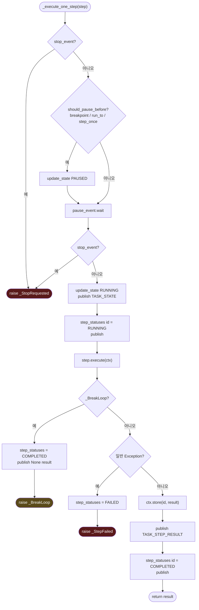

이 함수가 **단일 진입점** — ForEach.execute() 안에서 `ctx.run_child(child)`
호출하면 이 함수 다시 진입 (재귀). → nested step 도 동일 인프라 자동 적용.

---

## 7. Backend ↔ Frontend 메시지 흐름

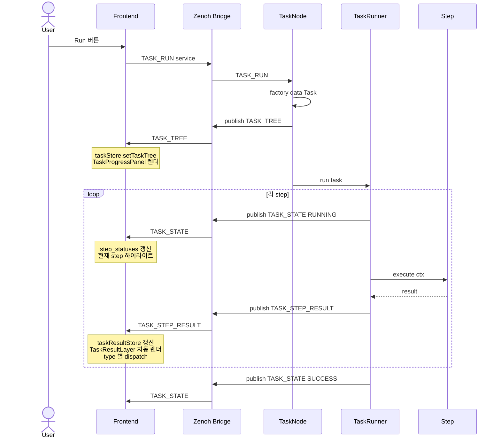

---

## 8. Frontend 시각화 흐름

`omx/task/step_result` 토픽 1개 + frontend 의 type 별 렌더러 매칭으로 **새 task
만들어도 frontend 코드 0줄 추가**.

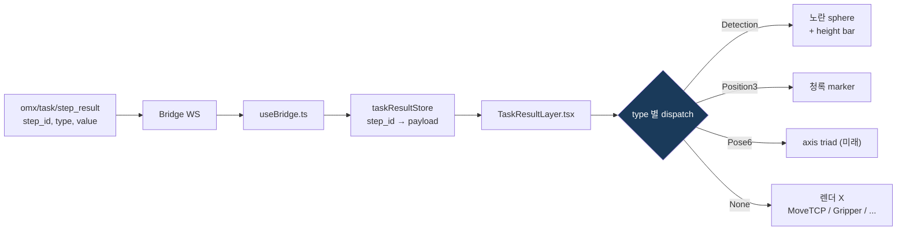

새 typed value (예: `Pose6`) 추가 시:
1. backend `schema.py` 에 dataclass 정의
2. backend step 의 `T_out` 으로 사용
3. frontend `TaskResultLayer.tsx` 에 `if (r.type === "Pose6") return <PoseTriad ...>` 1줄 추가

→ task / pick_and_place / executor 코드는 전혀 안 건드림.

---

## 9. 새 step 만드는 방법 — 확장 가이드

전체 템플릿:

```python
from dataclasses import dataclass
from modules.task.schema import SlotOr, Position3
from modules.task.step import Step, StepContext

@dataclass(kw_only=True)
class MoveCircle(Step[None]):
    """예시: 원호 경로 MoveC.
    
    center: SlotOr[Position3]    # 원 중심
    radius: float                 # 반지름 (literal, Slot 안 받음)
    """
    center: SlotOr[Position3]
    radius: float = 0.05

    def execute(self, ctx: StepContext) -> None:
        c = ctx.resolve(self.center)
        # ... motion 호출
        ctx.call_motion(Service.MOTION_MOVE_C, {...})
```

추가하는 순간 자동으로 되는 것들:
- `MoveCircle(center=grasp.out, radius=0.03)` 사용 가능
- pyright 가 `center: Slot[Detection]` 같은 타입 mismatch 거부
- task_tree publish 시 `{type: "MoveCircle", ...}` frontend 에 전달
- TaskProgressPanel 에 자동 표시 (params 펼침)
- 디버거 (breakpoint, run_to, step) 자동 작동

수정해야 하는 곳: **없음**. TaskRunner / Executor / 다른 step 코드 0줄 변경.

---

## 10. 새 task 만드는 방법 — 사용자 가이드

```python
from modules.task.recipes import home, search_and_detect
from modules.task.schema import Position3
from modules.task.step import Step, Task
from modules.task.steps import Gripper, GraspPolicy, MoveTCP, VerifyGrasp


def create_my_pick_task(target: str) -> Task:
    """단순 pick — drop 없이 들어서 home 으로."""
    pick_steps, pick_slot = search_and_detect(target)
    grasp = GraspPolicy(target=pick_slot)
    
    steps: list[Step] = [
        Gripper(action="open"),
        *pick_steps,
        grasp,
        MoveTCP(target=grasp.out, offset=Position3(0, 0, 0.06)),  # hover
        MoveTCP(target=grasp.out),                                # grasp
        Gripper(action="close", verify_grasp=True),
        MoveTCP(target=grasp.out, offset=Position3(0, 0, 0.08)),  # lift
        VerifyGrasp(),
        home(),
    ]
    return Task(name="my_pick", steps=steps)
```

원칙:
- **변수 (`pick_slot`, `grasp`) 가 데이터 통로** — string key 절대 X
- recipe 함수 (`search_and_detect`, `home`) 가 자주 쓰는 패턴 캡슐화
- step 의 `out` 은 **다른 step 의 입력에 직접** 넘김

---

## 11. Lego test 4가지 — 통과 근거 표

| Test | 원칙 | 통과 근거 |
|---|---|---|
| **#1 숨은 의존 X** | 입출력 contract 만으로 조립 가능 | `TaskContext.data: dict` 추방. Detection 객체에 base_z/height 다 흡수 → `_meta` suffix 같은 암묵 키 없음 |
| **#2 Substitutability** | 같은 type 자리에 어떤 step 이든 끼움 | `Slot[T]` covariant (frozen). `MoveTCP.target: SlotOr[Position3 \| Detection]` 둘 다 받음. `MoveJByName` 이 `Home` 케이스 흡수해 일반화 |
| **#3 새 step 추가 = runner 수정 0줄** | dispatch 가 polymorphic | `step.execute(ctx)` 단일 메서드. `ControlFlowStep` 같은 별도 base 도 안 만듦 — `ctx.run_child()` 헬퍼만으로 모든 control flow 일반 Step 인터페이스 |
| **#4 composite ↔ primitive 동등** | 외부 인터페이스 동일 | recipe 는 **함수** (값으로서 step list 와 같이 list 에 spread). `ForEach`/`Try` 도 일반 `Step`. nesting 자유 — frontend tree 가 재귀 indent 렌더 |

---

## 12. 의식적으로 *안* 한 것 — BT 도입 회피

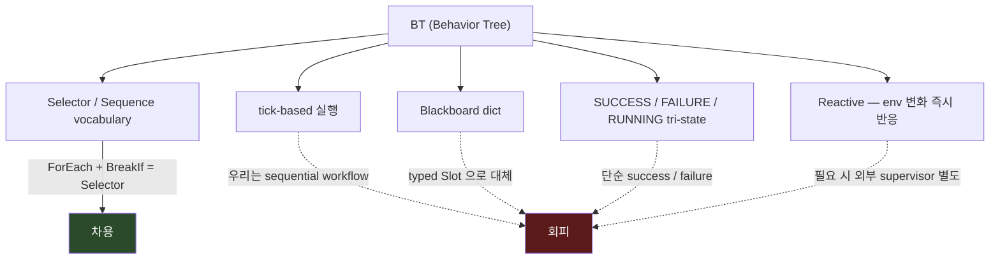

이유:
- 우리 task 의 99% 가 sequential workflow (pick_and_place, palletizing, NBV scan)
- reactive 가 진짜 필요한 시점 (closed-loop visual servoing) 은 별도 controller 영역
- LLM 이 sequential JSON 출력에 훨씬 강함 (BT 트리 출력은 어려움)
- 비개발자 visual editor user persona 가 현재 없음

→ "한 단어로 못 쓰는 hybrid" 가 **의도된 선택**. BT 어휘 빌리고 패러다임은 안 감.

---

## 13. 다음 단계

이 토대 위에 자연 확장 가능한 작업들:

| 작업 | 어디서 변경 |
|---|---|
| **Palletizing 본 작업** | 회전 박스 wire-up 6개 (Detector cluster decomp / Grasp enumerator / Reach filter / Orientation lock / Pick yaw). `Pose6` 가 실제로 쓰이는 시점 — [ideas.md](ideas.md) 의 Palletizing entry |
| **LLM orchestrator** | primitive 가 정리됐으니 system prompt few-shot 짜기 쉬워짐. `step_to_dict` 출력 형식이 LLM 출력 schema 와 동일하게 가능 |
| **Retry / UntilSuccess** | `Try` 를 generalize. `Retry(child, max_attempts=3)` 같은 새 control flow 추가 — runner 수정 0줄 |
| **Parallel** | 미래 case. 두 step 동시 실행. `Parallel(children=[...])` — thread-pool 도입 필요 |
| **TaskResultLayer 확장** | 새 typed value (Pose6 → axis triad) 추가 시 한 줄 |

---

## 부록 A. 파일 지도

| 파일 | 역할 |
|---|---|
| [backend/modules/task/schema.py](../backend/modules/task/schema.py) | typed value classes (Position3, Pose6, Detection) + Slot[T] + StepResult |
| [backend/modules/task/step.py](../backend/modules/task/step.py) | Step base + StepContext + Task + task_tree + step_to_dict + collect_step_ids |
| [backend/modules/task/steps.py](../backend/modules/task/steps.py) | primitive + control flow step 정의 |
| [backend/modules/task/recipes.py](../backend/modules/task/recipes.py) | home() / search_and_detect() recipe 함수 |
| [backend/modules/task/task_runner.py](../backend/modules/task/task_runner.py) | TaskRunner + _execute_one_step + 디버거 게이트 |
| [backend/modules/task/tasks/pick_and_place.py](../backend/modules/task/tasks/pick_and_place.py) | acceptance test task |
| [backend/nodes/task_node.py](../backend/nodes/task_node.py) | TASK_REGISTRY + Zenoh 서비스 핸들러 |
| [frontend/src/store/taskResultStore.ts](../frontend/src/store/taskResultStore.ts) | step_id → result 누적 store |
| [frontend/src/components/canvas/3d/TaskResultLayer.tsx](../frontend/src/components/canvas/3d/TaskResultLayer.tsx) | type 별 3D 자동 렌더 |
| [frontend/src/components/panels/TaskProgressPanel.tsx](../frontend/src/components/panels/TaskProgressPanel.tsx) | step 트리 + children 재귀 indent |

## 부록 B. 토픽 / 서비스 한 줄 요약

| 토픽 | 발행자 | 페이로드 |
|---|---|---|
| `omx/task/tree` | TaskNode (run/preview 시) | 전체 step 트리 (nested 재귀) |
| `omx/task/state` | TaskRunner | 현재 status / step_statuses / breakpoints |
| `omx/task/step_result` | TaskRunner (각 step 완료) | `{step_id, type, value}` |

| 서비스 | 핸들러 | 인자 |
|---|---|---|
| `omx/task/srv/run` | TaskNode | `{task, prompt, ...}` |
| `omx/task/srv/stop` | TaskNode | — |
| `omx/task/srv/pause` / `resume` | TaskNode | — |
| `omx/task/srv/step` | TaskNode | — (한 step 만 진행 후 pause) |
| `omx/task/srv/run_to` | TaskNode | `{step_id}` |
| `omx/task/srv/toggle_breakpoint` | TaskNode | `{step_id}` |
| `omx/task/srv/preview` | TaskNode | `{task, ...}` (실행 X, 트리만 빌드) |
