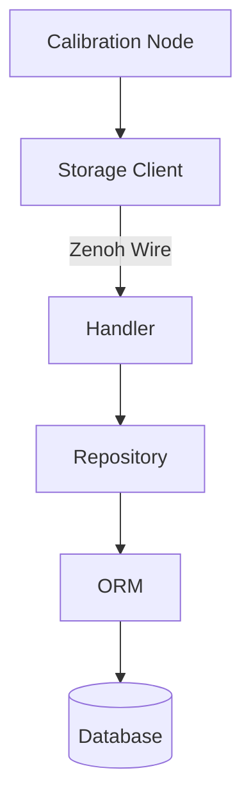
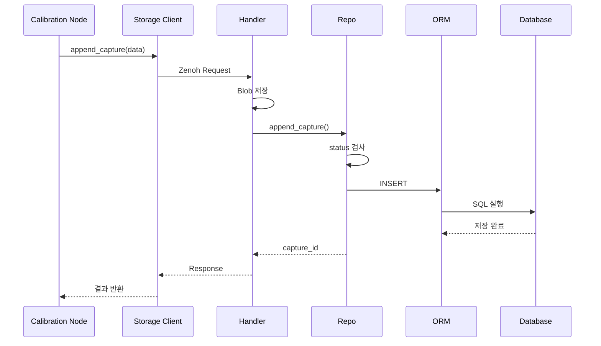
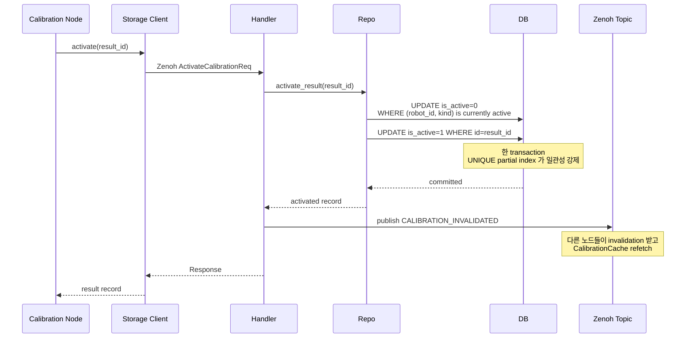
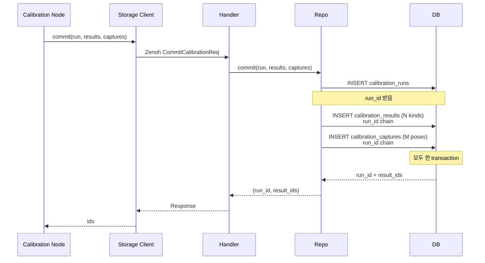
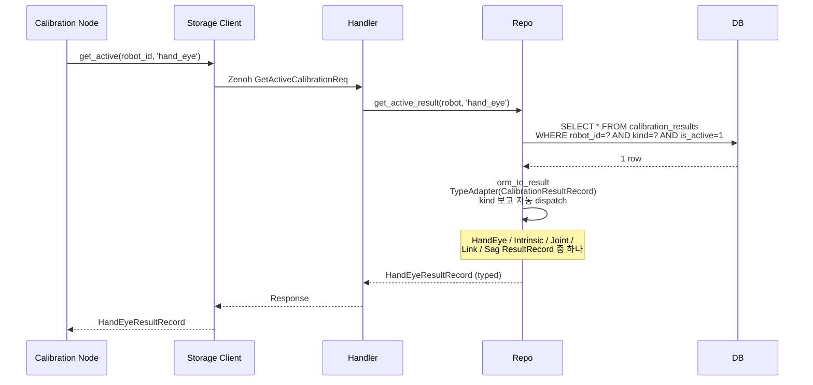
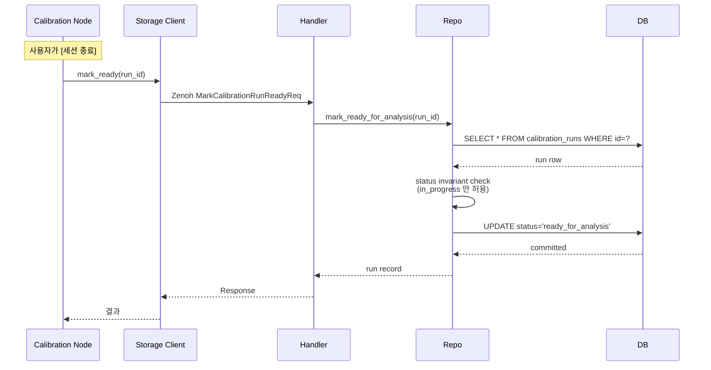
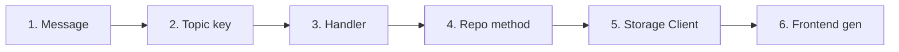
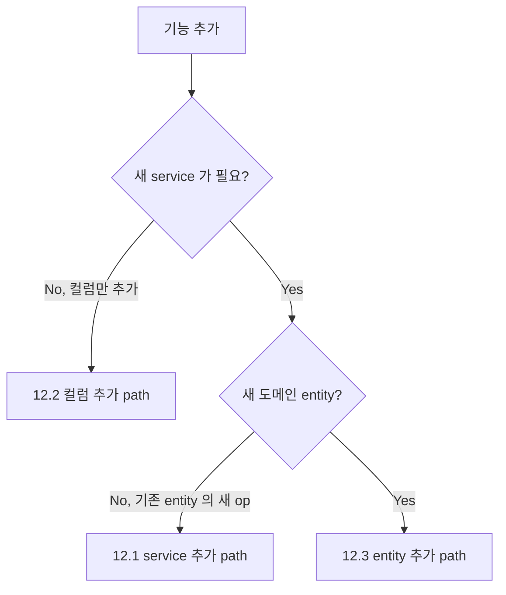

# Storage Layer Architecture 이해

## 한 줄 요약

이 구조의 목적:

> 각 계층이 자기 역할만 알게 해서 복잡도가 커지는 것을 막는다.

전체 구조:



---

# 1. 왜 Storage Layer를 나누는가?

처음에는 모든 것을 한 곳에서 처리하기 쉽다.

예:

```python
def save_capture():

    request 처리

    blob 저장

    SQL 작성

    transaction 시작

    DB insert

    응답 생성
```

작동은 한다.

하지만 기능이 늘어나면 문제가 생긴다.

예:

- append_capture
- finalize_run
- save_result
- get_active_result

각각이:

- SQL 작성
- transaction 처리
- 상태 검사
- FK 연결
- 변환 처리

를 반복하게 된다.

결과:

```text
Handler A
    run 상태 검사

Handler B
    run 상태 검사

Script
    run 상태 검사
```

같은 규칙이 여러 곳에 복사된다.

그러면:

```text
한 곳 수정
    ↓
다른 곳 누락
    ↓
데이터 불일치
```

발생 가능.

그래서 책임을 분리한다.

---

# 2. ORM

## 역할

ORM = Database row를 Python 객체로 표현하는 계층

구조:

```text
Database Table

        ↓

SQLAlchemy ORM

        ↓

Python Object
```

예:

Database:

```text
calibration_capture

id
run_id
blob_key
timestamp
```

Python:

```python
CalibrationCaptureOrm

id
run_id
blob_key
timestamp
```

---

## ORM이 담당하지 않는 것

ORM은 비즈니스 규칙을 몰라야 한다.

나쁜 예:

```python
if run.status != "in_progress":
    raise Error
```

이런 규칙은 ORM 책임이 아니다.

ORM은:

> DB 한 줄 표현

만 담당한다.

---

# 3. Repository (Repo)

## Repo란?

Repo = DB에서 하나의 의미 있는 작업을 완료하는 계층

쉽게:

> DB 주방 담당자

---

예:

```python
repo.append_capture(capture)
```

이 한 줄은 내부적으로:

```text
run 상태 확인

↓

capture INSERT

↓

artifact INSERT

↓

transaction commit
```

을 수행한다.

호출자는 내부 SQL을 몰라도 된다.

---

# Repo가 필요한 이유

## 1. SQL 숨김

나쁜 구조:

```python
session.execute(
    select(...)
)
```

모든 곳에서 SQL 작성.

좋은 구조:

```python
repo.get_active_result(
    robot_id,
    "hand_eye"
)
```

호출자는 DB 구조를 모른다.

---

## 2. Transaction 책임

예:

```python
with session.begin():

    repo.append_capture()

    repo.append_artifact()
```

여러 DB 작업을 하나의 작업 단위로 묶는다.

---

## 3. Invariant 보호

Invariant:

항상 지켜야 하는 규칙.

예:

캘리브레이션 capture는:

```text
run.status == in_progress
```

일 때만 추가 가능.

Repo:

```python
def append_capture():

    if run.status != "in_progress":
        raise Error
```

한 곳에서 보호한다.

---

## 4. 여러 테이블 작업 묶기

예:

```text
CalibrationRun

    |
    +-- CalibrationResult

    |
    +-- CalibrationCapture

            |
            +-- Artifact
```

여러 테이블이 연결된다.

Repo:

```python
finalize_run()
```

하나의 도메인 작업으로 처리한다.

---

## 5. ORM ↔ Pydantic 경계

밖으로 ORM을 노출하지 않는다.

흐름:

```text
ORM

↓

Mapper

↓

Pydantic Record
```

Handler, Test, Script는 SQLAlchemy 객체를 모른다.

---

# 4. Handler

## Handler란?

Handler = 외부 요청을 받아 전체 작업 흐름을 조립하는 곳

쉽게:

> 식당 직원

---

예:

캘리브레이션 저장 요청:

```text
카메라 이미지

joint 값

pose
```

들어옴.

Handler 역할:

```text
1. 요청 해석

2. ObjectStore 저장

3. Repo 호출

4. 실패 처리

5. 응답 반환
```

---

예:

```python
def append_capture_service(req):

    blob_key = object_store.put(
        req.image
    )


    capture_id = repo.append_capture(
        capture,
        artifact
    )


    return response
```

---

## Handler가 아는 것

Handler는:

```text
Zenoh
Request / Response
ObjectStore
Repo 호출
Publish
```

을 안다.

---

## Handler가 모르는 것

Handler는:

```text
SQL

session.add()

select()

FK 처리

transaction 내부
```

를 모른다.

그건 Repo 책임.

---

# 5. StorageClient

## StorageClient란?

StorageClient = 원격 Handler를 함수처럼 호출하게 만드는 객체

원래:

```python
call_service(
    Service.STORAGE_FINALIZE,
    request,
    timeout=5
)
```

이런 코드를 계속 작성해야 한다.

그래서:

```python
storage.finalize_run(
    run_id,
    results
)
```

처럼 만든다.

---

## StorageClient가 숨기는 것

숨김:

- Zenoh service 이름
- Request 생성
- Response parsing
- Timeout
- Error 처리

사용자는:

```text
저장해줘
```

만 호출한다.

---

# 6. 전체 흐름

## Capture 저장 예시



---

# 7. Handler와 Repo를 왜 분리하는가?

합쳐버리면:

```python
def handler():

    Zenoh 처리

    Blob 저장

    SQL 작성

    Transaction

    Status 검사

    Response 생성
```

한 함수가 너무 많은 것을 알게 된다.

---

분리하면:

```text
Handler

"무엇을 할지 조립"


        ↓


Repo

"DB에서 어떻게 처리할지 담당"
```

각 계층의 변경 이유가 달라진다.

---

# 8. 최종 책임 정리

| 계층             | 책임                              |
| ---------------- | --------------------------------- |
| Calibration Node | 캘리브레이션 로직                 |
| Storage Client   | 원격 호출 숨김                    |
| Handler          | 요청 처리 + 전체 흐름 조립        |
| Repository       | DB 업무 + invariant + transaction |
| ORM              | DB row 표현                       |
| Database         | 실제 저장                         |

---

# 9. 가장 쉽게 기억하는 법

## ORM

> DB 한 줄을 Python으로 보는 객체

## Repo

> DB에서 하나의 일을 끝내는 곳

## Handler

> 여러 시스템을 연결해서 일을 진행하는 곳

## Storage Client

> 원격 호출을 함수처럼 만들어주는 곳

---

# 10. Calibration 프로젝트에서 중요한 이유

Calibration 데이터는 단순 저장 데이터가 아니다.

구조:

```text
CalibrationRun

    |
    +-- Result

    |
    +-- Capture

            |
            +-- Artifact

                    |
                    +-- ObjectStore Blob
```

여러 데이터가 연결된다.

그래서 SQL을 아무 곳에서 작성하면:

```text
FK 누락

status 검사 누락

artifact 연결 누락

transaction 문제
```

가 발생할 수 있다.

그래서:

```text
모든 DB 작업

        ↓

      Repository
```

라는 하나의 진입점을 만든다.

---

# 11. 주요 흐름 지도

§6 의 APPEND_CAPTURE 외에 자주 보는 4 흐름을 추가로 정리.

각 흐름이 *어디서 시작 → 어디까지 흘러가는지* 한눈에. 새 기능 짤 때 "이 패턴 중 어느 것과 닮았나?" 비교 reference.

## 11.1 APPEND_CAPTURE — blob + RDB cross-storage 패턴

이미 §6 에 sequence diagram 있음. 핵심 — handler 가 *2 저장소* (ObjectStore + RDB) 를 orchestrate. RDB 실패 시 blob orphan cleanup.

용도: 캘 캡처 한 장 저장 (blob + 메타데이터).

## 11.2 ACTIVATE — atomic toggle + invalidation publish



**핵심**:
- atomic — 두 UPDATE 한 transaction. UNIQUE partial index (`idx_calibration_results_active`) 가 일관성 강제 (같은 robot+kind 에 active 1개)
- side-effect publish — `STORAGE_CALIBRATION_INVALIDATED` 토픽으로 다른 노드 (Coordinates / CalibrationCache) 가 refetch

**용도**: 캘 결과 활성화. rollback (옛 result 재활성화) 도 같은 path.

## 11.3 COMMIT — multi-table atomic (run + results + captures)



**핵심**:
- 3 테이블 동시 INSERT — autoincrement run_id 가 자식 row 의 FK 로 chain
- 한 transaction — 중간 실패 시 모두 rollback
- 같은 run 이 여러 kind 의 result 를 만들 수 있음 (intrinsic flow — result 1개, hand_eye flow — 4 kind: hand_eye + joint + link + sag)

**용도**: intrinsic 캘 (online, single-shot). offline BA 는 `calibrate_offline.py` 가 raw sqlite3 우회 — backend 안 떠 있는 가정.

## 11.4 GET_ACTIVE — read path + discriminated union dispatch



**핵심**:
- UNIQUE partial index (`is_active=1`) 가 1 row 보장
- discriminated union — `kind` 컬럼 보고 `TypeAdapter` 가 자동으로 알맞은 Record subclass 선택 + `result_data` 도 알맞은 shape validate
- caller (calibration_node) 는 `HandEyeResultRecord` typed 객체 받음 — `result.result_data.R_cam2gripper` 가 type-safe

**용도**: 부팅 시 active 캘 로드 / 매 service 호출마다 fresh fetch.

## 11.5 MARK_READY — state transition



**핵심**:
- status transition — `in_progress` → `ready_for_analysis`
- invariant 한 곳 — repo 가 status 체크. 다른 상태에서 호출하면 ValueError
- 이후 offline 스크립트 (`calibrate_offline.py`) 가 raw sqlite3 로 처리 → `success` 로 변환

**용도**: hand_eye 캡처 종료. offline BA 분석 대기 상태로 넘김.

---

# 12. 새 기능 추가 시 만지는 곳 (Recipe)

"Client 어디였지? Handler 어디였지?" 매번 탐험 안 하게 — 패턴별 체크리스트.

## 12.1 새 service 추가 (예: `STORAGE_GET_RUN_BY_DATE`)



| # | 파일 | 박는 것 |
|---|---|---|
| 1 | `core/transport/messages/storage.py` | `XxxReq` / `XxxRes` Pydantic 모델 |
| 2 | `core/transport/topic_map.py` | `Service.STORAGE_XXX` enum |
| 3 | `nodes/application/storage/handlers/calibration.py` | `_srv_xxx` method + `register` list 등재 |
| 4 | `modules/storage/rdb/repos/calibration.py` | DB 연산 추가 (필요 시) |
| 5 | `modules/calibration/storage_client.py` | wrapper method |
| 6 | `frontend/src/api/generated/` | `pnpm gen:types` (frontend 노출 시만) |

추가로 `api_contract.py` 의 `PUBLIC_SERVICES` 등재 — frontend 가 호출하는 service 만.

## 12.2 새 컬럼 추가 (예: `calibration_runs.operator_email`)

| # | 파일 | 박는 것 |
|---|---|---|
| 1 | `modules/calibration/persistence_models.py` | Pydantic Record field |
| 2 | `modules/calibration/orm.py` | ORM column + mapper (`run_record_to_orm` / `orm_to_run`) |
| 3 | `alembic/versions/...initial_schema.py` | `sa.Column(...)` (개발 단계 — initial 직접 수정 + DB 재생성) |
| 4 | `modules/calibration/storage_client.py` | 보통 X (Record 자체가 wire — 자동 전파) |
| 5 | `frontend` | `pnpm gen:types` 자동 |

migration 정책 — 운영 단계는 새 revision 추가, 개발 단계는 initial 직접 수정 (현재).

## 12.3 새 도메인 entity 추가 (예: `task_runs`)

| # | 파일 | 박는 것 |
|---|---|---|
| 1 | `modules/{domain}/persistence_models.py` | Pydantic Record (Run / Result / Capture 비슷한 패턴) |
| 2 | `modules/{domain}/orm.py` | ORM model + mapper 들 |
| 3 | `modules/storage/rdb/repos/{domain}.py` | `XxxRepo` class + 메서드들 |
| 4 | `modules/storage/rdb/store.py` | `RepoBundle` 에 새 repo 추가 |
| 5 | `core/transport/messages/storage.py` | wire Req/Res |
| 6 | `core/transport/topic_map.py` | `Service` enum |
| 7 | `nodes/application/storage/handlers/{domain}.py` | 새 handler 그룹 (또는 기존에 추가) |
| 8 | `nodes/application/storage_node.py` | handler register |
| 9 | `modules/{domain}/storage_client.py` | wrapper class |
| 10 | `alembic/versions/...initial_schema.py` | 새 테이블 (개발 단계) |
| 11 | `alembic/env.py` | `import modules.{domain}.orm` 추가 |

scan_workflow / calibration 이 같은 패턴 — 새 domain 도 11곳을 같은 모양으로 박으면 끝.

## 12.4 의사결정 트리



대부분 — 12.1 (새 service) 또는 12.2 (컬럼). 12.3 은 새 도메인 (scan_workflow / task_runs / log 등) 도입 시만.

## 12.5 "왜 이 모든 파일을 수정?" 답

분산 시스템 + typed wire + 4-layer 분리가 일관성을 강제. 단 *같은 패턴이 매번 반복* — 한 번 외우면 끝. recipe 자체가 그 외움을 문서로 외주화.

- handler 만 박고 client wrapper 안 박으면 → caller 가 매번 ServiceRequest 봉투 직접 짜야 함
- client wrapper 만 박고 handler 안 박으면 → wire RPC fail
- repo 만 박고 handler 안 박으면 → 다른 노드가 RDB 접근 불가

각 계층의 *역할이 다름* — 분리 자체는 정합. recipe 가 *위치 외움 부담* 을 줄임.

---

# 최종 결론

Repository는 단순한 SQL 모음이 아니다.

Repository는:

> 도메인에서 DB를 사용하는 유일한 문

이다.

Handler는:

> 외부 요청과 여러 시스템 작업을 연결하는 조율자

이다.

StorageClient는:

> 분산 환경에서 원격 저장소를 로컬 함수처럼 사용하게 만드는 인터페이스

이다.
