# Task (통합)

> **통합본 (2026-07-11 문서 다이어트)** — 아래 문서들을 원문 그대로 병합. 옛 파일명으로의
> 링크는 본 문서 내 해당 부(또는 git history). 각 부의 제목/상태 배너는 병합 당시 그대로.
> - `task.md`
> - `task.md`
>
> **2026-07-12 개정: 최상단 [확정 아키텍처] 부가 현행 정본.** 아래 두 옛 부
> (2026-07-08 중앙 프레임워크 설계 / Step DSL reference) 는 역사 기록.


---
---

<!-- ═══════════ [확정 아키텍처] Task = 모듈 + core 부품 (2026-07-13 @step 개정 — 현행 정본) ═══════════ -->

# Task 아키텍처 — task 모듈 + tasks/core 프레임워크 부품

> **status: 구현 완료 (2026-07-12 골격 + 2026-07-13 전면 개정).** 사용자 설계
> 토론 수렴판 — 아래 2026-07-08 "중앙 TaskModule + @task registry" 안을
> **대체**한다 (실행 규약 다수는 계승: cancel 기반 STOP / typed 예외 / TRACE /
> FakeContext).
>
> **2026-07-13 개정 (2건):**
> ① **@step** — step 을 프레임워크 강제 primitive 에서 **저자 지정 @step 함수**로.
> client 계층 기각 ("contract 가 SDK"), 거부 = 서비스 raise, timeout = contract
> 선언, 중첩 step 허용 (flat trace + depth).
> ② **runner wire 절단 + 의식 전폐** — TaskRunner 는 wire(runtime/키/robot/계약)
> 를 모르는 범용 감독기 (변화는 콜백 통지). 계약·조작판 노출·트리거·진행 발행
> 전부 **모듈 소유**. 등록 의식(registry/@task/TaskMetadata/GET /tasks) 전부 삭제
> — task 의 정보 채널은 계약이 유일. 핵심 진단: "runner 가 wire 를 발행하는 한
> 계약이 runner 의 사정이 된다" — wire 절단이 모든 엮임의 근본 수술.
>
> **2026-07-14 개정 (2건):**
> ③ **정적 프리뷰** — 실행 전 step 트리는 "실행 시뮬레이션"이 아니라 **코드 구조
> 인덱싱** (본문을 안 돌리니 모킹 대상 자체가 소멸 — dry-run/가짜응답 계열 기각
> 확정). §2 프리뷰 항목.
> ④ **runner 훅 = 데코레이터 선언** — 생성자 콜백 인자를 클래스 바디
> `@task.on_state`/`@task.on_trace` 로 (Mirror descriptor 동형 — TaskRunner 선언부
> / TaskRunnerState 인스턴스별 본체 분리). §2 TaskRunner 항목.

## 1. 지배 요구 (이 프레임워크의 존재 이유 — 기능 추가 판단 기준)

1. **귀찮은 공통 관심사는 프레임워크가** (AOP): 취소·일시정지·진행 보고·예외→실패
   처리·로깅·robot 배관·timeout 을 시나리오 코드에서 제거.
2. **시나리오 수정이 두렵지 않게**: 단계 순서 변경/추가 = 줄 편집. 에러 처리는
   재고 대상이 아님 ("try 를 안 쓰는 게 기본" — 실패는 raise, 프레임워크가 FAILED
   +사유+모터 정지). catch 는 도메인 복구를 원할 때만.
3. **작성 방식 강제 금지**: 본문은 그냥 Python. DSL 실패 교훈 — 작성자가 도메인
   대신 프레임워크 문제를 보게 만드는 순간 실패.
4. **트리거 다양성**: RUN 서비스는 어댑터 하나. `@subscriber` 콜백/내부 모듈의
   서비스 호출/CLI 어디서든 `runner.start()` 로 시작 가능 (fire-and-monitor).
5. **task 도 당당한 모듈**: 자기 contract 소유, 서비스 노출/수신·구독·발행 자유.
   다른 모듈과의 차이 = "감독되는 long-running 시나리오를 품는다" 하나뿐.

## 2. 구조 (구현 = modules/tasks/)

```
modules/tasks/
├── core/                     ← 부품 상자 (제공하되 강제 안 함 — 모듈 아님)
│   ├── runner.py             TaskRunner(선언 descriptor — @task.on_state/on_trace)
│   │                         + TaskRunnerState(인스턴스별 감독기 본체, wire 무지) + RunState
│   ├── step.py               @step 데코레이터 — 게이트/trace 경계 (저자가 step 지정)
│   │                         + 정적 표식(is_step/step_meta — 프리뷰 판정 채널)
│   ├── preview.py            build_preview — 소스만 읽는 정적 step 트리 (실행/모킹 0)
│   ├── context.py            TaskContext — ctx.call 단일 표면 + spec/on_abort
│   ├── contract.py           payload 규약 — TaskState/TaskTrace (스트림) + RunResponse/
│   │                         Control*/RunTo*/ToggleBreakpoint*/Preview* (조작판)
│   ├── errors.py             TaskError 계열 (도메인 판정 실패만 — 기술 실패는 서비스 raise)
│   ├── spec.py               TaskRobotSpec (motors.yaml 투영 — resolve 주입)
│   └── fake.py               FakeContext + ScriptedRuntime (서비스 키별 응답 스크립트)
└── pick_and_place/           ← task 모듈 표준형 (레퍼런스 구현)
    ├── contract.py           **전부 손코드, 전부 이 모듈 소유** — 트리거(RUN) +
    │                         노출하기로 결정한 조작판 6키 + 진행 스트림 3키 + RunRequest
    ├── module.py             부품 조립(__init__) + 진행 발행 메서드(runner 콜백) +
    │                         트리거/조작판 핸들러 + scenario + TASK_ROBOTS 상수
    ├── steps.py              @step 함수들 — raw service call + 도메인 판정 (task 소유)
    └── geometry.py           순수 함수 (하드웨어 없이 pytest)
```

- **TaskRunner = wire 무지 범용 감독기.** 실행/취소/일시정지/재개/step 게이트/예외
  →실패/상태·trace **데이터** 추적만. runtime·zenoh·키·robot·계약 무지. 변화는
  모듈이 단 **훅**(on_state/on_trace — 전부 선택, 안 달면 headless)으로 통지 —
  RunState 스냅샷 + TraceEntry 리스트. 훅 예외는 삼키고 로그 (관측이 실행을
  죽이면 안 됨). start(fn) 은 아무 async 함수나 받고 아무나 부를 수 있다 (트리거
  중립 — 서비스/@subscriber/내부 호출). 조작판 API 를 wire 로 노출할지, 코드에서
  직접 부를지(시나리오 중 조건부 pause 등)도 모듈 자유.
- **훅 연결 = 데코레이터 선언 (2026-07-14, Mirror descriptor 동형).** 모듈 클래스
  바디에 `task = TaskRunner()` (선언부) + 발행 메서드 위에 `@task.on_state`/
  `@task.on_trace` — @service/@publishes/@mirror.on_change 와 같은 리듬. 데코레이터
  는 클래스 바디 시점(인스턴스 없음)이라 **이름만** 잡고, 첫 `self.task` 접근 때
  __get__ 이 getattr 로 bound 해석 (MRO — 서브클래스 override 승리). 실행 상태
  (_run/_breakpoints)는 **TaskRunnerState** 로 분리해 인스턴스 __dict__ 에 lazy
  생성 — 클래스 변수 공유로 모듈 인스턴스 둘이 run 을 공유하는 사고 차단
  (Mirror/MirrorState 분리와 같은 이유, 회귀 테스트 잠금). TaskRunnerState 는
  생성자 콜백도 받는다 (단독 조립/테스트/headless — 본체는 여전히 함수만 받는
  순수 부품). 선행 확인: framework 가 이미 Mirror 로 이 결을 확립 — runner 혼자
  새 패턴이 아님. `_publish_markers` 는 runner 이벤트가 아니라 시나리오의 도메인
  발행이라 훅 대상 아님.
- **실행 전 정적 프리뷰 (2026-07-14 확정 — core/preview.py).** 프리뷰는 "실행
  시뮬레이션"이 아니라 **코드 구조 인덱싱**: "이 step 이 저 step 을 부른다"는
  소스에 이미 적혀 있어 본문을 돌릴 이유가 없다 — 모션/검출/DB/무거운 순수 연산이
  탈 자리도, 모킹할 대상도 없음 (**개발자 추가 규약 0** — @step 만 붙이면 끝.
  dry-run/가짜응답/ctx 게이팅 계열은 이 전제 위반이라 기각 확정). 실행 경로 보장은
  요구에서 제외: if/loop 는 풀지 않고 **조건부/반복 표시만**, 정적으로 못 푼
  호출은 `<동적>` 노드로 자리 표시 (구멍이 침묵으로 안 사라짐 — 실행되면 trace 가
  실제 진입으로 치환). step 판정 = 호출 문법이 아니라 **resolve 대상의 @step
  표식** (await 여부 무관), 이름 해석 = inspect.getattr_static (프리뷰 중 코드
  실행 금지). wire = TraceEntry 동형 flat+depth (`PreviewEntry` — 프리뷰↔trace
  같은 렌더 공유). run 밖 breakpoint 토글도 STATE 발행 (IDLE 스냅샷 + 모듈
  TASK_ROBOTS fallback) — 프리뷰에서 미리 박은 bp 가 보인다. 한계(표시하고
  넘어감): 콜백/자료구조로 넘긴 step·중첩 def 내부·일반 헬퍼 뒤 step 은 못 봄
  (계층 규약상 step 은 직접 호출이 정상).
- **모듈이 전부 소유**: 계약(자기 키 전부 손 선언 — 조작판 노출 여부/범위도 이
  모듈의 결정이라 계약에 명시), 배선(__init__ 에서 runner+contexts 조립), 진행
  발행(runner 콜백에 자기 발행 메서드 — payload 는 core 규약을 쓰면 공용 task UI
  가 그대로 붙음), 트리거(자기 RunRequest 로 자기 핸들러 → task.start), 시나리오.
- **등록 의식 없음**: registry/@task 데코레이터/TaskMetadata/GET /tasks 전부 삭제
  (2026-07-13). task 의 정보 채널 = 계약 (frontend 는 gen:types 로 키를 정적으로
  앎). robot 바인딩/표시 문구 = frontend task 전용 페이지 소유 상수
  (pickAndPlaceTask.ts — "robot 은 패널이 소유"). CLI(run_task.py)는 트리거 키를
  인자로 직접 받는다 — param 검증은 서비스(RunRequest)가 SSOT.

- **계층 (2026-07-13)**: 시나리오(step 호출 나열 — 의도) → @step 함수(raw service
  call + 정책 — 방법) → `ctx.call(contract)` → 서비스. **client 계층 없음 —
  contract 가 SDK.** 1:1 래퍼 (`move_l()` 미러) 금지 — 정책/조합이 실린 의미 있는
  동작만 @step 함수 (예: settle 포함 gripper). Request 조립 반복은 task 파일 안
  plain 헬퍼로 (게이트 없음 — step 안에서 재사용).
- **ctx = 이번 run 의 접점 — 호출 표면은 ctx.call 하나** (RobotHandle 삭제:
  표면이 둘이면 "어느 쪽으로 부르지?"가 오용을 낳음). robot-scoped/agnostic 구분은
  계약에만 산다: 키에 `{robot_id}` 있으면 `robot_id=` 인자 (**참여 명부 검증** —
  선언 밖 robot 명령 즉시 에러, on_abort STOP 커버리지 보장), agnostic 서비스는
  대상 robot 을 req 필드로 (§2.7 — agnostic 키에 robot_id= 를 주면 fail-fast).
  나머지 내용물: `spec(robot_id)` 물리값 / `record` 중간값 노출 / on_abort.
  step 간 데이터 공유 저장소 아님 — 데이터는 시나리오 지역 변수/반환값 (그냥
  파이썬. 상태 많으면 task 소유 dataclass — ctx.data 류 blackboard 금지, 옛 DSL 병).
- **step = 저자 지정**: `@step` / `@step(title="집기")`. **name(식별자 —
  breakpoint/run_to 키) = 함수 이름** (override 파라미터 없음 — 코드 이름이 곧
  안정 식별자), **title = UI 표시 문구** (한글 등 — 바뀌어도 name 불변). 같은 step
  함수가 여러 곳(pick·place 의 detect 등)에서 불리면 name 이 공유되므로 breakpoint
  는 그 이름의 모든 진입에 걸린다. **중첩 허용** — "함수 호출은 함수 호출이다":
  compound step (pick = detect+select+모션들) 이 자식 step 을 부르면 trace 에 depth
  로 찍힘. 게이트는 모든 진입점 (step_once = step-into; step-over 버튼 없음 —
  run_to 가 형제 건너뛰기 커버). run 밖에서 부르면 게이트/trace 없이 본문만
  (단위테스트 표면). 실행 중 진단(검출 수/선별 그룹 등)은 표준 `logging` 으로
  (step_note 폐기 — 2026-07-13 밤). `TraceEntry.detail` 은 실패 사유 전용.
- **실패 모델 (예외 vs 데이터)**: 예외 = 기술적 실패 — **서비스 자신이 raise**
  (MotionRejected/MotionFailed → RemoteError(type, msg)). task 에 `if not
  res.accepted` 체크 코드가 존재하지 않는 게 계약 (누가 잊으면 침묵 진행되던 급소
  제거). 데이터 = 부정적이지만 유효한 결과 (검출 0개, RESOLVE_REACHABLE index=-1) —
  치명 판정은 step 이 (NoReachableGrasp raise 등). timeout 은 각 서비스 contract.py
  가 `declare_service_timeouts` 로 선언 — 호출부는 안 넘김.
- **상속/자동배선/@task 데코레이터 없음** — 모듈이 `TaskRunner`/`TaskContextFactory`
  를 **부품으로 소유** (조합). 핸들러는 명시적으로 씀 (노출 = 결정이므로 계약과
  나란히 보임). **STOP 은 안전 의무** — 모듈 stop() 이 task.cancel() (레퍼런스
  참조), on_abort = **참여 robot 전원** Motion.STOP (moved 추적 폐기 — 안 움직인
  robot 에 STOP 은 무해, 보수적 안전).
- **책임 분리**: TaskRunner = 생명주기 + 게이트 + 콜백 통지 (도메인/wire 모름) /
  TaskContext = 검증된 call + spec + on_abort (core 의 유일한 도메인 지식 =
  Motion.STOP) / module.py = 계약·배선·발행·트리거·시나리오 / steps.py =
  도메인 동작 / geometry = 순수 계산.
- **시나리오 표면**: `so101 = "so101_6dof_0"` — 누가 움직이는지가 변수로 읽힘
  (리터럴 id — ctx.call 이 참여 검증).
- **관측**: STATE(status/current_name/current_title/error/breakpoints) /
  TRACE(step 진입 누적 — name/title/depth/status/detail, **flat 리스트 + depth**,
  트리 표현은 UI 들여쓰기). breakpoint/run_to = step **name** 기준, run 간 보존.
- **시각화 산출물 (파지/적치 지점 등)**: task 가 **자기 typed 스트림**으로 발행
  (2026-07-13 밤 확정 — "시각화 데이터는 그걸 계산한 쪽이 소유", detector
  DETECTIONS 동형). pick_and_place = `Stream.MARKERS` + `TaskMarker{label,
  position}`/`TaskMarkers{...markers[]}`, 모듈이 scenario 에서 스냅샷(latest-wins)
  publish, 프론트 `TaskMarkersOverlay` 가 STATE RUNNING 전이에 clear. 범용 채널
  (옛 ctx.record/STEP_RESULT) 미신설 — 중복 생기면 그때 헬퍼로 (task-first).
- **멀티 robot / 병렬**: 순차 협동 = 지금 구조 그대로 (step 이 robot_id 여러 개
  인자로, 참여 선언에 전부 나열 → 전원 STOP 커버). **병렬(asyncio.gather) =
  all-stop 의미론으로 지원** (회귀 테스트 잠금): pause/breakpoint 시 모든 가지가
  각자 다음 경계에서 hold (공유 게이트 — gdb all-stop 등가, 한 팔만 얼고 다른
  팔이 도는 상황 방지), cancel 은 가지 전파, depth 는 ContextVar 상속이라 가지별
  독립. 미장착(additive 확장): 가지 단위 step_once 선택, current_name 복수 표시,
  UI robot 트랙 분리.
- **step 재사용**: 중첩은 메커니즘, 재사용은 결과 — 어휘집 선축조 금지. step 은
  task 모듈에서 시작, 공용화는 실제 필요로 판단 (기계적 횟수 규칙 아님 — 설계 판단).

## 3. 새 task 만들기 (개밥먹기 체크리스트)

1. `modules/tasks/<name>/` 폴더 — pick_and_place 복제가 가장 빠름:
   - **contract.py** — 전부 손코드: 트리거 키(이름 자유) + 노출하기로 결정한
     조작판 키 + 진행 스트림 3키 + 자기 RunRequest. (조작판/스트림 req·res·payload
     모양은 tasks/core/contract.py 공용 — 공용 task UI 가 그대로 붙음.)
   - **module.py** — 클래스 바디에 `task = TaskRunner()` 선언 + 발행 메서드에
     `@task.on_state`/`@task.on_trace` (훅 배선), __init__ 에서 contexts 조립,
     stop() 에서 task.cancel() (**안전 의무**), 트리거 핸들러
     (`task.start(self.scenario, ctx=…, robot_ids=…, **req.model_dump())`),
     노출할 조작판 핸들러 (+PREVIEW = `build_preview(self.scenario)` — 공짜),
     scenario.
   - **steps.py** — @step 함수들 (`ctx.call` + 도메인 판정). **geometry.py** — 순수 함수.
2. apps/registry.py + deployment yaml 등록. FRONTEND_EXPOSED 에 키 추가 →
   `pnpm gen:types` (+fixture 쌍).
3. frontend — task 전용 페이지 (+ `<name>Task.ts` 상수: TASK_NAME/TASK_ROBOT_ID —
   robot 바인딩/표시 문구는 페이지 소유). 페이지는 task 별, 부품은 공용.
4. 검증: 순수 함수 pytest → step 함수 단독 (run 밖 = 평범한 async 함수) →
   FakeContext 시나리오 (서비스 키별 스크립트 — 분기/실패 경로) → CLI
   `uv run --no-sync python scripts/run_task.py srv/<name>/run --param k=v`
   (mock, bridge 미점유) → 전용 페이지.

## 4. PnP 실물 디버깅 runbook (2026-07-17 — 첫 완주 세션의 운영 지식)

> 다음 세션 진입점. 사용자가 실물 테스트를 반복하는 동안, **어느 세션이든 이
> 절차로 결과를 확인·분석하고 실패를 수정 위치로 매핑**한다. 값·사고의 1차
> 근거는 전부 코드 주석 (servo.py / steps.py / pybullet.py / motors.yaml) —
> 여기는 지도만.

### 4.1 실행 + 수정→재배포 매트릭스

실물 실행 = pi_hori1(so101 motor+motion) + pi_hori2(D405) + PC(`--host pc`) 가동
→ frontend `/tasks/pick_and_place` 에서 run. 프롬프트 예: pick "white small
round cube" / place "blue box".

| 수정한 것 | 재시작 대상 |
| --- | --- |
| tasks/(steps/servo/module)·detector·`apps/resolve.py`(held 문턱) | **PC 만** |
| motion/motor 코드·`pybullet.py`(IK)·motion contract·`robot/*/motors.yaml`·`motion.yaml` | **pi_hori1 pull+재시작** |
| camera 코드/설정 | pi_hori2 |

### 4.2 런 결과 읽는 법 (관측성 자산)

**`backend/debug/servo_pick/<ts>/trace.jsonl` + `summary.json`** 이 1차 소스 —
런당 1폴더, phase 별 레코드:

- `tick`: `observation.position[2]` = **윗면** band centroid z (base_z 는 top-view
  에선 ≈윗면이지 바닥이 아님 — 07-16 최대 함정), `lateral_mm` = 수렴 지표
  (**1.6~4mm 가 정상 도달치**, 8~12mm 정체 = 보상 문제), `comp_mm` = 플랜트
  잔차 (5~13mm 대가 정상), `action/reason` = decide_tick 판정.
- `commit`(blind_mm/cmd) → `touchup`(resid_mm — 3mm 이하로 수렴해야) →
  `close`/`withdraw`(`held|slip|empty` + gap_raw/load_raw) → `grasp_retry`,
  `refit`(yaw 재유도), `move`(rejected_hold = 이동 거부 관용).
- **판정 기준값 (07-17 실측)**: 빈손 gap 6~7 · load 56~64 / 슬립 sliver gap
  33~36 · load ~290 / 정상 물림 gap 117~217 · load 300+. held = gap>5%range
  **OR** load≥150 (`steps._gripper_holding`).

**`backend/debug/detect/<ts>/`** = 관측 원본 (det/fuse json+ply+png). 스윕 뷰 간
위치는 FK 계통 오차로 1.5~3.3cm 어긋나는 게 정상 — coarse 선택은 plan_pick 이
도달성 우선 순회로 흡수.

**사용자 영상**: cv2 로 0.5s 프레임 추출해 trace 와 교차 — 타격/슬립/yaw 스큐
판별은 영상이 결정적이었음 (trace 만 보면 "테이블 문 false HELD" 류를 오진).

### 4.3 실패 모드 → 수정 위치 사전 (07-16~17 실사고 전수)

| 증상 (trace 시그니처) | 원인 클래스 | 수정/노브 위치 |
| --- | --- | --- |
| plan 전멸 "자세 IK 실패 N" | solver false-neg 는 walk 로 해소됨 — 지금 전멸은 ① 오염 뷰 coarse (공중 부양 포함 — base_z 대역 후순위가 07-17 방어) ② yaw 위상: place 는 yaw 빗이 spot OBB yaw 에 고정, pick 도 IK 층 생존 가족 수(1~3/52)가 뷰 OBB yaw 에 좌우 (near-square 물체 OBB yaw = 뷰마다 랜덤) — **미수정**, 잔존 빈도로 yaw 격자 판단 | `steps.plan_pick`/`plan_place` (base_z 대역 정렬), `pybullet.ik`(walk), offline 재생 `scripts/grasp_verify/servo_reach_replay.py <detect세션>` |
| plan 전멸 "장애물(그리퍼↔물체) 기각 N" = IK 생존 전부 | **낡은 불변식** (07-17 오후 확정): engage(조를 대상 쪽으로 밀어 물기) 도입 후 grasp 자세의 조↔대상 겹침은 의도인데, 자기 점군을 장애물로 검사해 관측면 쪽 조가 걸림 — 같은 큐브·같은 파지가 "카메라가 어느 면을 봤나"로 전멸 (실측 침투 -3.6~-9.6mm = engage 겹침, 스침 아님) | `steps.plan_pick` 장애물=**이웃 점군만** (07-17 수정) — 대상 보호 = antipodal 구성 + servo closed-loop + 파지 판정 (MoveIt ACM 등가) |
| 엉뚱한 물체를 집으러 감 | 진짜 후보 전멸 → 도달성 우선 순회가 저신뢰 오검출로 폴백 (07-17: score 0.31 로봇 옆 흰 물체 채택 → 사용자 STOP. 실측 분리: 진짜 큐브 min 0.49 / 오검출 max 0.44) | `steps._PICK_SCORE_MIN` (0.45) 컷 — 미달만 남으면 명시 실패 (pick 전용 — place 는 진짜 spot 0.34 실측이 반례) |
| **[미수정·1순위]** 계획 g_tcp 가 관측에서 수 cm~11cm 이탈 / lateral 폭주 / 조 개구 3배 물체 채택 | **detector `points` 가 raw** — Fix 1(질량 군집)이 지표(base_z/top/pos)만 청소하고 점군은 안 씻음. 테이블 모서리 근처 mask 가 먼 바닥으로 새면 점군 과반이 1m 밖 쓰레기 (07-17 오후 실측: 채택 후보 399점 중 과반 median (0.9,0.07,−1.0)) → antipodal 쌍/width_along/융합/장애물이 전부 오염 소비 (13:52 g_tcp 11.6cm 이탈 = tick1 lat 110.6mm, 13:56 blob lateral 47mm) | **detector 가 points 도 몸통 군집(base_z~top 대역)으로 필터해 내보내기 — Fix 1 의 완결** (한 곳 수정, 소비자 전부 치유) |
| **[미수정]** score 0.45 넘는 큰 오검출 채택 (13:56: 손에 든 큐브 전멸 후 footprint 116mm blob 을 "small cube" 로 채택 — "완전 다른 데로") | 파지 물리 게이트 부재 — 조 최대 개구 35mm (`antipodal._JAW_OPEN_MAX_M` SSOT) 초과 물체는 물리적으로 못 무는데 plan 후보를 통과 (antipodal 쌍 필터는 쓰레기 점군 안 우연 쌍으로 우회됨) | plan 후보 footprint 짧은 변 ≤ 개구+관측번짐여유(실측 번짐: 실물 20→33mm) 컷 — 후보 레벨 게이트 신설 |
| **[미수정]** servo 첫 관측이 열화(부분 뷰)면 이후 정상 관측 연속 기각 → 소실 중단 (13:53: tick1 top z 16mm 낮은 score 0.43 관측이 앵커 → 정상 0.83 관측 2연속 "z 도약" 기각) | 나쁜 앵커가 좋은 관측을 기각하는 역전 — servo tick 은 score 하한도 없음 (plan 만 0.45) | ① servo gate 에 score 하한 ② 연속 기각 2건이 서로 일관하면(xy·z 일치) 재앵커 (기각된 쪽이 다수결 진실) |
| lateral 8~12mm 정체/발진 | 절대 재명령 (플랜트 잔차 무보상) | `servo.PlantComp` |
| 파지 z 이상 (윗면 nip / 테이블 뚫음) | base_z 앵커 허구 / 납작 물체 | `servo.grasp_point` (윗면 앵커) + `grip_below_top_m` / `floor_clear_m` |
| 물고도 EMPTY → 스스로 놓음 | gap 단독 판정 (조 피벗이라 gap 작음) | `steps._gripper_holding` (gap OR load), held 문턱 `apps/resolve.py` 5% |
| close 순간 물체 발사 | ① close 90°/s 타격 ② yaw 스큐 (물체 회전 후 옛 가족) | ① `motors.yaml` joint7 velocity_dps 30 (+`_GRIPPER_SETTLE_S` 4s 쌍) ② `servo.refit_family` (재획득 시) |
| withdraw 슬립 (gap 급감, load 유지) | 조 곡면+민면 마찰 — **경고+이송 계속이 정책** (내려놓고 재시도는 과잉이었음) | `slip_retention` (판정), 근본 = 조 마찰 패드 (하드웨어) |
| withdraw 완전 낙하 (load ~50) | 동일 마찰 문제 | 재시도 체인: `reacquire_radius_m` 15cm + refit — 굴러간 물체 재발견 |
| 관측 오염 (top z 점프/455mm 도약/점군 부족) | 조/가림 depth, mask 오검출 | `servo.gate_observation` (z_jump/jump/min_points/match_radius) + 이동 거부 1회 관용 (`TrackState.move_fails`) |
| 검출이 공중 부양 (base_z +0.04~+0.18, "허공 목표 IK 거부"/공중 spot) | 실루엣 flying-pixel(카메라 쪽 = 위로 뜸) 트레일이 옛 p98 top 앵커 탈취 → z-gap 군집이 트레일만 몸통으로 (07-17 PLY 실측: 점군 99%가 테이블인데 base_z=+0.175) | `detector geometry._body_z_band` (질량 군집 — 07-17 수정, 회귀 test) + `steps` base_z 대역 후순위 (2차 방어) |
| 적치 성공 후 `[retreat] MoveL failed` | MoveL 사전검증 통과했는데 실행 seed 연쇄가 끝점(=pre) IK 못 풂 — pre 는 관절해가 알려진 자세 (좁은 basin 복권) | `steps.retreat` pre_joints MoveJ 폴백 (07-17) — 정석(insert 궤적 역재생)은 motion 단 지원 필요 |
| commit blind 하강 중 조 끝 바닥 스침 (touch-up 이 회복은 함) | stale comp 과보상 — 스틱션/유격이 tick 국면에서 학습된 ±5~13mm 잔차(42런 실측, 부호 반전 포함)를 착지 직전 release. sag 캘(active)로 못 잡는 불연속 성분 | `steps` commit 2단 하강 (07-17 밤): midstop 하강방향 재안착(dither) → FK 실측 잔차 재앵커 (`servo.midstop_sequence`/`reanchor`, 노브 `commit_*`). 실패 시 단발 하강 폴백 (trace `midstop_skipped`). 하강 중 20Hz FK z+load = trace `descent_profile` (+`floor_contact_suspect` summary) — 스침 여부/시점을 데이터가 답함. **실물 미검증 — 첫 런에서 descent_profile 로 midstop/dither 노브 특성화** |

### 4.3.1 run 옵션 — build_world (2026-07-18)

`RunRequest.build_world` (기본 false): search 스윕에 편승해 scan 세션
(new_session → pose 당 capture → 전체 재빌드)을 돌려 3D World 배경을 갱신.
**best-effort** — 어떤 실패도 pick 을 죽이지 않는다 (`steps.WorldScan`, 첫 실패
후 비활성 + 경고 로그). ~~place 스윕은 같은 자세 재방문이라 중복 캡처 없음~~
(2026-07-19 §4.3.3 스윕 통합으로 place 별도 스윕 자체가 사라짐 — 스윕은 run 당 1회).
프론트 = PickAndPlacePanel 체크박스 (마지막 선택 localStorage), 표시는 별도
토글 (docs/frontend.md §8 World).

**`RunRequest.world_voxel_size` (2026-07-18, 기본 None=scan 2mm)**: 월드 빌드
TSDF voxel(m). UI 4단 셀렉터 (1/2/4/8mm, `scanStore.VOXEL_TIERS` SSOT — ScanPanel
수동 빌드와 공유). scan 모듈이 voxel→sdf_trunc 파생. 정합은 colored ICP
(docs/perception.md 개정 배너). search 자세 밀도가 월드 품질 지배 →
`scripts/plan_search_poses.py`.

**빌드 백그라운드화 (2026-07-19 — 스윕 크리티컬 패스 최적화)**: 15:50 실물 런
분해 = 스윕 59.5s 중 world capture+build ~40s (전체 재빌드가 스캔 누적으로
3.8→8.4s 증가). 수정: 크리티컬 패스에는 **capture(정지 필요, 1.2~1.6s)만**
남기고 빌드는 asyncio 백그라운드 (in-flight 1 + dirty 병합 재킥 — 폭주 상한,
회귀 테스트 잠금) + 스윕 끝 finalize 킥 (마지막 캡처 포함 최종 빌드 보장,
대기 안 함). 품질 무영향 — 같은 스캔·같은 빌드, 최종 메시는 항상 전 스캔
포함. 로그: `world_capture pose=N` (크리티컬 패스 실측) / `world_build (bg)`
(백그라운드 빌드 ms). 같은 날 detector 디버그 덤프(PNG+16bit depth+PLY 동기
쓰기)도 fire-and-forget 스레드로 이동 — 검출 응답에서 파일 I/O 제거 (내용
무손실, 실패는 콜백 로깅).

### 4.3.2 place 중심 융합 (2026-07-18 실물 — 모서리 적치 버그)

실물에서 물체가 상자 **가운데가 아니라 모서리**에 놓임. debug 덤프 진단: 정적
상자를 여러 search pose 에서 본 검출 중심이 **부분-림 관측으로 2~3cm 흔들린다**
(실측: 같은 상자 X 0.276→0.298 / Y 0.085→0.117, footprint 도 4.6~8.5cm 들쭉).
`plan_place` 가 그중 **단일 점수 1등**을 그대로 써서, 7cm 상자에선 그 오차가 곧
모서리. **왜 pick 은 되고 place 는 안 되나** = pick 은 closed-loop servo(가까이서
재검출→보정)로 coarse 오차를 잡지만, place 는 **open-loop** 라 그대로 물려받음.

**수정 = `steps._fuse_place_center`** (open-loop 유지, closed-loop 미도입): 상자는
정적이라 **집기 전 스윕의 가림 없는 관측들**을 융합하면 occlusion 없이 안정된
중심을 얻는다 (물체 든 채 재검출 = 상자 가림 → 회피). plausible base_z 검출을 XY
클러스터링 → 최대 score 군집의 score-가중 평균 중심을 대표 검출에 덮어 반환
(garbage base_z 제외, 단일뷰면 None→기존 경로). 융합 중심을 먼저 시도 후 도달
불가 시 단일-spot 폴백 (동작 후퇴 없음). 실덤프 검증: 5뷰 융합 (0.294→0.286,
단일 best 가 클러스터 far 모서리였음) + 산포 √N 감소로 run 간 안정화.

**TODO (미도입, 문서만)**: closed-loop place 는 정석이나 **물체 든 채 상자 가림**
문제가 있어 look-then-move(가리기 전 standoff 재검출)가 필요 — occlusion 때문에
융합 대비 ROI 낮음. 정밀 요구 생기면 재검토. detector 가 컨테이너 중심을 림-점
평균이 아니라 OBB 기하중심으로 주는 개선도 후보 (부분관측 강건).

### 4.3.3 스윕 통합 — 검출 1회에 pick+place+world (2026-07-19)

옛 구조 = pick 스윕(자세 N개 순회) 후 plan_place 가 **같은 자세를 다시 순회**
(place 검출) — 스윕 비용의 대부분이 관측 자세 MoveJ 라 run 당 자세 N개 × 이동
1회가 통째로 낭비였다. 통합:

- **시나리오 골격 변경**: `detect`(시나리오 직속 step 승격 — preview 트리 depth0)
  가 pose 당 wire 1호출 `DetectRequest(prompts=[pick, place])` 로 두 클래스를
  함께 검출 + world capture 편승 → prompt 별 dict 반환. `plan_pick`/`plan_place`
  는 검출을 직접 안 부르고 **후보 주입** (모션 0 순수 판정으로 정리).
- **detector 멀티 프롬프트 일반화** (wire 는 "무엇을 찾을지"만): contract
  `DetectRequest.prompts`(prompt 는 하위호환) + top_k 는 **프롬프트별** + 응답
  flat list 의 per-candidate `prompt` 귀속. 추론 전략은 detector 내부 —
  기본 = prompt 별 단독 N-loop (**score 는 옛 단일 prompt 와 동일** — 실측
  튜닝된 `_PICK_SCORE_MIN` 무영향), opt-in = GDINO 1-forward 합동
  (`detector_joint_inference`, docs/perception.md 멀티 프롬프트 부 참조).
- 판정/컷/융합(§4.3.2)/servo 는 전부 무변경 — 검출 수집 경로만 바뀜.
  trace/debug 덤프는 후보별 `prompt` 필드가 추가돼 스윕 원본에서 pick/place
  귀속을 구분할 수 있다.

### 4.4 노브 SSOT

`servo.ServoConfig` (전 필드 주석에 실측 근거) / `steps._PLAN_TRY_MAX` 등 상수 /
`robot/so101_6dof/motors.yaml` joint7 profile (close 속도) / `motion.yaml`
joint_limits (전역 움직임 속도감 — 07-17 vel 0.7/acc 1.5) / `apps/resolve.py`
held 5%. **임계값은 추측 말고 trace 실측으로만 조정** (CLAUDE.md 작업 방식).

### 4.5 회귀 검증 루틴 (완료 보고 전)

`uv run ruff check . && uv run pyright && uv run --no-sync pytest -m "not sim" -q`
— ⚠ **부분 스위트만 돌리다 test_motion 의 실 URDF sim 게이트 회귀를 놓친 전례**
(07-17). 같은 LAN 에 실 robot backend 가 떠 있으면 pytest 가 broadcast 될 수
있음 — motion 관련 test 는 사용자 확인 후.

### 4.6 알려진 한계 / 다음

- **재현성 통계 수집 중** (07-17 첫 완주 + 2연속까지 확인) — trace 폴더가 곧 데이터.
- **조 마찰 패드 미적용** (하드웨어) — 슬립/이젝션 클래스의 근본. 최대 레버.
- 얇은 물체(펜 ~8-10mm): gap 문턱 아래 → load 신호가 커버할 예정, 실물 미검증.
- place "blue box" **유령 뷰**: 매 세션 (0.15, 0.09, z 0.2) 에 로봇 자신의 파란
  몸체가 box 로 검출됨 (score 0.4~0.6) — 진짜 상자(0.84+)가 이겨서 무사하지만
  score 역전 시 위험. plan_place 도달성 우선이 2차 방어. **07-17 후속**: score
  역전이 실제 발생 (0.80 유령이 1위) — flying-pixel 이 유령을 z≈0.2 공중 spot
  으로 띄워 spot 당 resolve ~55s×2 낭비. detector 질량 앵커가 접지시키고
  base_z 대역 정렬이 후순위 — 이제 낭비 없이 진짜 상자 먼저.
- steps.py 파일 분리 (pick/place/primitives) 미완 — servo_pick 은 리팩토링 완료
  (PlantComp/TrackState).
- **offline IK 진단 도구는 캘 미적용 낙관** (07-17 오후 발견): 실행부 kin =
  `kinematics_builder` (URDF 링크 오프셋 패치 + joint offsets + sag 래핑) 인데
  `servo_reach_replay` 등 grasp_verify 스크립트는 raw `PybulletKinematics`.
  가장자리 실낱 island(2~3/84)는 이 모델 차로 생사가 갈림 — replay 도구에 캘
  적용 옵션 필요, 그 전까지 offline "가용" 판정은 낙관으로 읽을 것.
- **가장자리 작업영역**: (0.17,-0.16) 적치 / r≥0.31 파지 등은 캘 모델 기준
  실낱~빈 지역 (07-17 오후 전멸 다발 자리). 다음 특성화 후보 = 캘 kin 워크
  스페이스 그리드 스캔 → 신뢰 영역 heatmap (frontend 표시까지 가면 UX 완결).
- **손에 든 물체 파지는 범위 밖** (07-17 확인): 공중 물체는 base_z 대역이
  의도적으로 후순위 (이 task 의 세계 = 테이블 위) + 손 근처 파지는 안전 설계
  별도 필요 — 핸드오버는 자기 대역을 선언하는 전용 task 로.

### 4.7 handover task 신설 (2026-07-17 — 코드만, **실물 미검증**)

[modules/tasks/handover/](../backend/modules/tasks/handover/) — omx(giver)가
집어 든 물체를 so101(receiver)이 받아 상자 적치. pick_and_place 표준형 복제
(§3 체크리스트) + 신규 부품 = **cross-robot 충돌 체커**
([collision.py](../backend/modules/tasks/handover/collision.py) — 두 URDF 를 한
PyBullet 세계에, base_pose 는 robots.yaml 크로스캘. motion 모듈 불침범 — 정석
통합 자리는 motion resolve ③b 옆 TODO 주석).

- **활성화**: mock 은 켜져 있음 (터미널: `scripts/run_task.py srv/handover/run
  --param "pick_object=..." --param "place_object=..."`). **pc.yaml 은 주석
  TODO** — pick_and_place 실물 검증 완료 후 해제.
- **핵심 불변식** (mock 테스트 잠금): so101 이 close + held 판정한 **뒤에만**
  omx 가 연다 / 수취 계획은 충돌 그룹 제외 재시도, 전멸 = 명시 실패 / omx
  복귀 경로 충돌 위험 = omx 정지 유지 (so101 이 물건을 듦 — 멈추는 쪽이 안전).
- **실물 전 확인 가정 3개** = [steps.py](../backend/modules/tasks/handover/steps.py)
  docstring: ① omx tcp 축 규약 ② 크로스캘 오차 예산 (omx open-loop pick)
  ③ 'handover' waypoint 티칭 (omx home/handover + so101 home/search 그룹 필수).
- 충돌 margin 2cm = 보수 기본값 (미검증 — 실물 특성화로 튜닝).

---
---

<!-- ═══════════ [통합 원문] task.md — 2026-07-08 중앙 프레임워크 안 (대체됨 — 역사 기록) ═══════════ -->

# Task Framework — 명령형 async 함수 + 보일러플레이트 흡수 프레임워크 (설계 확정)

> **status: 대체됨 (2026-07-12 — 최상단 [확정 아키텍처] 부가 정본).** 이 부의
> "중앙 TaskModule + @task registry + ctx 단일 robot 바인딩" 구조는 기각.
> 실행 규약 (cancel STOP / typed 예외 / TRACE / FakeContext) 은 계승됨.
> (원문: 설계 확정 2026-07-08 논의 수렴, 구현 대기 상태였음)

## 1. 목표 — 단일 원칙

**Task Framework 는 FastAPI/NestJS 와 동일한 철학을 따른다. 개발자는 로봇 시나리오의
의도만 작성한다. 실행, 바인딩, 예외 처리, 상태 관리, 진행 보고, 취소, 추적, 타입 변환,
로깅 — 모든 공통 관심사는 프레임워크가 담당한다.**

기능 추가 기준은 하나: **"이 기능이 개발자가 반복해서 작성하는 보일러플레이트를
제거하는가?"** 반복이 관찰되면 프레임워크 후보, 아니면 그냥 Python 코드다.
(ctx 에 뭘 넣나 / helper 로 빼나 류의 분류 논쟁도
이 기준으로 절차화 — 미리 taxonomy 를 만들지 않고 반복을 관찰한다.)

이건 이 프로젝트가 이미 검증한 수다 — module framework 의 `@service`/`@subscriber` 가
정확히 같은 철학 (Zenoh 배관/직렬화/에러 봉투를 프레임워크가 흡수, 개발자는 핸들러
본문만). Task Framework 는 같은 수를 시나리오 층에서 반복한다.

| FastAPI/NestJS | Task Framework |
|---|---|
| 라우팅 (`@app.get`) | `@task(name=...)` → registry |
| param 바인딩 + validation | `RunRequest.params` → signature 기반 타입 변환·필수 검증 |
| exception handler → HTTP 상태 | typed 예외 → FAILED + STATE + Motion.STOP + cleanup (§5) |
| DI (`Depends`) | ctx 주입 — robot_id 를 작성자가 한 번도 안 적음 |
| middleware | primitive 경계 게이트/trace/로깅 (작성자 비가시) |
| OpenAPI 자동 생성 | signature → task 스펙 자동 노출 (§6) |

FastAPI 와의 차이는 흡수량이 **더 많다**는 것 — task 는 물리 세계의 long-running
프로세스라 취소·일시정지·모션 정지·진행 추적까지 전부 공통 관심사다.

**폐기 결정**: Step/Slot 선언형 DSL. 선언형이 밥값하는 조건 (반응성 / 비개발자 GUI
편집 / 정적 분석) 이 우리 task 에 없고, 작성자가 도메인 문제보다 프레임워크 문제
(Step 연결, Slot 타입, resolve, factory) 를 더 많이 보게 만들었다. 디버거 UI (tree
preview) 는 표면 설계에 역방향 요구를 못 낸다 — 시나리오 작성성이 결정하고 디버거는
적응한다.

## 2. 작성자가 쓰는 것 / 프레임워크가 가져가는 것

| 작성자가 쓴다 (= 로직 그 자체) | 프레임워크가 가져간다 (작성자 코드에 등장 금지) |
|---|---|
| task 함수 시그니처 (typed params) | params 파싱·타입 변환·기본값·필수 검증 |
| ctx primitive 호출 순서 | robot_id 배관 (ctx 바인딩) |
| `if`/`for`/변수 — 언어 그대로 | wire 계약 (Request/Response 클래스, 서비스 키, timeout 상수) |
| 순수 계산 함수 (grasp 위치 등) | 예외 → FAILED 전파·메시지 조립 (§5) |
| 복구할 때만 typed 예외 catch | 취소 (cancel + in-flight Motion.STOP + cleanup) |
| 보이고 싶은 중간값 `ctx.record` | STATE/TRACE/STEP_RESULT 발행 전부 |
| — | pause/step 게이트 (primitive 경계 자동) |
| — | primitive 호출/완료/실패 로깅 |

현행 Step DSL 이 오른쪽 칸을 작성자에게 새게 하는 실측 지점 (steps.py):
`ctx.resolve` + isinstance 8곳, `timeout=60.0` 반복 5곳, wire 클래스 직접 조립,
`.out`/Slot 배관, dataclass 껍데기 4개. 전부 오른쪽으로 넘어간다.

## 3. 작성 표면

### 3.1 `@task` — 시그니처가 스펙

```python
@task(name="pick_and_place", robot_ids=["so101_6dof_0"])
async def pick_and_place(
    ctx: TaskContext,
    pick_object: str,                # 필수 — 누락 시 실행 전 거부
    place_object: str = "",
    search_group: str = "search",
) -> None:
    ...
```

- `@task` 가 TASK_REGISTRY 등록. 수동 params 파싱 함수 (`_pick_and_place_task`) 소멸.
- wire 는 `RunRequest.params: dict[str, str]` 유지 (LLM/PromptPanel 호환) — 프레임워크가
  signature 로 str/int/float/bool 변환 + 검증. 타입 확장은 실요구 시.

### 3.2 TaskContext — Day-1 primitive + escape hatch

```python
class TaskContext:
    robot_id: str
    # Day-1 primitive — timeout/wire/재시도 정책은 메서드가 소유 (호출부 고민 X)
    async def move_j_waypoint(self, name: str, *, label: str = "") -> None
    async def move_to_pose(self, pos: Position3, *, offset=..., tool_offset=None, label="") -> None
    async def move_l(self, pos: Position3, *, offset=..., orientation="keep", label="") -> None
    async def gripper(self, action: Literal["open", "close"], *, label: str = "") -> None
    async def verify_grasp(self, *, label: str = "") -> None
    async def detect(self, prompt: str, *, top_k: int = 5, label: str = "") -> list[Detection]
    async def wait(self, sec: float, *, label: str = "") -> None
    async def waypoint_group(self, group: str) -> list[Waypoint]
    # escape hatch — 아직 흡수 안 된 서비스 직접 호출
    async def call(self, key, req, res_cls, *, timeout=5.0) -> TRes
    runtime: ModuleRuntime
    # 중간값 노출 (STEP_RESULT → TaskResultLayer, 옛 step 자동 발행의 명시 대체)
    def record(self, label: str, value: BaseModel | None) -> None
```

- 메서드 본문 = 옛 steps.py execute 이식. **의미 단위 경계** — detect 는
  `list[Detection]` 반환 (`DetectResponse` 아님). timeout/wire/실패→예외 변환이 안으로.
- `verify_grasp` 의 TaskRobotSpec/gripper raw 캐시는 ctx 내부 (현행 주입 경로 유지).
- 작성자가 만나는 값 타입은 소수 유지 (`Detection`, `Position3`) — 타입 은닉이 아니라
  typed signature 가 "지금 이 타입 뭐지" 를 해결. 변환 지점 (`grasp_position(det)`) 은
  숨길 게 아니라 가장 잘 보여야 할 도메인 결정 (집 튜닝 knob 이 전부 거기 있음).

### 3.3 도메인 어휘 — helper 함수로 자라고, 반복되면 흡수

```python
async def search_group_detect(ctx, prompt: str, group: str) -> list[Detection]:
    """task 로컬 helper — group 자세 순회 + Top-K 후보 누적 (§17.5)."""
    candidates = []
    for wp in await ctx.waypoint_group(group):
        await ctx.move_j_waypoint(wp.name)
        await ctx.wait(0.3)
        candidates += await ctx.detect(prompt)
    return candidates
```

- 규약: `async def f(ctx, ...)` 자유 함수. task-로컬로 시작 → 두 번째 task 가 반복하면
  `modules/task/helpers.py` 로 이동 (import 한 줄 = 승격 비용 ~0).
- `ctx.pick`/`ctx.detect_best` 선제작 금지 — §1 기준 그대로: 아직 반복 안 됐고, grasp
  전략/best 판정은 task 가 튜닝하는 도메인 결정. **반복이 관찰되는 순간 흡수 후보**
  (search 순회는 유력한 첫 후보 — task #2 가 쓰면 helpers.py 로).
- helper 내부의 move/detect 는 각각 게이트/trace 를 탐 — 관측 무손실.

### 3.4 pick_and_place 재작성 (before: 329줄 Slot 배관 / after: 로직만)

```python
@task(name="pick_and_place", robot_ids=["so101_6dof_0"])
async def pick_and_place(ctx: TaskContext, pick_object: str,
                         place_object: str = "", search_group: str = "search"):
    await ctx.gripper("open")

    pick = select_target(await search_group_detect(ctx, pick_object, search_group))
    place = None
    if place_object:                                   # 그냥 if
        place = select_target(await search_group_detect(ctx, place_object, search_group))

    grasp = grasp_position(pick)                       # 순수 함수 — Slot 없음
    ctx.record("grasp", grasp)
    await ctx.move_to_pose(grasp, offset=Z(PRE_GRASP_DZ), label="pre_grasp")
    await ctx.move_to_pose(grasp, tool_offset=PINCH_OFFSET, label="grasp")
    await ctx.gripper("close")
    await ctx.verify_grasp()
    await ctx.wait(0.5)
    await ctx.move_to_pose(grasp, offset=Z(LIFT_DZ), label="lift")
    await ctx.verify_grasp()
    if place is not None:
        p = place_position(place)
        await ctx.move_to_pose(p, offset=Z(PLACE_HOVER_DZ), label="pre_place")
        await ctx.move_to_pose(p, tool_offset=PINCH_OFFSET, label="place")
        await ctx.verify_grasp()
        await ctx.gripper("open")
        await ctx.wait(0.3)
        await ctx.move_to_pose(p, offset=Z(PLACE_HOVER_DZ), label="retreat")
    await ctx.move_j_waypoint("home")
```

select_target / grasp_position / place_position / GeometricPrior = ctx 무관 순수 함수.

## 4. 실행 규약 (프레임워크 책임)

| 항목 | 규약 |
|---|---|
| 실행 | RUN → `asyncio.create_task(fn(ctx, **kwargs))`. per-robot 동시 1 task |
| 성공 | 정상 반환 → SUCCESS |
| 실패 | 예외 → FAILED + error (§5 실패 모델) |
| 중단 | STOP → `task.cancel()` → CancelledError → STOPPED + **finally 에서 Motion.STOP** |
| 일시정지 | primitive 진입 직전 게이트 hold. 모션 중 급정지는 STOP 의 몫 |
| 관측 | STATE (status/current_label/error/breakpoints) / TRACE (신설 — primitive 호출 누적, TREE 폐기 자리) / STEP_RESULT (값 primitive 자동 + ctx.record) |

**현행 결함 해소**: 지금 runner 의 stop 은 step 경계에서만 검사돼
([runner.py:193](../backend/modules/task/runner.py#L193)) 60s MoveJ 비행 중 정지가
안 먹힌다. `task.cancel()` 은 in-flight await 를 즉시 끊는다.

게이트/trace: 게이트 대상 primitive 진입 시 TraceEntry (id = label 또는 자동
`"primitive#n"`) → pause/step_once/run_to/breakpoint 판정 → 게이트 → 실행 → 완료
마킹. **작성자에겐 존재하지 않는 층** (label 인자 하나만, 그마저 선택).

## 5. 실패 모델 — "try 를 안 쓰는 게 기본"

primitive 는 **typed 도메인 예외**를 던진다 (현행 `RuntimeError(f"...")` 전면 대체):

```python
class TaskError(Exception): ...          # 공통 베이스 — 프레임워크 exception filter 대상
class DetectionNotFound(TaskError): ...  # prompt, 시도 자세 수
class WaypointMissing(TaskError): ...    # name, robot_id
class GraspVerifyFailed(TaskError): ...  # raw, threshold
# MotionFailed 는 motion contract 기존 것 재사용
```

- **기본형: try 없음.** 예외는 그대로 위로 → 프레임워크가 FAILED 전환 + 어디서/어떤
  입력으로 실패했는지 trace 로 메시지 조립 + Motion 정지 + STATE 발행 (NestJS
  exception filter 등가).
- **복구는 예외적으로, 잡고 싶은 타입만**:

```python
try:
    await ctx.verify_grasp()
except GraspVerifyFailed:
    await ctx.gripper("open")      # 놓고 한 번 재시도
    ...
```

## 6. task 스펙 자동 노출 (OpenAPI 등가)

`@task` signature 에서 param 스펙 (이름/타입/기본값/필수/docstring) 을 추출해
`GET /tasks` 에 노출:

```json
{"name": "pick_and_place", "robot_ids": ["so101_6dof_0"],
 "params": [{"name": "pick_object", "type": "str", "required": true}, ...]}
```

- LLM 의 한국어→params 파싱이 task 스펙을 자동으로 앎 (현재 PromptPanel 의
  pick_and_place 하드코딩 제거 경로).
- frontend task 실행 폼 자동 생성 가능 (후속).
- 시그니처 = param SSOT 의 자연 연장 — 스펙 문서/파싱 코드/검증 코드 hand-sync 소멸.

## 7. 로직 검증 경로 — 하드웨어도 frontend 도 없이

1. **순수 함수 pytest** — select_target/grasp_position/prior: 입력→출력 검증 끝. ctx 조차 없음.
2. **FakeContext** — 프레임워크가 정식 제공 (표면의 일부). wire 수준이 아니라 의미
   수준 fake:

```python
async def test_place_생략시_pick만():
    ctx = FakeContext(
        waypoint_groups={"search": [wp("a"), wp("b")]},
        detect_script={"red cube": [[], [det(score=0.9)]]},   # 자세별 결과
    )
    await pick_and_place(ctx, pick_object="red cube")
    assert ctx.calls("detect") == ["red cube", "red cube"]    # 두 자세 순회
    assert "pre_place" not in ctx.labels()                    # place 분기 안 탐
```

   시나리오 로직 (분기/순회/누적/실패 경로) 을 프로세스 하나로 검증. 실 ctx 와 같은
   Protocol 구현 — 드리프트는 pyright 가 잡음.
3. **CLI 직접 실행** — `uv run python scripts/run_task.py pick_and_place --param
   pick_object="red cube" --deploy mock`. host_mock 스택 부팅 → RUN → STATE/TRACE
   stdout 실시간 → 종료 코드 = 결과. `--paused` = 첫 primitive 앞 정지 + Enter 한
   스텝 (터미널 디버거 — frontend 없이 작성 루프 완결).
4. **실 hardware** — 집. 1–3 이 로직 오류를 소진하고 hardware burn 은 캘/검출
   정확도에만.

## 8. 통합 diff (기존 아키텍처)

- **framework 코어 무변경** — TaskContext = `runtime.call` wrapper + 게이트. task 는
  여전히 순수 consumer 모듈. robot-agnostic §2.7 / Motion §17.3 계약 / Waypoint/
  Detector/Motor 계약 전부 무변. llm 모듈 무변 (RunRequest wire 유지).
- **contract diff**: RUN + `start_paused: bool` / PREVIEW·TREE 폐기 / TRACE 신설 /
  RUN_TO·TOGGLE_BREAKPOINT step_id → label / GET /tasks 에 param 스펙 (§6).
  `FRONTEND_EXPOSED` 갱신 → `pnpm gen:types`.
- **처분**:

| 자산 | 처분 |
|---|---|
| TaskModule (8 service) | 유지·수정 (위 diff) |
| TaskRunner | 재작성 — coroutine 감독 + 게이트 + exception filter |
| step.py / schema.py 의 Slot·SlotOr·StepResult | 폐기 (값 타입 Position3 등만 잔류) |
| steps.py Day-1 6종 | ctx 메서드로 이식 + typed 예외 전환 |
| tasks/pick_and_place.py | §3.4 로 재작성 |
| TASK_REGISTRY / robot_ids 바인딩 | 유지 (`@task` 가 등록 + param 스펙 추출) |

- **frontend (후속, 표면에 역방향 요구 금지)**: TaskProgressPanel steps 소스
  TREE→TRACE, bp/run-to = label. PromptPanel 의 실행 전 확인 = `start_paused`
  (CLI `--paused` 의 UI 소비) + 직전 run TRACE 보존. TaskResultLayer 무변.
  dry-run 은 기각 (detect 가 분기를 좌우하면 trace 가 거짓).

## 9. 구현 순서 (착수 지시 대기)

1. **코어**: `@task` + param 바인딩 + TaskContext (primitive 이식 + typed 예외) +
   runner 재작성 (cancel/게이트/exception filter/STATE·TRACE 발행) — noop task 로
   runner e2e (pytest).
2. **FakeContext + 순수 함수 분리** — pick_and_place 를 §3.4 로 재작성 + FakeContext
   테스트 (분기/순회/실패 경로).
3. **CLI runner** (`scripts/run_task.py`) — host_mock 으로 터미널 실행 검증.
4. **contract 정리** — PREVIEW/TREE 제거, TRACE/start_paused/GET /tasks 스펙 추가,
   gen:types 재생성.
5. **frontend 적응** — TaskProgressPanel/PromptPanel (별도 세션).
6. **backend.md §17 개정 + task.md reference 격하** (§10).

각 단계 = 독립 검증 가능 (testing_strategy L2→L3 정렬). 1–4 는 hardware 무관.

## 10. 확정 시 개정 대상 (옛 문구)

- backend.md §17.4 "Slot/StepResult/Step/StepContext/task_tree 거의 그대로" — 폐기
  (runner/디버거/stream 3종 포팅 자체는 유효했음, 작성 표면만 본 문서로 대체).
- §17.1 ④ "task #2 에서 반복 보이면 Step/Slot 추출" — "반복 보이면 helper 승격 /
  프레임워크 흡수" 로 교체.
- §17.1 "비주얼 에디터 — 직렬화 가능한 스펙 유지" — 문 닫음. task 정본 = Python 함수.
  에디터가 진짜 필요해지면 그때 IR 별도 설계.
- task.md (옛 backend) — reference 격하.


---
---

<!-- ═══════════ [통합 원문] task.md ═══════════ -->

# Step DSL — typed Slot 기반 lego 조립

> 2026-05-30 refactor 완성. 이 문서는 그 결과물 + 설계 결정을 공부용으로 풀어
> 둠. 코드 위치는 [backend/modules/task/](../backend/modules/task/).

## 한 줄

한 step 의 **출력이 다음 step 의 입력으로 변수처럼 흐르는** typed dataflow DSL.
BT (Behavior Tree) 의 control vocabulary 차용 + Airflow 의 typed deps + sequential
단순성. blackboard / tick 같은 BT 의 함정은 의식적으로 피함.

---

## 0. Before / After — 한 눈에 차이

같은 일을 하는 코드:

### Before (구버전, string-key dict chaining)

```python
steps = [
    SearchAndDetectStep(
        prompt="cube",
        output_key="pick_pos",          # ← 사용자가 임의 string 박음
    ),
    GraspPolicyStep(
        input_key="pick_pos",           # ← 위와 똑같이 외워서 박아야 함
        output_key="grasp_xyz",         # ← 또 새 키
    ),
    MoveTCPStep(
        position_key="grasp_xyz",       # ← 또 외움
        offset=(0.0, 0.0, 0.06),
    ),
]
```

문제:
- `"pick_pos"` 가 *어떤 타입* 인지 run-time 까지 모름
- 오타 (`"pick_poss"`) 가 run-time 에야 발견
- `output_key + "_meta"` 같은 숨은 추가 키 (`step_executor.py` 에 박힘)
- 새 task 마다 임의 키 이름 외움

### After (현재, typed Slot)

```python
pick_steps, pick_slot = search_and_detect("cube")   # → Slot[Detection]
grasp = GraspPolicy(target=pick_slot)               # → grasp.out: Slot[Position3]

steps = [
    *pick_steps,
    grasp,
    MoveTCP(
        target=grasp.out,                # 변수처럼 직접 넘김
        offset=Position3(0.0, 0.0, 0.06),
    ),
]
```

차이:
- 변수 (`pick_slot`, `grasp.out`) 가 typed reference
- 오타? Python NameError — plan-time 에 터짐
- 타입 mismatch? pyright 가 잡음
- 외울 string 0개

---

## 1. 핵심 컨셉 4가지

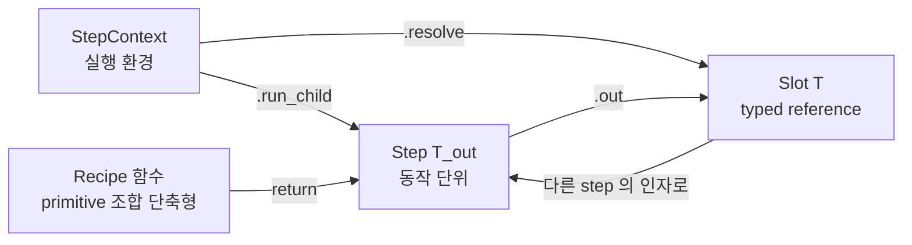

| 컨셉 | 코드 위치 | 역할 |
|---|---|---|
| **Step[T_out]** | [step.py](../backend/modules/task/step.py) | 동작 단위. `execute(ctx) → T_out` |
| **Slot[T]** | [schema.py](../backend/modules/task/schema.py) | 다른 step 의 출력 reference. covariant frozen dataclass |
| **StepContext** | [step.py](../backend/modules/task/step.py) | 실행 자원 모음 + `resolve()` / `run_child()` 헬퍼 |
| **Recipe 함수** | [recipes.py](../backend/modules/task/recipes.py) | primitive 조합 단축형. step 클래스 안 만들고 함수로 |

---

## 2. 클래스 다이어그램

### 2.1 Step 상속 — 카테고리별 그룹화

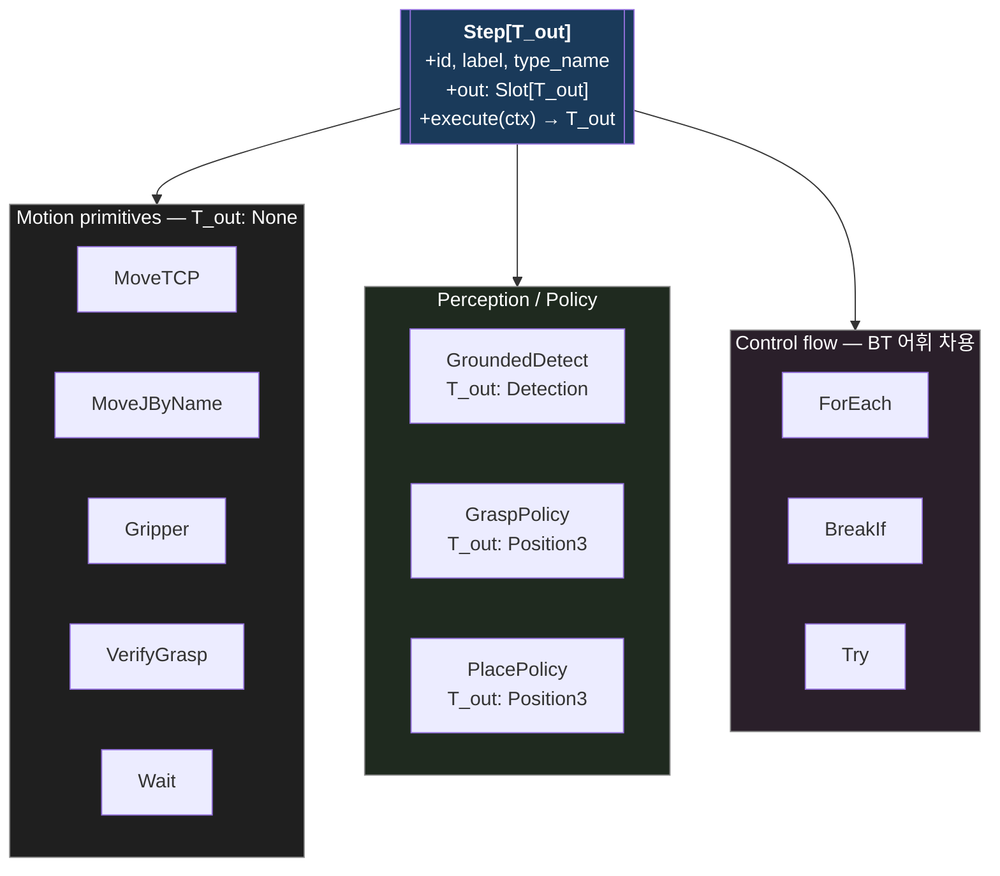

지원 클래스 (Step 옆에 같이 다님):

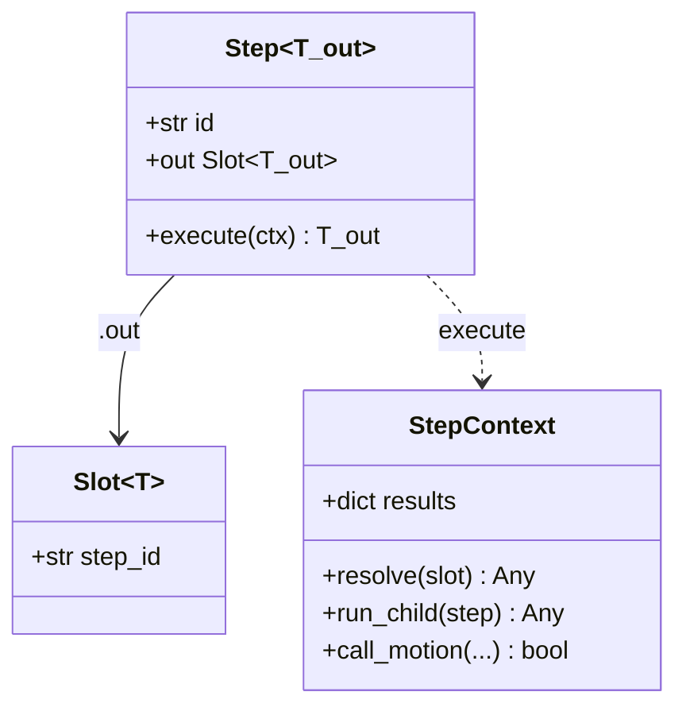

### 2.2 Typed value classes (schema)

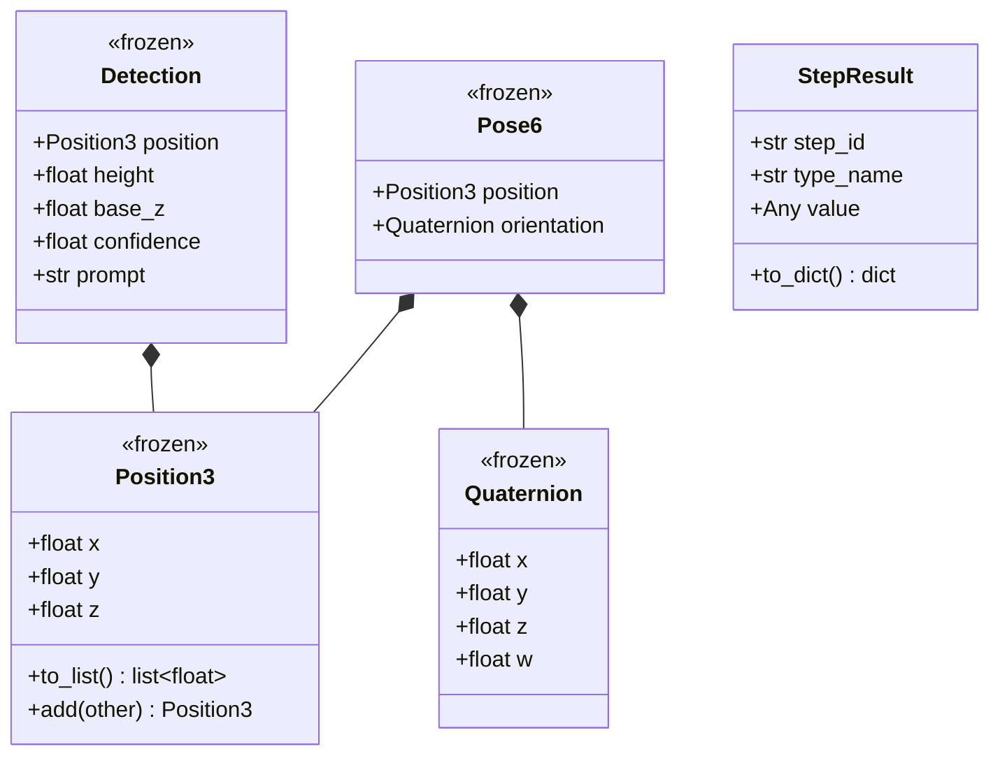

### 2.3 출력 타입 → step 의 Generic 인자

| Step | T_out | 의미 |
|---|---|---|
| `Wait` | `None` | 사이드이펙트만 |
| `MoveTCP`, `MoveJByName`, `Gripper`, `VerifyGrasp` | `None` | 모터 동작만 |
| `GroundedDetect` | `Detection` | 객체 위치 + 메타 |
| `GraspPolicy`, `PlacePolicy` | `Position3` | derived xyz |
| `ForEach`, `BreakIf` | `None` | control flow (값 안 반환) |
| `Try` | `Any` | child 의 출력 또는 None (실패 시) |

---

## 3. Slot 의 dataflow — pick_and_place 핵심

전체 18 step 다 그리면 어지러우니 **Slot 의 흐름만** 추출. 실행 순서가 아니라
*어떤 step 의 출력이 어떤 step 의 입력으로 가는지*.

### 3.1 핵심 dataflow (pick 절반만)

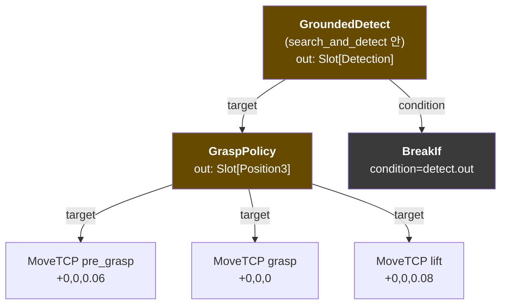

핵심 관찰:
- **같은 `grasp.out` 슬롯을 3개 MoveTCP 가 공유** — 같은 위치 + 다른 offset 만
- **같은 `detect.out` 슬롯이 GraspPolicy 입력 + BreakIf condition 둘 다로** —
  Slot 은 immutable reference 라 분기 가능

### 3.2 search_and_detect 안의 ForEach 구조

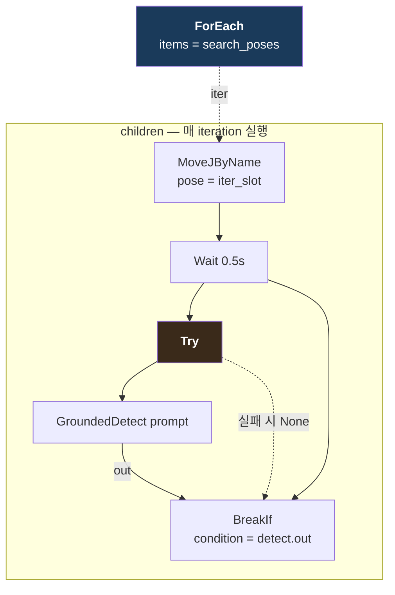

동작:
1. ForEach 가 `search_poses` 의 자세를 순회 (lexical sort)
2. 각 iteration 에서: MoveJ → Wait → Try(GroundedDetect) → BreakIf
3. GroundedDetect 가 raise 하면 Try 가 catch → None 반환 (다음 iteration 으로)
4. 성공 시 BreakIf 의 `detect.out` 이 truthy → `_BreakLoop` raise → ForEach 종료
5. 모든 iteration 실패면 detect.out 이 None → 후속 GraspPolicy 에서 TypeError

---

## 4. Run-time 동작 — results dict 의 변화

`StepContext.results: dict[step_id, value]` 가 step 들 사이 데이터를 운반.

| 시점 | results 내용 |
|---|---|
| task 시작 | `{}` |
| `Gripper(open)` 후 | `{}` (None 출력은 저장 X) |
| ForEach iteration 0, `MoveJByName` 후 | `{iter-xxx: "search_left"}` |
| 같은 iter, `Try(GroundedDetect)` 후 (실패) | `{iter-xxx: "search_left", step-yyy(Try): None}` |
| iteration 1, `MoveJByName` 후 | `{iter-xxx: "search_front", ...}` |
| 같은 iter, `Try(GroundedDetect)` 후 (성공) | `{iter-xxx: "search_front", step-zzz(detect): Detection(...), step-yyy(Try): Detection(...)}` |
| `BreakIf(detect.out)` truthy → break | (iter slot cleanup) |
| `GraspPolicy(target=Slot(step-zzz))` 실행 | `resolve(Slot(step-zzz))` → Detection lookup → grasp 계산 → 저장 |

→ **string key 없음, 모두 UUID step.id**.

```python
# StepContext.resolve 의 핵심
def resolve(self, value_or_slot):
    if isinstance(value_or_slot, Slot):
        return self.results[value_or_slot.step_id]
    return value_or_slot  # literal 값이면 그대로
```

---

## 5. Control flow — ForEach 의 nested unroll

`ctx.run_child()` 가 lego 의 핵심 메커니즘. ControlFlowStep base 없이도
nested step 이 디버거 게이트를 받음.

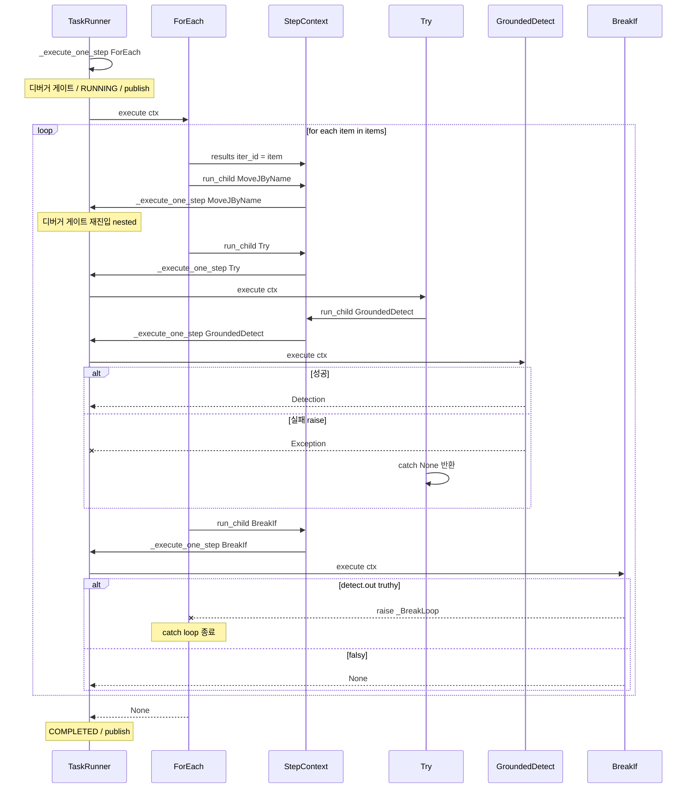

핵심:
- `ctx.run_child(step)` 안에서 **runner 의 `_execute_one_step` 이 재호출** → 디버거 게이트 + status + publish 가 nested step 에도 일관 작동
- `_BreakLoop` exception 으로 break 표현 — Python 의 StopIteration 패턴
- `Try` 가 `_BreakLoop` 는 안 잡고 일반 Exception 만 catch → break 가 위로 정상 전파

---

## 6. 디버거 호환 — runner 의 step 처리 흐름

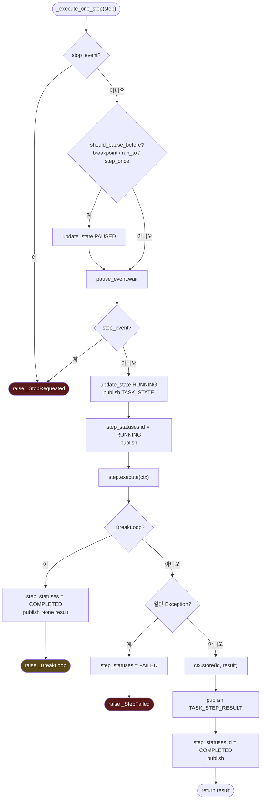

이 함수가 **단일 진입점** — ForEach.execute() 안에서 `ctx.run_child(child)`
호출하면 이 함수 다시 진입 (재귀). → nested step 도 동일 인프라 자동 적용.

---

## 7. Backend ↔ Frontend 메시지 흐름

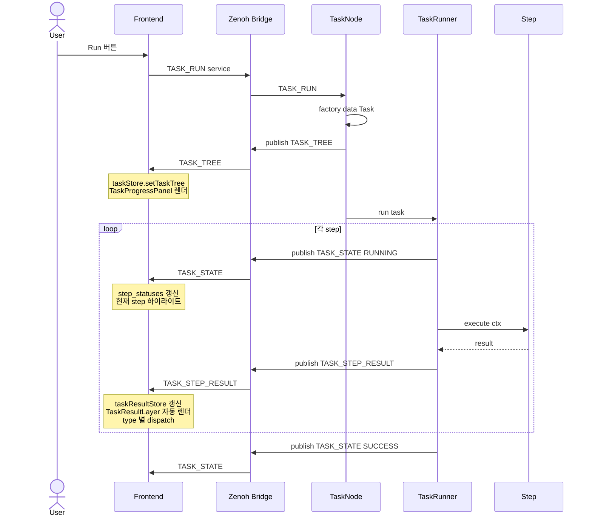

---

## 8. Frontend 시각화 흐름

`omx/task/step_result` 토픽 1개 + frontend 의 type 별 렌더러 매칭으로 **새 task
만들어도 frontend 코드 0줄 추가**.

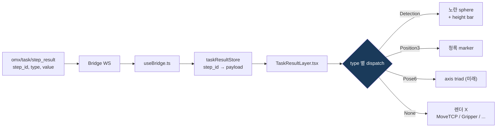

새 typed value (예: `Pose6`) 추가 시:
1. backend `schema.py` 에 dataclass 정의
2. backend step 의 `T_out` 으로 사용
3. frontend `TaskResultLayer.tsx` 에 `if (r.type === "Pose6") return <PoseTriad ...>` 1줄 추가

→ task / pick_and_place / executor 코드는 전혀 안 건드림.

---

## 9. 새 step 만드는 방법 — 확장 가이드

전체 템플릿:

```python
from dataclasses import dataclass
from modules.task.schema import SlotOr, Position3
from modules.task.step import Step, StepContext

@dataclass(kw_only=True)
class MoveCircle(Step[None]):
    """예시: 원호 경로 MoveC.
    
    center: SlotOr[Position3]    # 원 중심
    radius: float                 # 반지름 (literal, Slot 안 받음)
    """
    center: SlotOr[Position3]
    radius: float = 0.05

    def execute(self, ctx: StepContext) -> None:
        c = ctx.resolve(self.center)
        # ... motion 호출
        ctx.call_motion(Service.MOTION_MOVE_C, {...})
```

추가하는 순간 자동으로 되는 것들:
- `MoveCircle(center=grasp.out, radius=0.03)` 사용 가능
- pyright 가 `center: Slot[Detection]` 같은 타입 mismatch 거부
- task_tree publish 시 `{type: "MoveCircle", ...}` frontend 에 전달
- TaskProgressPanel 에 자동 표시 (params 펼침)
- 디버거 (breakpoint, run_to, step) 자동 작동

수정해야 하는 곳: **없음**. TaskRunner / Executor / 다른 step 코드 0줄 변경.

---

## 10. 새 task 만드는 방법 — 사용자 가이드

```python
from modules.task.recipes import home, search_and_detect
from modules.task.schema import Position3
from modules.task.step import Step, Task
from modules.task.steps import Gripper, GraspPolicy, MoveTCP, VerifyGrasp


def create_my_pick_task(target: str) -> Task:
    """단순 pick — drop 없이 들어서 home 으로."""
    pick_steps, pick_slot = search_and_detect(target)
    grasp = GraspPolicy(target=pick_slot)
    
    steps: list[Step] = [
        Gripper(action="open"),
        *pick_steps,
        grasp,
        MoveTCP(target=grasp.out, offset=Position3(0, 0, 0.06)),  # hover
        MoveTCP(target=grasp.out),                                # grasp
        Gripper(action="close", verify_grasp=True),
        MoveTCP(target=grasp.out, offset=Position3(0, 0, 0.08)),  # lift
        VerifyGrasp(),
        home(),
    ]
    return Task(name="my_pick", steps=steps)
```

원칙:
- **변수 (`pick_slot`, `grasp`) 가 데이터 통로** — string key 절대 X
- recipe 함수 (`search_and_detect`, `home`) 가 자주 쓰는 패턴 캡슐화
- step 의 `out` 은 **다른 step 의 입력에 직접** 넘김

---

## 11. Lego test 4가지 — 통과 근거 표

| Test | 원칙 | 통과 근거 |
|---|---|---|
| **#1 숨은 의존 X** | 입출력 contract 만으로 조립 가능 | `TaskContext.data: dict` 추방. Detection 객체에 base_z/height 다 흡수 → `_meta` suffix 같은 암묵 키 없음 |
| **#2 Substitutability** | 같은 type 자리에 어떤 step 이든 끼움 | `Slot[T]` covariant (frozen). `MoveTCP.target: SlotOr[Position3 \| Detection]` 둘 다 받음. `MoveJByName` 이 `Home` 케이스 흡수해 일반화 |
| **#3 새 step 추가 = runner 수정 0줄** | dispatch 가 polymorphic | `step.execute(ctx)` 단일 메서드. `ControlFlowStep` 같은 별도 base 도 안 만듦 — `ctx.run_child()` 헬퍼만으로 모든 control flow 일반 Step 인터페이스 |
| **#4 composite ↔ primitive 동등** | 외부 인터페이스 동일 | recipe 는 **함수** (값으로서 step list 와 같이 list 에 spread). `ForEach`/`Try` 도 일반 `Step`. nesting 자유 — frontend tree 가 재귀 indent 렌더 |

---

## 12. 의식적으로 *안* 한 것 — BT 도입 회피

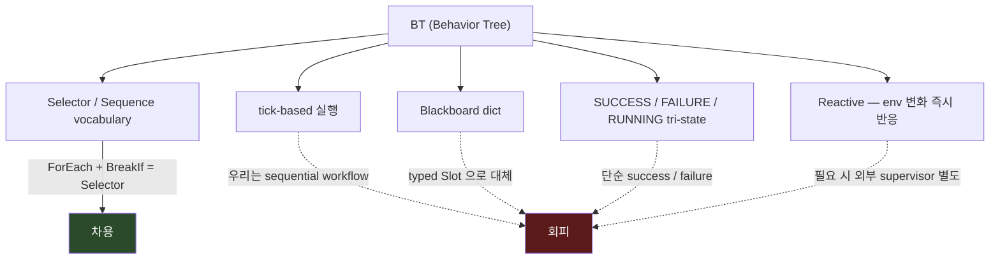

이유:
- 우리 task 의 99% 가 sequential workflow (pick_and_place, palletizing, NBV scan)
- reactive 가 진짜 필요한 시점 (closed-loop visual servoing) 은 별도 controller 영역
- LLM 이 sequential JSON 출력에 훨씬 강함 (BT 트리 출력은 어려움)
- 비개발자 visual editor user persona 가 현재 없음

→ "한 단어로 못 쓰는 hybrid" 가 **의도된 선택**. BT 어휘 빌리고 패러다임은 안 감.

---

## 13. 다음 단계

이 토대 위에 자연 확장 가능한 작업들:

| 작업 | 어디서 변경 |
|---|---|
| **Palletizing 본 작업** | 회전 박스 wire-up 6개 (Detector cluster decomp / Grasp enumerator / Reach filter / Orientation lock / Pick yaw). `Pose6` 가 실제로 쓰이는 시점 — [dev_reference.md](dev_reference.md) 의 Palletizing entry |
| **LLM orchestrator** | primitive 가 정리됐으니 system prompt few-shot 짜기 쉬워짐. `step_to_dict` 출력 형식이 LLM 출력 schema 와 동일하게 가능 |
| **Retry / UntilSuccess** | `Try` 를 generalize. `Retry(child, max_attempts=3)` 같은 새 control flow 추가 — runner 수정 0줄 |
| **Parallel** | 미래 case. 두 step 동시 실행. `Parallel(children=[...])` — thread-pool 도입 필요 |
| **TaskResultLayer 확장** | 새 typed value (Pose6 → axis triad) 추가 시 한 줄 |

---

## 부록 A. 파일 지도

| 파일 | 역할 |
|---|---|
| [backend/modules/task/schema.py](../backend/modules/task/schema.py) | typed value classes (Position3, Pose6, Detection) + Slot[T] + StepResult |
| [backend/modules/task/step.py](../backend/modules/task/step.py) | Step base + StepContext + Task + task_tree + step_to_dict + collect_step_ids |
| [backend/modules/task/steps.py](../backend/modules/task/steps.py) | primitive + control flow step 정의 |
| [backend/modules/task/recipes.py](../backend/modules/task/recipes.py) | home() / search_and_detect() recipe 함수 |
| [backend/modules/task/task_runner.py](../backend/modules/task/task_runner.py) | TaskRunner + _execute_one_step + 디버거 게이트 |
| [backend/modules/task/tasks/pick_and_place.py](../backend/modules/task/tasks/pick_and_place.py) | acceptance test task |
| [backend/nodes/application/task_node.py](../backend/nodes/application/task_node.py) | TASK_REGISTRY + Zenoh 서비스 핸들러 |
| [frontend/src/store/taskResultStore.ts](../frontend/src/store/taskResultStore.ts) | step_id → result 누적 store |
| [frontend/src/components/canvas/3d/TaskResultLayer.tsx](../frontend/src/components/canvas/3d/TaskResultLayer.tsx) | type 별 3D 자동 렌더 |
| [frontend/src/components/panels/TaskProgressPanel.tsx](../frontend/src/components/panels/TaskProgressPanel.tsx) | step 트리 + children 재귀 indent |

## 부록 B. 토픽 / 서비스 한 줄 요약

| 토픽 | 발행자 | 페이로드 |
|---|---|---|
| `omx/task/tree` | TaskNode (run/preview 시) | 전체 step 트리 (nested 재귀) |
| `omx/task/state` | TaskRunner | 현재 status / step_statuses / breakpoints |
| `omx/task/step_result` | TaskRunner (각 step 완료) | `{step_id, type, value}` |

| 서비스 | 핸들러 | 인자 |
|---|---|---|
| `omx/task/srv/run` | TaskNode | `{task, prompt, ...}` |
| `omx/task/srv/stop` | TaskNode | — |
| `omx/task/srv/pause` / `resume` | TaskNode | — |
| `omx/task/srv/step` | TaskNode | — (한 step 만 진행 후 pause) |
| `omx/task/srv/run_to` | TaskNode | `{step_id}` |
| `omx/task/srv/toggle_breakpoint` | TaskNode | `{step_id}` |
| `omx/task/srv/preview` | TaskNode | `{task, ...}` (실행 X, 트리만 빌드) |
